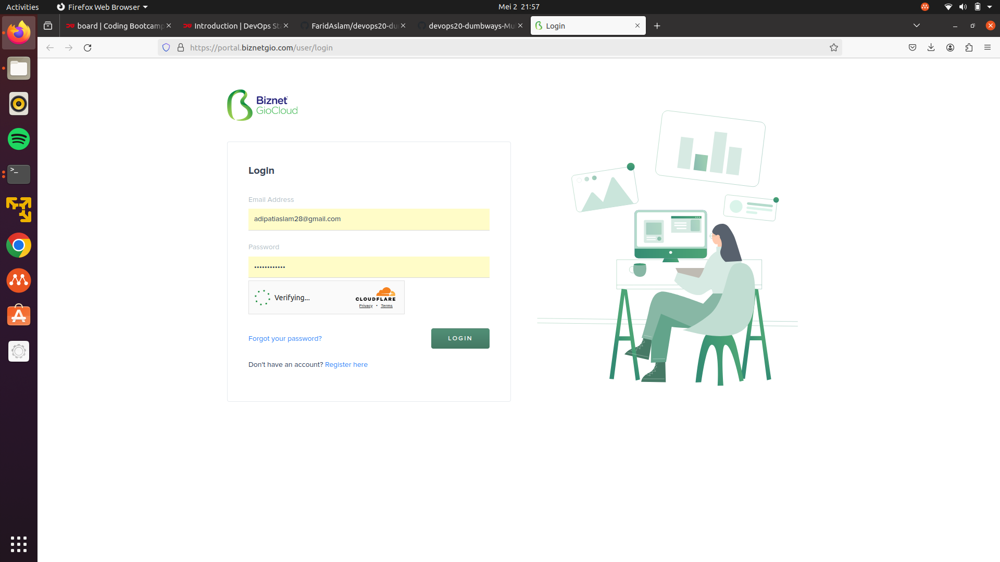
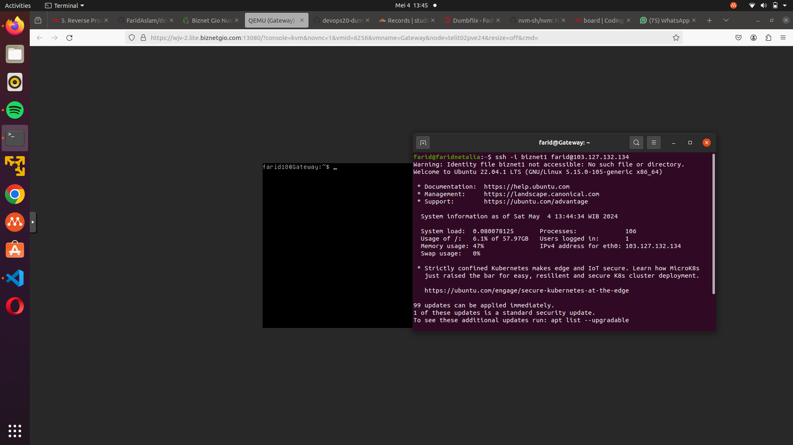
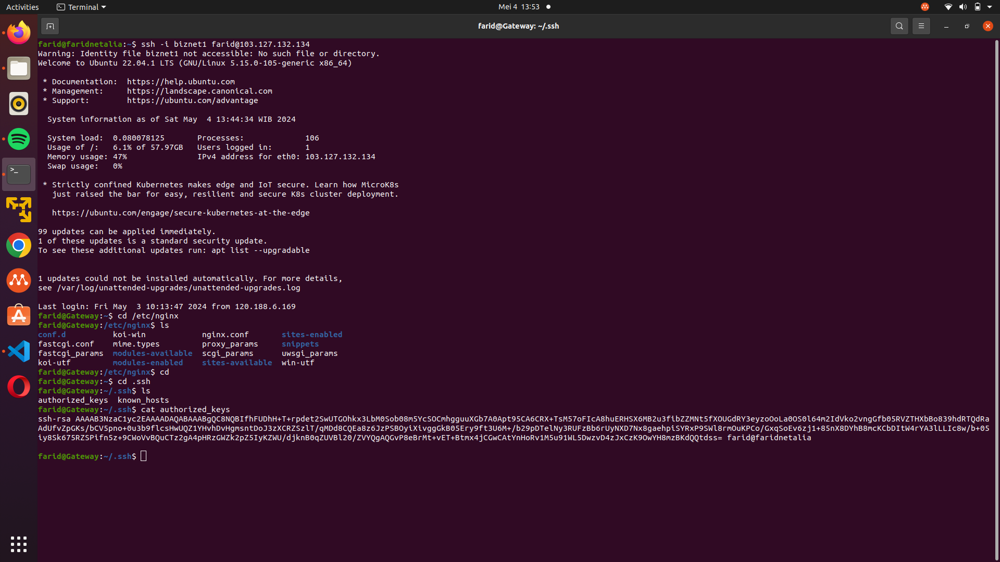
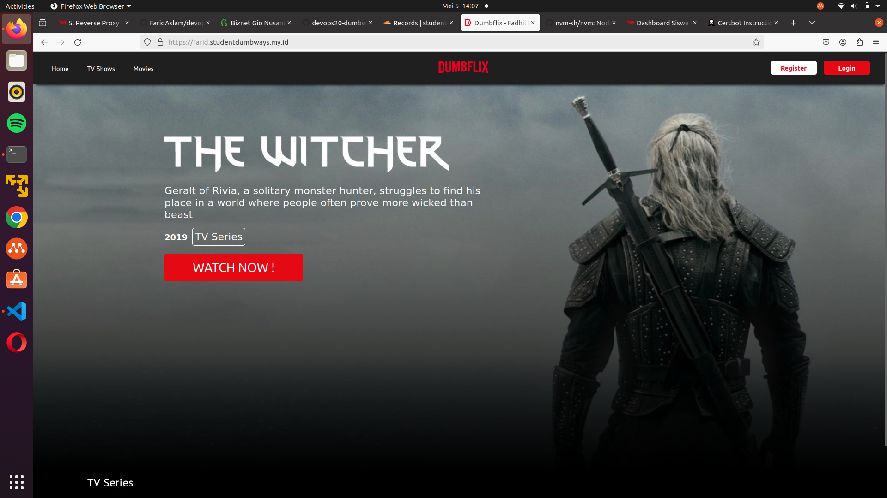

# Tugas Devops Dumbways Week 1 Stage 2

Repository :
[Dumbflix Frontend](https://github.com/dumbwaysdev/dumbflix-frontend)

Task :

- Jelaskan langkah-langkah pembuatan VM di BiznetGio
- Setelah server sudah terbuat, buatlah suatu user baru lalu implementasikan penggunaan ssh-key pada server tersebut.
- Deploy aplikasi Dumbflix-Frontend menggunakan nodejs versi 14.x
- Clone repository Dumbflix-frontend lalu deploy aplikasinya menggunakan PM2

Tasks :

- Install nginx
- Buatlah reverse proxy dan gunakan domain dengan nama kalian (ex. amanda.studentdumbways.my.id)
- untuk Installation Certbot ada banyak cara (salah 1 nya seperti pada saat di kelas), atau kalau kalian menemukan cara lain untuk melakukan installation certbot atau tools yang lain yang digunakan untuk melakukan generate ssl feel free to use yaa.
- Generate SSL untuk reverse proxy kalian.
- Happy Explore :)

## Jawaban Task 1

### Langkah-langkah pembuatan VM di BiznetGio

1. Login Terlebih dahulu ke website biznetGionya.
   [BiznetGio Login](https://portal.biznetgio.com/user/login)



2. Setelah Login klik tombol Quick Create lalu pilih variannya (Neo lite)


3. Beri nama server nya dan isi data yang di butuhkan


4. set up juga SSH nya untuk login melalui ssh-key (bila lupa kata sandi seperti saya)


5. Tunggu sampai selesai, bila sudah selesai lalu klik open console untuk membuka vm nya dan selesai.


### Membuat user baru lalu implementasikan penggunaan ssh-key pada server

1. Connect ke VM nya pakai ssh key yg sudah di daftarkan di biznet gionya atau bisa lewat openconsole supaya bisa langsung masuk ke vm

```bash
ssh -i biznet1 farid@103.127.132.134
```



2. setelah masuk ke vm nya kita langsung bisa membuat user

```bash
# command untuk menambah user
sudo adduser farid

# command untuk menambahkan sudo (super user do)
sudo usermod -aG sudo farid

# command untuk switch user
su - farid
```

3. untuk meng-implementasikan ssh-key nya saya membuat nya dengan cara vim file authorized_keys di user farid (~/.ssh/authorized_keys) dan copy public key ssh nya yg sudah dibuat di biznet nya.



4. setelah itu kita bisa uji coba login pakai ssh di manapun (host machine yang sudah ada privat key "ssh-keygen")


### Deploy aplikasi Dumbflix-Frontend menggunakan nodejs versi 14.x

- Siapkan dulu semua tools yang di butuhkan untuk menjalankan aplikasi, karena ini adalah aplikasi react JS maka wajib di install adalah NVM, Node JS, NPM, dan pm2

install dulu node version managernya (NVM) setelah selesai lalkukan perintah "exec bash"
- salin link nya dulu di [NVM] (https://github.com/nvm-sh/nvm) lalu scroll ke bawah, dan salin link nya (curl -o- https://raw.githubusercontent.com/nvm-sh/nvm/v0.39.7/install.sh | bash)


- Setelah itu kita bisa install node JS dan NPM yg diinginkan dengan NVM


setelah itu install pm2 dengan NPM supaya kita bisa running di background dan bisa di monitoring juga


### Clone repository Dumbflix-frontend lalu deploy aplikasinya menggunakan PM2

- Setelah semua tools siap kita bisa mulai cloning aplikasinya dari github repositorinya ke vm kita dengan perintah git clone lalu pergi ke direktori tersebut dan lakukan npm install

- Pertama kita pergi ke github untuk mencari repository nya lalu clone


- lalu jalankan perintah git clone https://github.com/dumbwaysdev/dumbflix-frontend.git


- lalu kita bisa buat file ecosystem dari pm2 untuk merunning aplikasinya di background dengan menggunakan vim atau nano


- running pm2 (aplikasi dumbflix nya)


untuk menguji aplikasi running bisa pergi ke web browser lalu masukan ipaddress:port contoh 192.168.1.1:3000


## Jawaban Task 2

### Install nginx

installasi nginx dan juga cerbot serta install juga python3-certbot-nginx

```bash
sudo apt-get update && sudo apt-get upgrade
sudo apt-get install -y nginx certbot python3-cerbot-nginx
```


### Buatlah reverse proxy dan gunakan domain dengan nama kalian (ex. farid.studentdumbways.my.id) 

set up dulu cloudflare dns record nya di web cloudflare dan tambahkan dns record dan isi data ipv4 nya dengan ip address dari virtual machine nya


lalu kita membuat file konfigurasi nya menggunakan sudo su (super user) dan masuk ke cd /etc/nginx lalu kita cari directory sites-available dan directory sites-enable dan kita hapus file default nya atau membuat file baru di directory nya lalu kita buat menggunakan vim untuk membuat reverse proxy nya.


```bash
sudo ln -s /etc/nginx/site-available /etc/nginx/site-enable adalah perintah untuk mentautkan antar file
```
lalu setelah itu kita bisa cek dulu configurasi nginx nya dengan perintah "sudo nginx -t"

### Installation Certbot

saya menggunakan cara saya sendiri untuk installasi dan configurasi certbot nya. cara ini saya dapat waktu saya magang dan di ajari oleh senior saya.

1. setelah install nginx kita wajib install juga certbot dan sebuah package lain yang bernama python3-certbot-nginx

```bash
sudo apt-get update; sudo apt-get -y upgrade

sudo apt-get install certbot

sudo apt-get install python3-certbot-nginx
```

2. setelah selesai di install certbot dan nginx configurasinya juga sudah kita konfigurasi seperti di atas kita bisa mengaktifkan ssl sertifikat kita dengan perintah

```bash
sudo certbot --nginx -d "farid.studentdumbways.my.id"
```


kalau sudah sukses bisa langsung aja cek di browser dan nanti website kita akan berubah jadi https dan ssl sertificate untuk apliskasi web kita akan terpasang dan provider nya adalah lestencript




