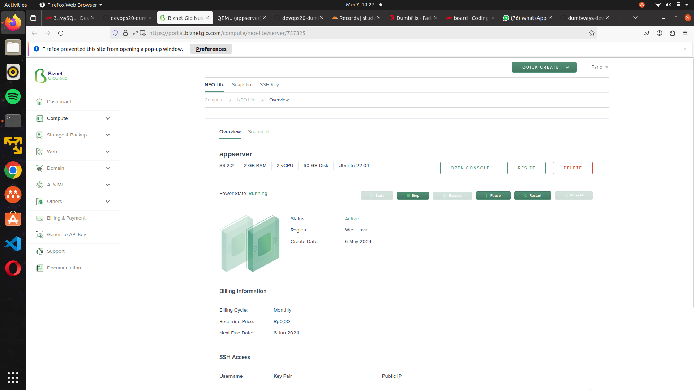
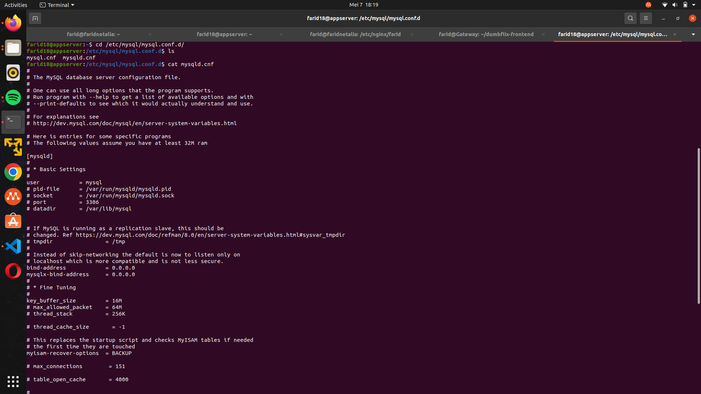
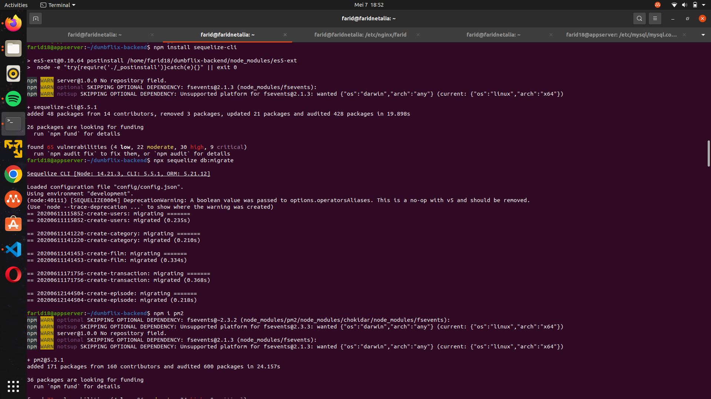
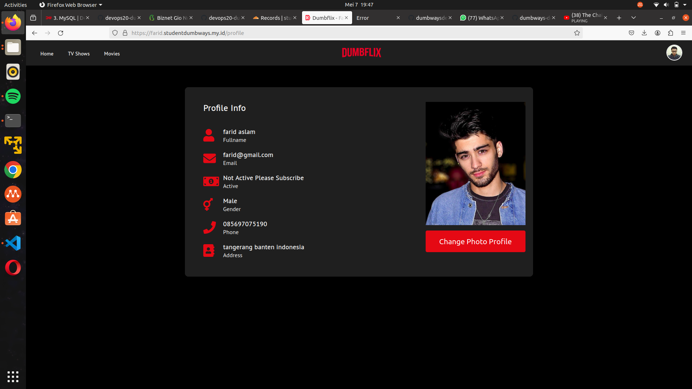

# Manage Database & Setup Backend

- pertama tama kita login ke biznetgio nya, lalu pilih server tempat untuk mendeploy database backend dan mysqlnya, lalu klik open console

lalu jalankan ssh -i (ssh) user@ip

## Instalasi dan konfigurasi database MySql

sebelum install mysql, kita update dan upgrade terlebih dahulu

        sudo apt update; sudo apt upgrade

  - Install MySql menggunakan command berikut
  
        sudo apt install mysql*

  - Jalankan secure installation mysql

  - Buka mysql sebagai root dan buat user baru
  - Beri privilege pada user baru
  - Buat database baru menggunakan user yang sudah dibuat

  - Buka direktori `/etc/mysql/mysql.conf.d/mysqld.cnf`

        sudo nano /etc/mysql/mysql.conf.d/mysqld.cnf

    Ubah `bind-address` dan `mysqlx-bind-address` menjadi seperti ini
        
        bind-address: 0.0.0.0
        mysqlx-bind-address: 0.0.0.0
        

     
  - Restart service mysql

        sudo systemctl restart mysql     

## Setup aplikasi backend

  - Clone aplikasi dumbflix

        git clone https://github.com/dumbwaysdev/dumbflix-backend.git

  - Install sequelize

        npm install sequelize-cli

  - sebelum installsequelize kita Install node versi 14 terlebih dahulu menggunakan nvm (curl -o- https://raw.githubusercontent.com/nvm-sh/nvm/v0.38.0/install.sh | bash)
  - lalu ketik nvm i 14
  - dan ketik exec bash

  - Build aplikasi backend

  - Build dan edit pm2 ecosystem file

  - Edit file `config.json`

  - Migrate isi database aplikasi ke database server menggunakan sequelize

  - Cek apakah database sudah berhasil di migrate

  - Kembali dan jalankan aplikasi melalui pm2

  - Buka browser dan ketikkan alamat aplikasi

  - Membuat konfigurasi reverse proxy

  - Buat domain baru di cloudflare

  - Coba akses domain yang sudah dibuat di browser
  - disini perlu untuk mendeploy ssl certificate menggunakan certbot agar domain bisa terkoneksi dengan aman

  - Install certbot
  - Jalankan certbot dan konfigurasi certbot 

  - Restart nginx

  - Buka kembali aplikasi backend melalui web browser

## Integrasi aplikasi frontend dan backend

  - Masuk ke direktori aplikasi frontend dan edit file `src/config/api.js`

  - Buka aplikasi dan register user baru

  - Jika berhasil maka akan muncul profile seperti ini

