# Tugas devops Dumbways Mandiri Project Week 3 Stage 2

## DAY 1 Docker & Docker Compose

Tasks :
[ Docker ]

- Jelasakan langkah-langkah melakukan rebuild server BiznetGio, dan ubah menggunakan os ubuntu 22
- Setelah server sudah selesai ter rebuild, buatlah suatu user baru dengan nama **team kalian** .
- Buatlah bash script se freestyle mungkin untuk melakukan installasi docker.
- Deploy aplikasi Web Server, Frontend, Backend, serta Database on top `docker compose`
  - Buat suatu docker compose yang berisi beberapa service kalian
    - Web Server
    - Frontend
    - Backend
    - Database
  - Di dalam docker-compose file buat suatu custom network dengan nama **team kalian**, lalu pasang ke setiap service yang kalian miliki.
  - Deploy database terlebih dahulu menggunakan mysql dan jangan lupa untuk pasang volume di bagian database.
  - Untuk building image frontend dan backend sebisa mungkin buat dockerized dengan image sekecil mungkin. dan jangan lupa untuk sesuaikan configuration dari backend ke database maupun frontend ke backend sebelum di build menjadi docker images.
  - Untuk Web Server buatlah configurasi reverse-proxy menggunakan nginx on top docker.
    - **SSL CLOUDFLARE OFF!!!**
    - Gunakan docker volume untuk membuat reverse proxy
    - SSL sebisa mungkin gunakan wildcard
    - Untuk DNS bisa sesuaikan seperti contoh di bawah ini
      - Frontend team1.studentdumbways.my.id
      - Backend api.team1.studentdumbways.my.id
  - Push image ke docker registry kalian masing".
- Aplikasi dapat berjalan dengan sesuai seperti melakukan login/register.

## JAWABAN

### Rebuild server BiznetGio

1. login ke biznet gio

2. Pergi ke dashboard lalu klik ke vm yg mau di Rebuild

3. Stop VM lalu klik tombol rebuild dan pilih server ubuntu 22 dan setup ssh keys nya

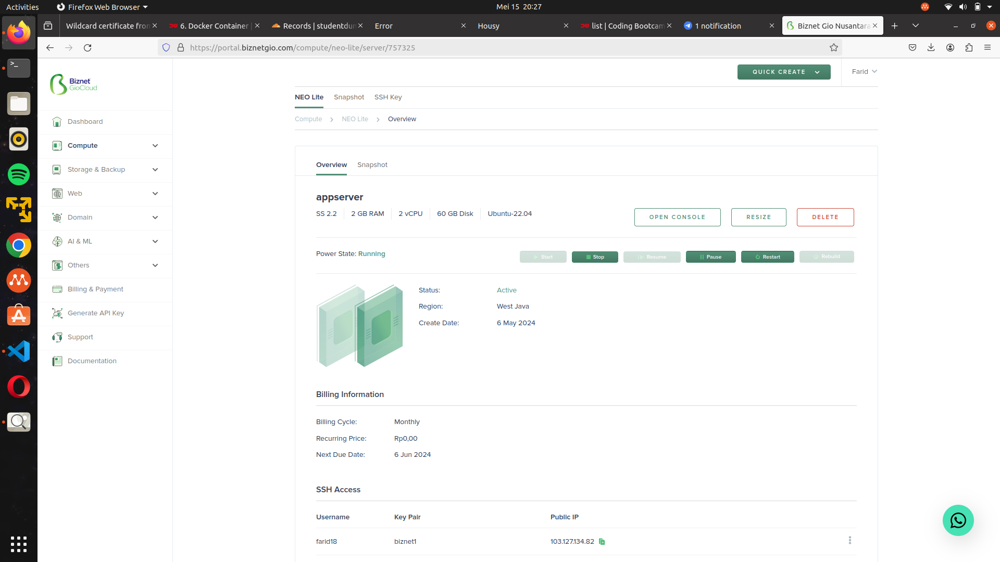

4. Periksa Kembali status server (running atau tidak)

5. Jika berhasil Login proses rebuild selesai.

### buatlah suatu user baru dengan nama **team1**

untuk membuat user baru di terminal linux kita bisa masukan perintah sebagai berikut :

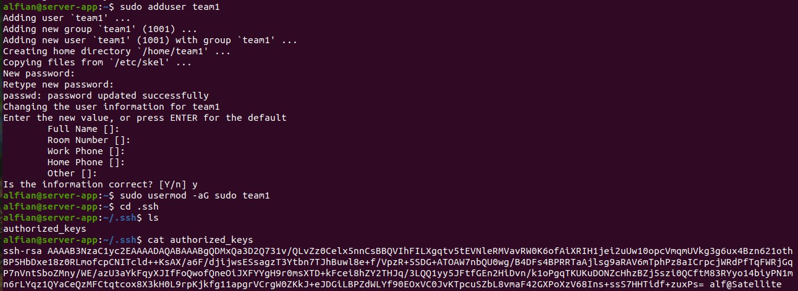

```bash
# Menambahkan user
sudo adduser team1

# Menambahkan user baru agar punya sudo (super user do)
sudo usermod -aG sudo team1
```

Periksa kembali installasi user baru dengan pidah ke user tersebut di terminal dengan perintah :


```bash
# pindah user
su - team1

# masukan password nya
password:
```

### Installasi Docker menggunakan bashscript atau (.sh) file

untuk melakukan installasi docker kita harus menuju ke repository original docker untuk menginstall docker engine di linux server kita, isi dari bashscript nya adalah:

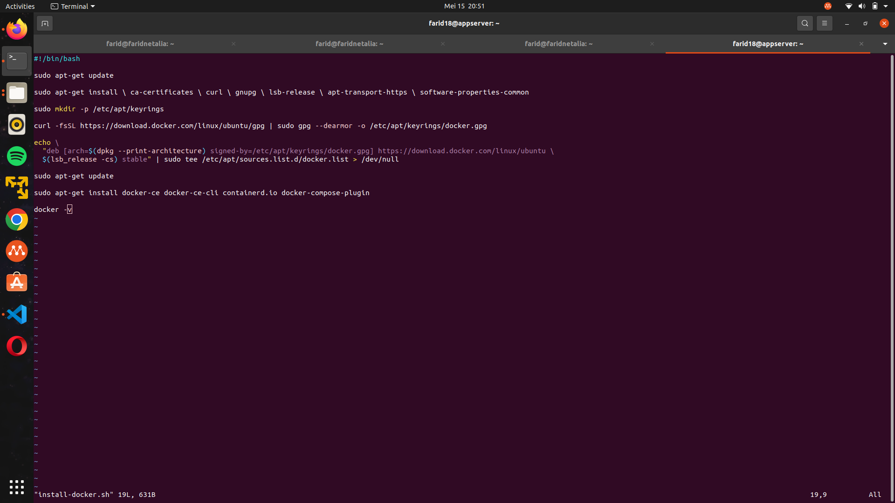

install-docker.sh


```bash
# Add Docker's official GPG key:
sudo apt-get update
sudo apt-get install -y ca-certificates curl
sudo install -m 0755 -d /etc/apt/keyrings
sudo curl -fsSL https://download.docker.com/linux/ubuntu/gpg -o /etc/apt/keyrings/docker.asc
sudo chmod a+r /etc/apt/keyrings/docker.asc

# Add the repository to Apt sources:
echo \
  "deb [arch=$(dpkg --print-architecture) signed-by=/etc/apt/keyrings/docker.asc] https://download.docker.com/linux/ubuntu \
  $(. /etc/os-release && echo "$VERSION_CODENAME") stable" | \
  sudo tee /etc/apt/sources.list.d/docker.list > /dev/null
sudo apt-get update

# Install all docker tools
sudo apt-get install -y docker-ce docker-ce-cli containerd.io docker-buildx-plugin docker-compose-plugin

```

untuk menjalankan installasi script bisa menggunakan perinatah:

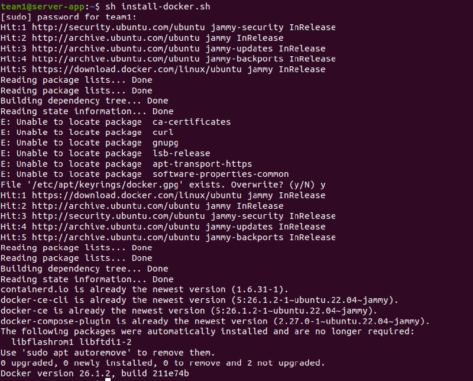

```bash
# run script
sudo sh install-docker.sh

# atau
sudo ./install-docker.sh
```

setelah semua dijalankan periksa apakah docker sudah terinstall atau belum


### Deploy aplikasi Web Server, Frontend, Backend, serta Database on top `docker compose` Nama aplikasi = housy

Sebelum menjalankan aplikasi kita wajib Pull terlebih dahulu source code nya dari git hub dengan perintah:

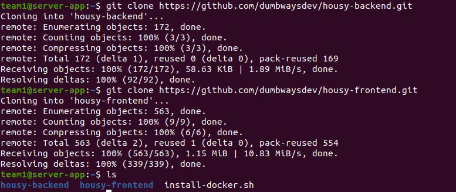

```bash
# Pull Frontend App
git clone https://github.com/dumbwaysdev/wayshub-frontend.git

# Pull Backend App
git clone https://github.com/dumbwaysdev/wayshub-backend.git
```

### Setup VM

#### VM1 (gateway) untuk setup Frontend dan Nginx secara container

```yaml
services:
  frontend:
    image: 
    container_name: frontend
    ports:
      - "3000:80"
    restart: always
    stdin_open: true
    networks:
      - team1

  webserver:
    image: nginx:latest
    container_name: webserver
    depends_on:
      - frontend
    ports:
      - "80:80"
      - "443:443"
    volumes:
      - "./nginx:/etc/nginx/conf.d"
      - "./nginx/certs:/etc/nginx/certs"
    networks:
      - team1
networks:
  team1:
```

#### VM2 (appserver) untuk setup Backend & database & Nginx secara container

```yaml
services:
  database:
    image: mysql:5.7
    container_name: database
    restart: always
    environment:
      MYSQL_ROOT_PASSWORD: team1
      MYSQL_DATABASE: team1
      MYSQL_USER: team1
      MYSQL_PASSWORD: team1
    ports:
      - "3306:3306"
    volumes:
      - ./mysql/data:/var/lib/mysql
    networks:
      - team1
  backend:
    image: 
    container_name: backend
    restart: always
    stdin_open: true
    ports:
      - "5000:5000"
    depends_on:
      - database
    networks:
      - team1
  webserver:
    image: nginx:latest
    container_name: webserver
    depends_on:
      - frontend
    ports:
      - "80:80"
      - "443:443"
    volumes:
      - "./nginx:/etc/nginx/conf.d"
      - "./nginx/certs:/etc/nginx/certs"
    networks:
      - team1
```

kita juga bisa membuat satu docker compose yang berisi semua configuration file di dalam satu project. tapi di projek ini nanti akan dipisah ke 2 vm karena jika di gabung semua akan berat dan leg juga, berikut ini adalah contoh semua aplikasi di deploy di satu vm:

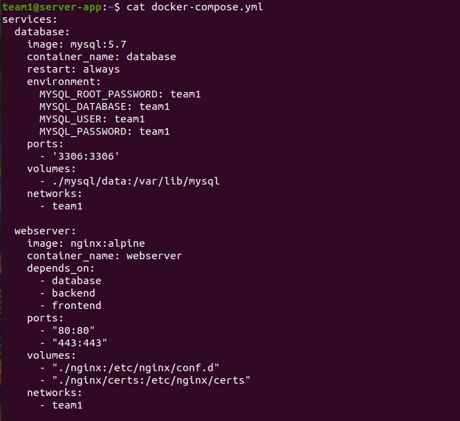
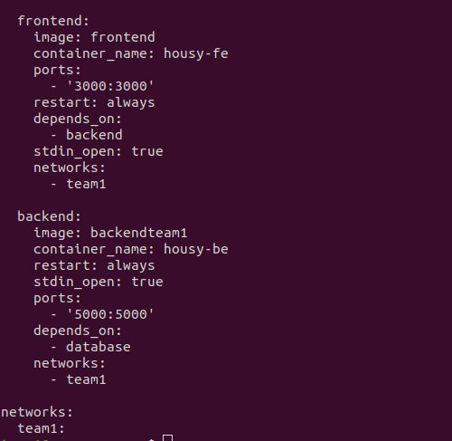

```yaml
services:
  database:
    image: mysql:5.7
    container_name: database
    restart: always
    environment:
      MYSQL_ROOT_PASSWORD: team1
      MYSQL_DATABASE: team1
      MYSQL_USER: team1
      MYSQL_PASSWORD: team1
    ports:
      - "3306:3306"
    volumes:
      - ./mysql/data:/var/lib/mysql
    networks:
      - team1

  webserver:
    image: nginx:latest
    container_name: webserver
    depends_on:
      - frontend
    ports:
      - "80:80"
      - "443:443"
    volumes:
      - "./nginx:/etc/nginx/conf.d"
      - "./nginx/certs:/etc/nginx/certs"
    networks:
      - team1

  frontend:
    image: 
    container_name: housy-be
    ports:
      - "3000:3000"
    restart: always
    depends_on:
      - backend
    stdin_open: true
    volumes:
      - ./housy-frontend/container-data:/app
    networks:
      - team1

  backend:
    image: 
    container_name: housy-be
    restart: always
    stdin_open: true
    ports:
      - "5000:5000"
    depends_on:
      - database
    networks:
      - team1

networks:
  team1:
```

setelah ada configuration file kita jalankan "docker compose up -d"


membuat Dockerfile di backend untuk membuat images

```Dockerfile
FROM node:14

WORKDIR /app

COPY package*.json ./

RUN npm install

RUN npm i sequelize-cli

COPY . .

RUN npx sequelize db:migrate

EXPOSE 5000

CMD [ "npm", "start" ]
```

jalankan docker build di terminal dengan perintah:

```bash
contoh : docker build -t housy-backend .
```


### Deploy Frontend aplication

berikut adalah configurasi Dockerfile untuk membuild images frontend:

Dockerfile

```Dockerfile
FROM node:14

WORKDIR /usr/src/app

COPY package*.json ./

RUN npm install

COPY . .

CMD ["npm","start"]
```

build Dockerfile diatas dengan perintah:

```bash
contoh : docker build -t housy-frontend .
```


untuk menjalankan dengan docker compose perintahnya:

```bash
docker compose up -d
```

setelah itu cek apakah aplikasinya berjalan atau tidak di browser:

link app: https://team1.studentdumbways.my.id

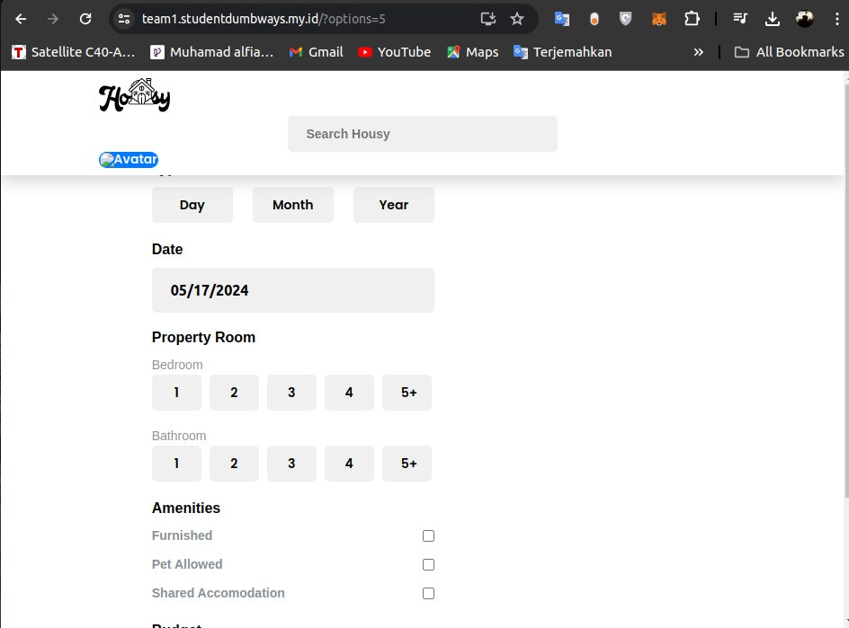

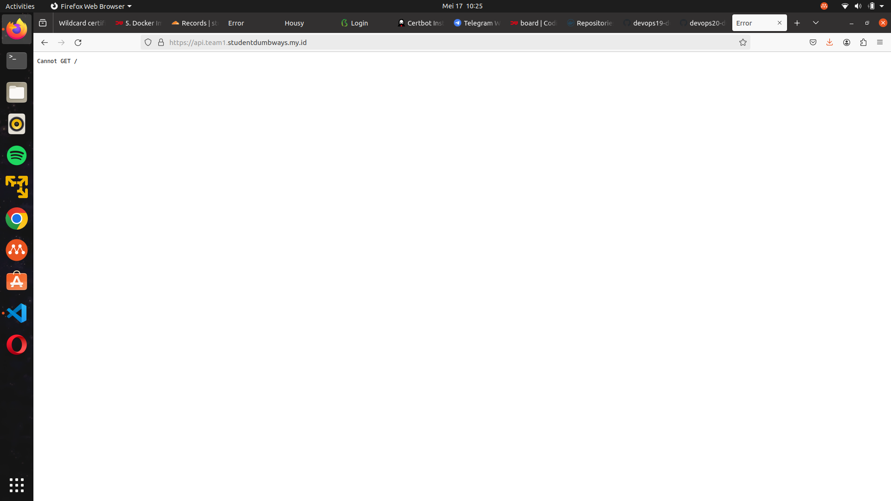

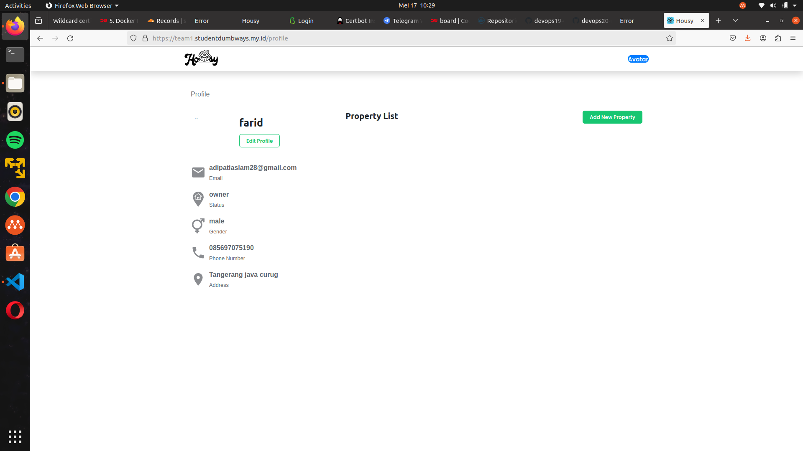

### Resize docker images sekecil dan seefisien mungkin

Supaya Docker images kita ukurannya bisa kecil dan efisien cara yang paling mudah adalah mengatur configurasi saat membuild nya, Misalnya:

#### Untuk Frontend

Dockerfile-Normal

Ukuran Images = 1.1GB

```Dockerfile
FROM node:14

WORKDIR /usr/src/app

COPY package*.json ./

RUN npm install

COPY . .

CMD ["npm","start"]
```

Konfigurasi Dockerfile diatas adalah konfigurasi normal untuk menjalankan Dockerfile, tetapi images yang dihasilkan masih sangat besar, maka dari itu kita bisa menggunakan base -alpine.

Ukuran Images = 307MB

Dockerfile-alpine

```Dockerfile
FROM node:14-alpine

WORKDIR /usr/src/app

COPY package*.json ./

RUN npm install

COPY . .

CMD ["npm","start"]
```

Konfigurasi di atas diganti menggunakan node JS dengan base images linux apine, linux alpine ini sangat lah kecil dan tidak memakan resource yang banyak. begitupun saat kita meng-konfigurasi dockerfile di back-end.


### Webserver (NGINX) & Wild Card SSL Certificate & Cloudflare on Container

kita buat terlebih dahulu DNS Record agar IP address dari VM kita yg ada di Frontend dan Backend dapat di pointing ke masing2 IP VM di biznet gio menggunakan Cloudflare DNS Record.

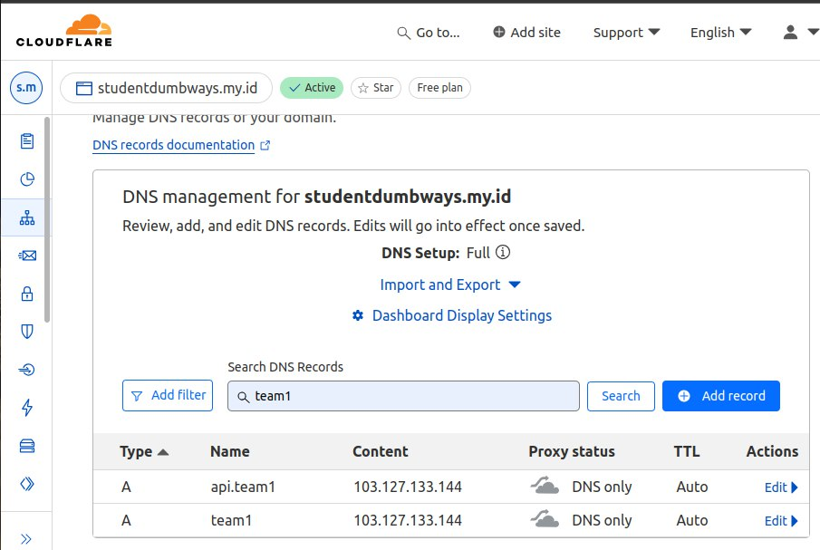

Frontend: team1.studentdumbways.my.id

Backend: api.team1.studentdumbways.my.id

Untuk SSL certificate Wildcard saya menggunakan Certbot untuk generate satu kali SSL sertificate yang nantinya bisa di gunakan untuk semua SSL.

Docs Installation Certbot WildCard :
https://certbot.eff.org/instructions?ws=nginx&os=ubuntufocal&tab=wildcard

```bash
sudo snap install --classic certbot

sudo ln -s /snap/bin/certbot /usr/bin/certbot

sudo snap set certbot trust-plugin-with-root=ok

sudo snap install certbot-dns-cloudflare
```

Setup Credential cloudflare terlebih dahulu dan simpan ke dalam file cloudflare.ini di lokasi /root/.secret/cloudflare.ini

```ini
dns_cloudflare_email = "emailname@gmail.com"
dns_cloudflare_api_key = "Token isi Here"
```

setelah di setup jalankan perintah berikut untuk genereate SSL sertificate wildcard dari cloudflare dan lestencritp via certbot

```bash
certbot certonly --dns-cloudflare --dns-cloudflare-credentials /root/.secrets/cloudflare.ini -d team1.studentdumbways.my.id,*.team1.studentdumbways.my.id --preferred-challenges dns-01
```

buat configurasi default.conf untuk nginx reserve_proxy

```conf
server {
 listen 80;
 listen 443 ssl;
 server_name team1.studentdumbways.my.id;

 ssl_certificate /etc/nginx/certs/fullchain.pem;
 ssl_certificate_key /etc/nginx/certs/privkey.pem;

 location / {
  proxy_pass http://frontend:3000;
  proxy_set_header Host $host;
  proxy_set_header X-Real-IP $remote_addr;
 }
}

server {
        listen 80;
        listen 443 ssl;
        server_name api.team1.studentdumbways.my.id;
        
        ssl_certificate /etc/nginx/certs/fullchain.pem;
        ssl_certificate_key /etc/nginx/certs/privkey.pem;
        
        location / {
                proxy_pass http://backend:5000;
                proxy_set_header Host $host;
                proxy_set_header X-Real-IP $remote_addr;
        }       
}

```

Taruh configurasi tersebut di folder nginx karena folder tersebut sudah di konfigurasi di container di docker compose nya. dan jangan lupa jalankan terlebih dahulu docker-compose.yaml nya untuk menjalankan service nginx.

Dan Jangan lupa copy juga File SSL Certificate wildcard nya juga ke dalam folder nginx/cert, Berikut adalah gambaran file nya

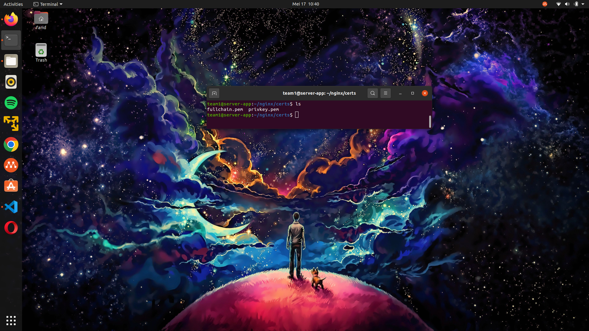


running kembali docker compose nya

```bash
docker compose down

docker compose up -d
```

Periksa kembali aplikasinya nanti dia bisa running Secara HTTPS, dan SSL Sertificate akan menyala.
link app: https://team1.studentdumbways.my.id


### Push Images Ke Docker Registry

agar kita bisa push ke registry kita wajib login dahulu menggunakan docker login, lalu image kita beri tagname sesuai dengan username/namaimages agar kita bisa push ke registry kita.

sebelum push login terlebih dahulu
```
docker login
```


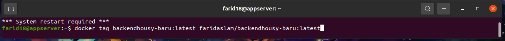

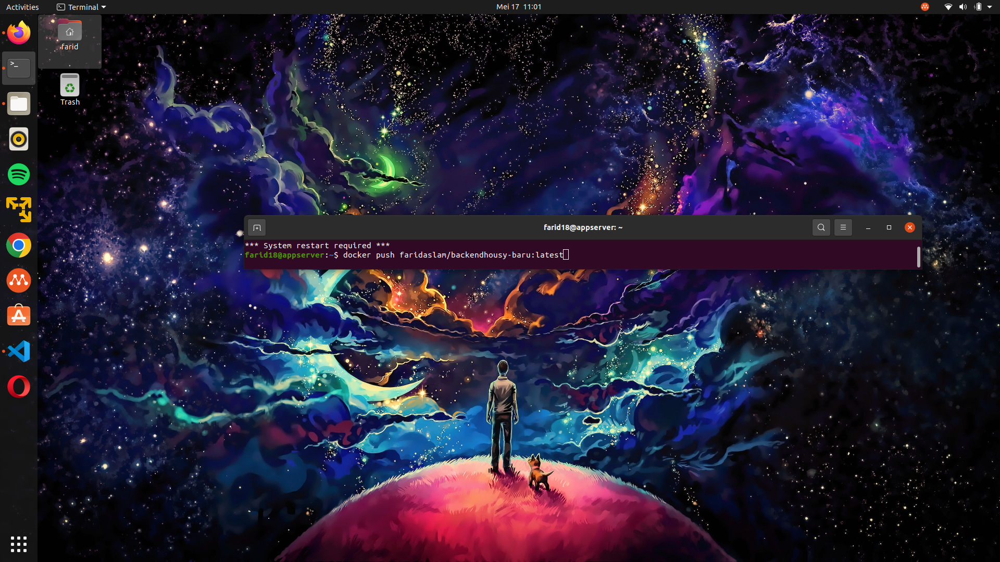