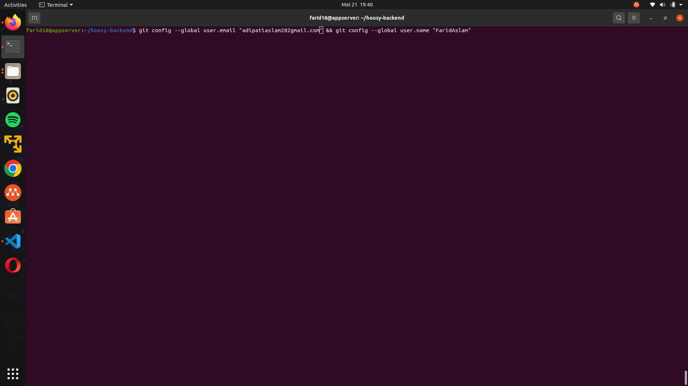
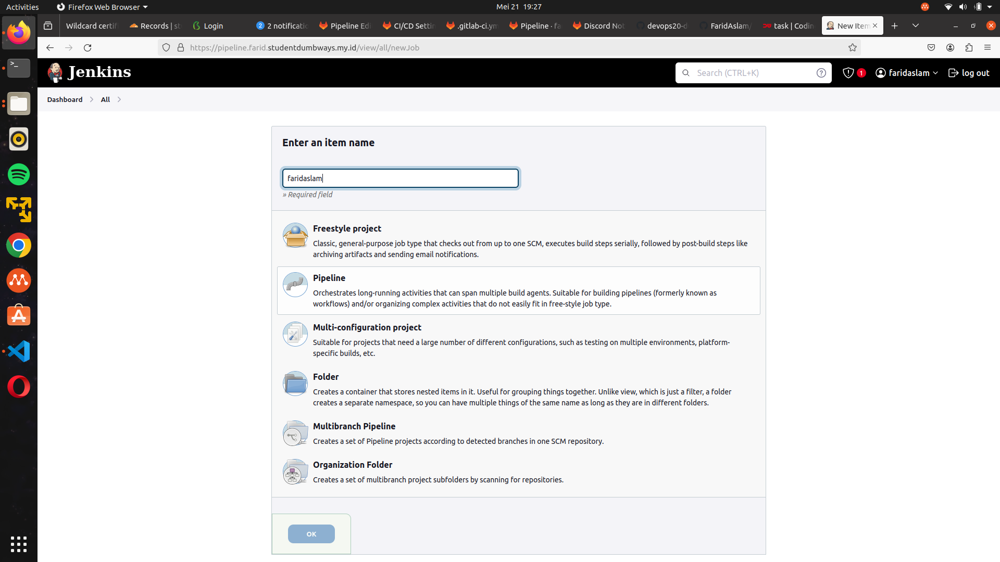

# Tugas Jenkins

## CICD using JENKINS

Disini saya akan menginstall jenkins dengan menggunakan docker compose.

Langkah pertama yaitu buat folder baru bernama jenkins. Lalu masuk ke dalam folder tersebut dan buat file baru bernama docker-compose.yaml

```
mkdir jenkins; cd jenkins; nano docker-compose-jenkins.yaml
```

bisa juga di gabung di luar seperti docker.compose.yaml yg sudah dibuat sebelum nya.

Masukkan script ini kedalamnya:
```
version: '3.8'

services:
  jenkins:
    image: jenkins/jenkins:lts
    ports:
      - "8080:8080"
      - "50000:50000"
    volumes:
      - jenkins_data:/var/jenkins_home

volumes:
  jenkins_data:

```
Selanjutnya jalankan command berikut
```
docker compose up -d atau docker compose -f docker-compose-jenkins.yaml up -d
```


Jika sudah, cek apakah jenkins berjalan
```
docker compose ps -a
```

Akses servernya menggunakan browser dengan menggunakan port 8080, jika muncul seperti ini maka sudah berhasil


Selanjutnya, masuk ke bash dari jenkins

```
docker compose exec -it jenkins:(tag) bash
```

Lalu jalankan command berikut
```
cat /var/jenkins_home/secrets/initialAdminPassword
```


Copy paste password tersebut ke browser tadi, lalu klik continue


Pilih yang ```install suggested plugins```


Lalu tunggu sampai proses setup selesai


Selanjutnya, buat akun admin lalu Klik Save and Continue


Proses setup selesai


Selanjutnya, masuk ke cloudflare dan buat subdomain baru dengan mempointing ke ip webserver


Di webserver, buat konfigurasi baru untuk subdomain jenkins


Masukkan script konfigurasi berikut

```
upstream jenkins {
  keepalive 32; # keepalive connections
  server 103.127.134.82:8080; # ip address + port server jenkins
}

# Required for Jenkins websocket agents
map $http_upgrade $connection_upgrade {
  default upgrade;
  '' close;
}

server {
  listen          80;       # Listen on port 80 for IPv4 requests
  listen 443 ssl;
  ssl_certificate /etc/letsencrypt/live/farid.studentdumbways.my.id/fullchain.pem; # lokasi ssl cert
  ssl_certificate_key /etc/letsencrypt/live/farid.studentdumbways.my.id/privkey.pem; # lokasi ssl cert

  server_name     pipeline.farid.studentdumbways.my.id;  # subdomain yang tadi

  # this is the jenkins web root directory
  # (mentioned in the output of "systemctl cat jenkins")
  root            /var/run/jenkins/war/;

  access_log      /var/log/nginx/jenkins.access.log;
  error_log       /var/log/nginx/jenkins.error.log;

  # pass through headers from Jenkins that Nginx considers invalid
  ignore_invalid_headers off;

  location ~ "^/static/[0-9a-fA-F]{8}\/(.*)$" {
    # rewrite all static files into requests to the root
    # E.g /static/12345678/css/something.css will become /css/something.css
    rewrite "^/static/[0-9a-fA-F]{8}\/(.*)" /$1 last;
  }

  location /userContent {
    # have nginx handle all the static requests to userContent folder
    # note : This is the $JENKINS_HOME dir
    root /var/lib/jenkins/;
    if (!-f $request_filename){
      # this file does not exist, might be a directory or a /**view** url
      rewrite (.*) /$1 last;
      break;
    }
    sendfile on;
  }

  location / {
      sendfile off;
      proxy_pass         http://jenkins;
      proxy_redirect     default;
      proxy_http_version 1.1;

      # Required for Jenkins websocket agents
      proxy_set_header   Connection        $connection_upgrade;
      proxy_set_header   Upgrade           $http_upgrade;

      proxy_set_header   Host              $http_host;
      proxy_set_header   X-Real-IP         $remote_addr;
      proxy_set_header   X-Forwarded-For   $proxy_add_x_forwarded_for;
      proxy_set_header   X-Forwarded-Proto $scheme;
      proxy_max_temp_file_size 0;

      #this is the maximum upload size
      client_max_body_size       10m;
      client_body_buffer_size    128k;

      proxy_connect_timeout      90;
      proxy_send_timeout         90;
      proxy_read_timeout         90;
      proxy_request_buffering    off; # Required for HTTP CLI commands
  }

}
```


Simpan lalu reload webserver nginx
```
docker compose exec webserver nginx -s reload
```

Selanjutnya ke jenkins -> Manage Jenkins -> System


Pastikan di bagian ```Jeknins URL``` sudah sesuai. Lalu Apply & Save.


Selanjutnya ke Plugins -> Available Plugins -> cari ```SSH Agent``` -> Install


Jika terdapat error, Install ulang pluginnya sampai berhasil. Dan pastikan ceklist pada ```Restart Jenkins when installation is complete...```


Satu lagi install Plugin ```Discord Notifier```. Caranya sama seperti tadi.

Kembali ke Manage Jenkins -> Credentials


Lalu pilih ```Add Credentials```


- Pada bagian Kind, pilih ```SSH Username with private key```.
- Pada bagian ID, masukan id yang nantinya akan dipakai pada file Jenkinsfile.
- Pada bagian Username, masukkan username dari server backend.


- Pada bagian Privat Key, Klik ```Enter Directly``` Lalu klik ```Add```. Masukkan privat key dari server backend.


Jika sukses, akan tampil seperti ini.


Masuk ke github, lalu tambahkan Public key dari ssh tadi.
Ke Settings -> SSH and GPG keys -> New SSH Key.


Masukkan Public keynya lalu klik ```Add SSH Key```.


Jika sudah, tes koneksi ke github.
```ssh -T git@github.com```


Selanjutnya buat repository baru di github.

Jika sudah dibuat, jalankan command berikut.
```
git config --global user.email "alamat email" && git config --global user.name "username github"
```



Selanjutnya pergi ke folder wayshub-backend dan buat file baru dengan nama Jenkinsfile. Berikut adalah isi dari file Jenkinsfile. Silahkan edit sesuai kebutuhan
```
pipeline {
   agent any
   environment{
       credential = 'vm'
       server = 'farid18@103.127.134.82'
       directory = '/home/farid18/housy-backend'
       branch = 'main'
       service = 'backend'
       tag = 'latest'
       image = 'faridaslam/backendhousy-baru'
   }
   stages {
       stage('Pull code dari repository'){
         steps {
            sshagent([credential]) {
                sh '''ssh -o StrictHostKeyChecking=no ${server} << EOF
                cd ${directory}
                git pull origin ${branch}
                exit
                EOF'''
               }
           }
       }
       stage('Building application') {
         steps {
            sshagent([credential]) {
                sh '''ssh -o StrictHostKeyChecking=no ${server} << EOF
                cd ${directory}
                docker build -t ${image}:${tag} .
                exit
                EOF'''
               }
           }
       }
       stage('Testing application') {
         steps {
            sshagent([credential]) {
                sh '''ssh -o StrictHostKeyChecking=no ${server} << EOF
                cd ${directory}
                docker run --name test_be -p 5000:5000 -d ${image}:${tag}
                wget --spider localhost:5000
                docker stop test_be
                docker rm test_be
                exit
                EOF'''
               }
           }
       }
       stage('Deploy aplikasi on top docker'){
         steps {
            sshagent([credential]) {
                sh '''ssh -o StrictHostKeyChecking=no ${server} << EOF
                sed -i '22c\\ image: ${image}:${tag}' docker-compose.yaml
                docker compose up -d
                cd ${directory}
                exit
                EOF'''
               }
           }
       }
       stage('Push image to docker hub'){
         steps {
            sshagent([credential]) {
                sh '''ssh -o StrictHostKeyChecking=no ${server} << EOF
                cd ${directory}
                docker push ${image}:${tag}
                exit
                EOF'''
               }
           }
       }
       stage('send notification to discord'){
         steps {
            discordSend description: "backend-team1 notify", footer: "team1 notify", link:
env.BUILD_URL, result: currentBuild.currentResult, title: JOB_NAME, webhookURL: "https://discord.com/api/webhooks/1240153059674423326/XjUW5UpIS4XJoCmyK-6amPN7Ap3H_cfgKf2L2-SpsHmGv1fx3g-Kr6Xg0BnWYeVP_ZYB"
             } 
          }
       }
    }

```

Jika sudah simpan dan jalankan command berikut, sesuaikan dengan nama branch dan repository yang barusan dibuat.
```
git remote set-url branch git-repo && git add .
```


```
git commit -m "chore: Adding Jenkins and Docker" && git push origin main
```
Cek kembali repository tadi.


Ke Dashboard Jenkins. Klik ```New Item```.


Masukkan nama yang diinginkan, lalu pilih yang ```Pipeline``` -> Klik OK.



Ceklist pada bagian ```GitHub hook triger for GITScm polling.```

Scroll kebawah,
- Pada bagian Definition ganti menjadi ```Pipeline script from SCM```
- Pada bagian SCM ganti menjadi ```Git```
- Pada bagian Repository, masukkan alamat repository tadi.
- Pada bagian Credentials, pilih credentials yang barusan dibuat.


Scroll kebawah lagi, Sesuaikan untuk branch dan Script path.


Jika sudah, coba untuk menjalankannya dengan klik ```Build Now```.


Jika sukses tanpa error, akan tampil seperti ini, jika ada error cek kembali file ```Jenkinsfile``` tadi.


Selanjutnya ke github repository tadi, lalu Klik ```Settings```.

Ke bagian Webhook -> Add webhook.

Masukkan Payload URL dengan alamat URL dari jenkins + ditambah ```/github-webhook```. Lalu klik Add Webhook.


Jika sudah, coba buat perubahan pada backend dan push kembali ke github.

Lalu cek lagi di jenkins, maka proses build sudah otomatis berjalan ketika user push ke github.
