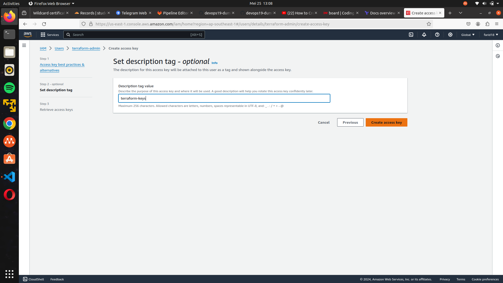

# Day 8 (Challenge Task)
Challenge Task: Terraform

1.  Dengan mendaftar akun free tier AWS/GCP/Azure, buatlah Infrastructre dengan terraform menggunakan registry yang sudah ada. (spec menyesuaikan saja dengan free tier yang di dapatkan)

## Step by step
### Mendaftar akun aws-freetier

### Terraform environment
Menggunakan dokumentasi resmi aws di terraform registry :
 https://registry.terraform.io/providers/hashicorp/aws/latest/docs
 

 pertama-tama cari IAM di aws

lalu klik user dan create user

centang ini saja

jika sudah terbuat lalu klik user yg sudah dibuat

masukkan access key

pilih CLI

beri nama

salin kode accsess nya

lalu cari EC2

PILIH launch instance di sebelah kanan

lalu salin ami untuk kebutuhan file main.tf kita nanti nya

Membuat file `main.tf`

### Excecution
1. Jika sudah membuat file nya kita init terlebih dahulu
	`terraform init`

2. lalu masukkan command Terraform plan
`terraform plan`

3. dan kita apply jika sudah benar semua nya
`terraform apply`

### Hasilnya

jika sudah berhasil, kita masuk ke server yg sudah dibuat tersebut, lalu klik security, edit inbounds security grup dan atur menjadi ssh, dan pilih ipv4, lalu pilih 0.0.0.0 untuk mengakses di segala ip.

