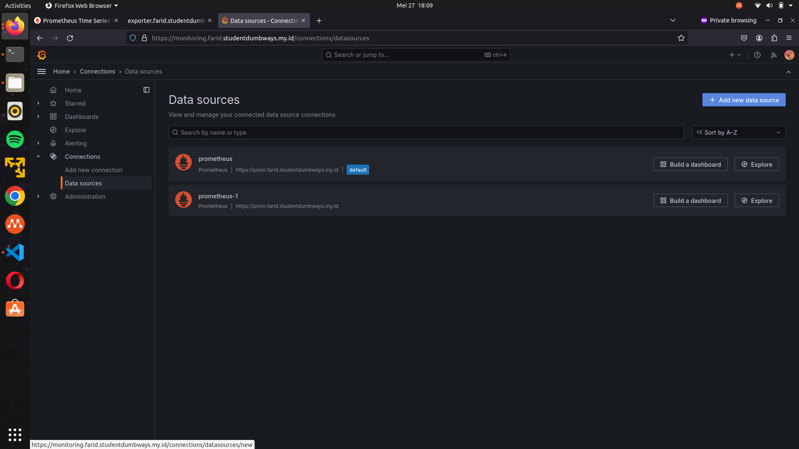
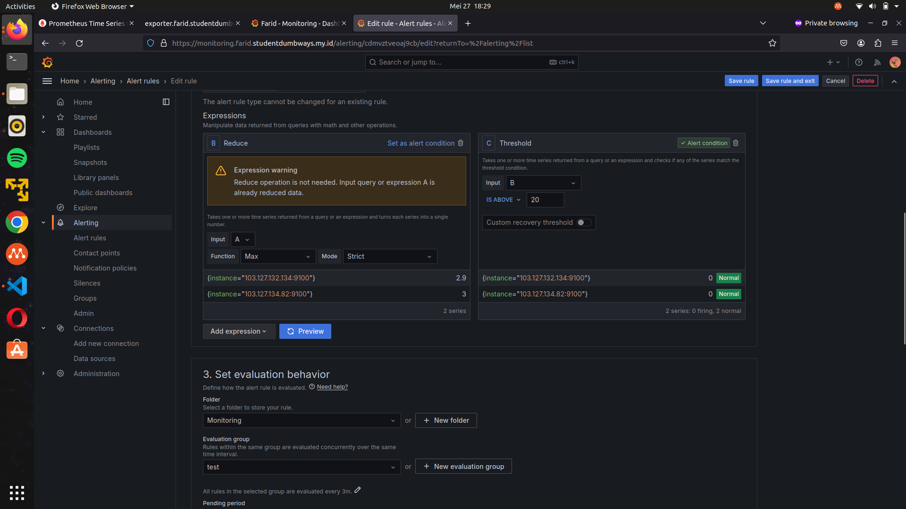

# Monitoring

## Setup node-exporter, prometheus dan Grafana menggunakan docker

### 1. Buat File ```docker-compose.yml```

buat directory terlebih dahulu supaya rapih dan buat file ```docker-compose.yml``` dan lakukan konfigurasi untuk node exporter, prometheus, dan grafana di server app-server

```
volumes:
  prometheus_data: {}

services:
  node-exporter:
    image: prom/node-exporter:latest
    container_name: node-exporter
    restart: unless-stopped
    volumes:
      - /proc:/host/proc:ro
      - /sys:/host/sys:ro
      - /:/rootfs:ro
    command:
      - '--path.procfs=/host/proc'
      - '--path.rootfs=/rootfs'
      - '--path.sysfs=/host/sys'
      - '--collector.filesystem.mount-points-exclude=^/(sys|proc|dev|host|etc)($$|/)'
    ports:
      - '9100:9100'
    networks:
      - farid

  prometheus:
    image: prom/prometheus:latest
    container_name: prometheus
    restart: unless-stopped
    volumes:
      - ./prometheus.yml:/etc/prometheus/prometheus.yml
      - prometheus_data:/prometheus
    command:
      - '--config.file=/etc/prometheus/prometheus.yml'
      - '--storage.tsdb.path=/prometheus'
      - '--web.console.libraries=/etc/prometheus/console_libraries'
      - '--web.console.templates=/etc/prometheus/consoles'
      - '--web.enable-lifecycle'
    ports:
      - '9090:9090'
    networks:
      - farid


  grafana:
    image: grafana/grafana:latest
    container_name: grafana
    restart: unless-stopped
    ports:
     - '3001:3000'
    user: root
    volumes:
     - ./grafana/provisioning/datasources:/etc/grafana/provisioning/datasources
     - ./grafana/data:/var/lib/grafana
    networks:
      - farid


networks:
  farid:
```

### 3. Buat File ```prometheus.yml``` di directory grafana yg sudah kita buat di server app-server

Buat File ```prometheus.yml``` dan targetkan node exporter tiap-tiap server

```
global:
  scrape_interval: 10s

scrape_configs:
  
  - job_name: 'prometheus'
    static_configs:
      - targets:
          - 103.127.134.82:9100 ###ip server app-server

  - job_name: 'node'
    static_configs:
      - targets:
          - 103.127.134.82:9100 ###appserver
          - 103.127.132.134:9100 ###gateway


```

dan buat directory baru di server gateway dan buat file docker-compose.yaml di server gateway untuk install node-exporter

```

volumes: 
  prometheus_data: {}

services:
  node-exporter:
    image: prom/node-exporter:latest
    container_name: node-exporter
    restart: unless-stopped
    volumes:
      - /proc:/host/proc:ro
      - /sys:/host/sys:ro
      - /:/rootfs:ro
    command:
      - '--path.procfs=/host/proc'
      - '--path.rootfs=/rootfs'
      - '--path.sysfs=/host/sys'
      - '--collector.filesystem.mount-points-exclude=^/(sys|proc|dev|host|etc)($$|/)'
    ports:
      - '9100:9100'


```

### 4. Jalankan docker compose up

jalankan di server gateway dengan command : docker compose up -d


server appserver : docker compose up -d


## Reverse Proxy

### menggunakan SSL secara wildcart menggunakan certbot dengan membuat docker-compose-webserver.yaml

```

services:
  webserver:
    container_name: nginx
    image: nginx:alpine
    ports:
      - "80:80"
      - "443:443"
    restart: always
    volumes:
      - ./nginx/conf:/etc/nginx/conf.d
      - ./certbot/www/:/var/www/certbot
      - ./certbot/conf/:/etc/letsencrypt
    networks:
      - farid


  certbot:
    container_name: certbot
    image: certbot/dns-cloudflare:latest
    volumes:
      - ./certbot/certbot.ini:/etc/letsencrypt/renewal/renewal.conf:ro
      - ./certbot/www/:/var/www/certbot
      - ./certbot/conf/:/etc/letsencrypt
    command: [
      "certonly",
      "--non-interactive",
      "--dns-cloudflare",
      "--dns-cloudflare-credentials",
      "/etc/letsencrypt/renewal/renewal.conf",
      "--email", "adipatiaslam28@gmail.com.com", ###email
      "--agree-tos",
      "--no-eff-email",
      "--server", "https://acme-v02.api.letsencrypt.org/directory",
      "--domain", "*.farid.studentdumbways.my.id", ###nama domain
      "--domain", "farid.studentdumbways.my.id"
    ]
    networks:
      - farid
networks:
  farid:


```

### 2. buat file ```rproxy.conf``` untuk domain yg ditugaskan

menuju direktori ```/etc/nginx/conf/``` dan buat file  ```rproxy.conf``` dan lakukan konfigurasu seperti berikut

```
server {
        listen 80;
        server_name exporter.farid.studentdumbways.my.id;

        location /.well-known/acme-challenge/ {
           root  /var/www/certbot;
        }

        location / {
           return 301 https://$host$request_uri;
        }
}

server {
        listen 443 ssl;
        server_name exporter.farid.studentdumbways.my.id;

        ssl_certificate /etc/letsencrypt/live/farid.studentdumbways.my.id/fullchain.pem;
        ssl_certificate_key /etc/letsencrypt/live/farid.studentdumbways.my.id/privkey.pem;

        location / {
                proxy_pass http://103.127.132.134:9100;
        }
}


server {
        listen 80;
        server_name prom.farid.studentdumbways.my.id;

        location /.well-known/acme-challenge/ {
           root  /var/www/certbot;
        }

        location / {
           return 301 https://$host$request_uri;
        }
}

server {
        listen 443 ssl;
        server_name prom.farid.studentdumbways.my.id;

        ssl_certificate /etc/letsencrypt/live/farid.studentdumbways.my.id/fullchain.pem;
        ssl_certificate_key /etc/letsencrypt/live/farid.studentdumbways.my.id/privkey.pem;

        location / {
                proxy_pass http://103.127.134.82:9090;
        }
}

server {
        listen 80;
        server_name monitoring.farid.studentdumbways.my.id;

        location /.well-known/acme-challenge/ {
           root  /var/www/certbot;
        }

        location / {
           return 301 https://$host$request_uri;
        }
}

server {
        listen 443 ssl;
        server_name monitoring.farid.studentdumbways.my.id;

        ssl_certificate /etc/letsencrypt/live/farid.studentdumbways.my.id/fullchain.pem;
        ssl_certificate_key /etc/letsencrypt/live/farid.studentdumbways.my.id/privkey.pem;

        location / {
                proxy_pass http://103.127.134.82:3001;
                proxy_set_header Host $host;
                proxy_set_header X-Real-IP $remote_addr;
                proxy_set_header X-Forwarded-For $proxy_add_x_forwarded_for;
                proxy_set_header X-Forwarded-Proto $scheme;
        }
}
```

dan hasilnya semua DNS yang direverse proxy dalam keadaan secure atau https:


## Grafana

### 1. login ke grafana dengan username dan password admin


### 2. menambahkan data source


### pilih data sources


### 3. Membuat dashboard


#### 1. CPU Usage

masukkan promql berikut


```
  100 - (avg by(instance)(irate(node_cpu_seconds_total{mode="idle"}[1h]))*100)
```

Dalam rumus ini:

Rumus ini dapat diartikan sebagai 100 dikurangi dengan persentase rata-rata waktu CPU dalam mode 'idle' dalam satu jam terakhir. Semakin tinggi nilai hasil rumus, semakin sedikit waktu CPU yang dihabiskan dalam mode 'idle', yang mungkin mengindikasikan tingkat beban CPU yang lebih tinggi.

#### 2. RAM Usage

masukkan promql berikut
```
 100  *  (  1  -  ((avg_over_time(node_memory_MemFree_bytes[10m])  +  avg_over_time(node_memory_Cached_bytes[10m])+  avg_over_time(node_memory_Buffers_bytes[10m]))  /  avg_over_time(node_memory_MemTotal_bytes[10m])))
```
Rumus ini dapat diartikan sebagai persentase penggunaan memori terhadap total kapasitas memori yang tersedia dalam interval waktu 10 menit terakhir. Semakin tinggi nilai hasil rumus, semakin tinggi penggunaan memori terhadap kapasitas total yang tersedia.

#### 3. Disk Usage


masukkan promql berikut

```
(1 - (avg(node_filesystem_free_bytes) by (instance) / avg(node_filesystem_size_bytes) by (instance))) * 100
```

dalam rumus ini:

- avg(node_filesystem_free_bytes) by (instance): Mengambil rata-rata ruang disk yang tersedia untuk setiap instance.
- avg(node_filesystem_size_bytes) by (instance): Mengambil rata-rata total kapasitas disk untuk setiap instance.
- (1 - ...) * 100: Menghitung persentase penggunaan disk dengan menghitung perbandingan antara ruang disk yang tersedia dan total kapasitas disk, lalu mengonversinya ke dalam persen.

### 4. Membuat Alert

##### 1. menambahkan contact poin


##### 2. Membuat Alert Rules

- CPU Usage Over 20%





- RAM Usage Over 75%


#### Hasilnya akan mengirimkan alert secara otomatis
