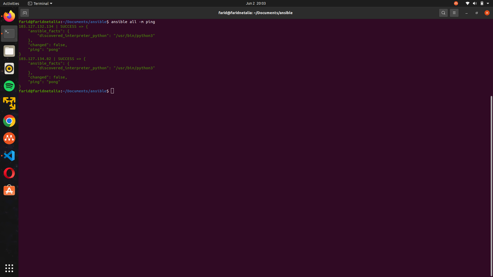

# Ansible

Ansible adalah sebuah platform open-source yang digunakan untuk otomatisasi tugas-tugas IT, manajemen konfigurasi, dan penyebaran aplikasi. Dikembangkan oleh Ansible, Inc. (sekarang dimiliki oleh Red Hat), Ansible menyediakan cara yang sederhana dan efisien untuk mengotomatisasi tugas-tugas di lingkungan IT, seperti manajemen server, konfigurasi perangkat lunak, penyebaran aplikasi, dan tugas-tugas lainnya.

## 1. Install Ansible

untuk install ansible di ubuntu dapat memasukkan perintah berikut

```
$ sudo apt update
$ sudo apt install software-properties-common
$ sudo add-apt-repository --yes --update ppa:ansible/ansible
$ sudo apt install ansible
```


### 2. Buat File ```Inventory``` dan ```ansible.cfg```

Buat Direktori baru dan buat File ```Inventory``` dan ```ansible.cfg```
```
mkdir ansible
```
Inventory

```
[appserver]
103.127.132.82

[gateway]
103.127.132.134

[all:vars]
ansible_user="farid"
```


ansible.cfg
```
[defaults]

inventory = Inventory
private_key_file = /home/farid/.ssh/id_rsa
host_key_checking = False
interpreter_python = auto_silent
```


### 3. Salin ```id_rsa.pub``` local ke ```authorized_keys``` appserver dan gateway

buka file ```id_rsa.pub``` dan salin
```
cat ~/.ssh/id_rsa.pub
```


setelah disalin paste ke file ```authorized_keys``` appserver dan gateway
```
cd ~/.ssh
```
```
vim athorized_keys
```

test ping
```
ansible all -m ping
```




### 4. Membuat User baru

membuat ```create-user.yml```
```
- hosts: appserver
  become: true
  tasks:

    - name: "buat user di app server serlin"
      ansible.builtin.user:
        name: serlin1
        password: '$1$SomeSalt$2aO932zlQ7II8jURoMLPx1' ###serlin18
        groups: sudo
        append: yes
        shell: /bin/bash
        home: /home/serlin1
        state: present

    - name: "buat .ssh nya"
      file:
        path: /home/serlin1/.ssh
        state: directory
        owner: serlin1
        group: serlin1
        mode: "0700"1


    - name: "buat authorized_keys"
      ansible.legacy.copy:
        src: ~farid/.ssh/id_rsa.pub
        dest: /home/serlin1/.ssh/authorized_keys
        owner: serlin1
        mode: "0600"

    - name: setup sshd config
      lineinfile:
        path: /etc/ssh/sshd_config
        regexp: 'PasswordAuthentication no'
        line: 'PasswordAuthentication yes'
      loop:
        - /etc/ssh/sshd_config
        - /etc/ssh/sshd_config.d/50-cloud-init.conf

- hosts: gateway
  become: true
  tasks:

    - name: "buat user di app server serlin"
      ansible.builtin.user:
        name: serlin1
        password: '$1$SomeSalt$2aO932zlQ7II8jURoMLPx1' ###serlin18
        groups: sudo
        append: yes
        shell: /bin/bash
        home: /home/serlin1
        state: present

    - name: "buat .ssh nya"
      file:
        path: /home/serlin1/.ssh
        state: directory
        owner: serlin1
        group: serlin1
        mode: "0700"


    - name: "buat authorized_keys"
      ansible.legacy.copy:
        src: ~farid/.ssh/id_rsa.pub
        dest: /home/serlin1/.ssh/authorized_keys
        owner: serlin1
        mode: "0600"

    - name: setup sshd config
      lineinfile:
        path: /etc/ssh/sshd_config
        regexp: 'PasswordAuthentication no'
        line: 'PasswordAuthentication yes'
      loop:
        - /etc/ssh/sshd_config
        - /etc/ssh/sshd_config.d/50-cloud-init.conf
```

```
ansible-playbook create-user.yml
```


### 5. instalasi docker di appserver dan gateway

buat file ```docker.yml``` (ini kondisi jika sudah ada docker di vm kita) dan konfigurasinya seperti berikut
```
- become: true
  gather_facts: false
  hosts: appserver
  tasks:

    - name: Check if Docker is installed
      command: docker --version
      register: docker_version
      ignore_errors: true

    - name: Install Docker if not already installed
      apt:
        name:
          - apt-transport-https
          - ca-certificates
          - curl
          - gnupg-agent
          - software-properties-common
      when: docker_version.rc != 0

    - name: Docker GPG Key
      apt_key:
        id: 0EBFCD88
        url: https://download.docker.com/linux/ubuntu/gpg
      when: docker_version.rc != 0


    - name: Docker Repository
      apt_repository:
        repo: "deb [arch=amd64] https://download.docker.com/linux/ubuntu jammy stable"
      when: docker_version.rc != 0


    - name: Docker Engine
      apt:
        update-cache: true
        name:
          - docker-ce
          - docker-ce-cli
          - containerd.io
          - docker-compose-plugin
          - docker-buildx-plugin
          - docker-scan-plugin
      when: docker_version.rc != 0


    - name: add user docker group
      shell: sudo usermod -aG docker serlin1
      when: docker_version.rc != 0

- become: true
  gather_facts: false
  hosts: gateway
  tasks:

    - name: Check if Docker is installed
      command: docker --version
      register: docker_version
      ignore_errors: true

    - name: Docker Dependencies
      apt:
        update_cache: true
        name:
          - ca-certificates
          - curl
          - gnupg
          - lsb-release
      when: docker_version.rc != 0

    - name: Docker GPG Key
      apt_key:
        url: https://download.docker.com/linux/ubuntu/gpg
      when: docker_version.rc != 0


    - name: Docker Repository
      apt_repository:
        repo: "deb [arch=amd64] https://download.docker.com/linux/ubuntu jammy stable"
      when: docker_version.rc != 0


    - name: Docker Engine
      apt:
        update-cache: true
        name:
          - docker-ce
          - docker-ce-cli
          - containerd.io
          - docker-compose-plugin
          - docker-buildx-plugin
          - docker-scan-plugin
      when: docker_version.rc != 0


    - name: add user docker group
      shell: sudo usermod -aG docker serlin1
      when: docker_version.rc != 0
```

#### Jalankan Node Exporter, Prometheus, Grafana

Node Exporter adalah sebuah perangkat lunak open-source yang digunakan untuk mengumpulkan dan mengekspor metrik-metrik sistem dari sebuah host. Node Exporter dirancang khusus untuk bekerja dengan Prometheus, yang merupakan sistem pemantauan dan pengumpulan data open-source. 

buat file node-exporter.yml dan konfigurasi seperti berikut

```
- become: true
  gather_facts: false
  hosts: appserver
  tasks:

    - name: "buat dir "
      file:
        path: /home/serlin1/monitoring
        state: directory
        owner: serlin1
        group: serlin1
        mode: 0700

    - name: "copy docker compose"
      copy:
        src: /home/farid/monitoring/docker-compose.yaml
        dest: /home/serlin1/monitoring/docker-compose.yaml
        owner: serlin1
        group: serlin1

    - name: "copy prometheus.yaml"
      copy:
        src: /home/farid/monitoring/prometheus.yml
        dest: /home/serlin1/monitoring/prometheus.yml
        owner: serlin1
        group: serlin1

    - name: "deploy"
      shell: cd /home/serlin1/monitoring/ && docker compose up -d


- become: true
  gather_facts: false
  hosts: gateway
  tasks:

    - name: "buat dir "
      file:
        path: /home/serlin1/monitoring
        state: directory
        owner: serlin1
        group: serlin1
        mode: 0700

    - name: "copy docker compose"
      copy:
        src: /home/farid/monitoring/docker-compose-exporter.yaml
        dest: /home/serlin1/monitoring/docker-compose-exporter.yaml
        owner: serlin1
        group: serlin1
        mode: 0700

    - name: "deploy"
      shell: cd /home/serlin1/monitoring/ && docker compose -f docker-compose-exporter.yaml up -d
```

```
ansible-playbook node-exporter.yml
```


#### Prometheus

Prometheus adalah sistem pemantauan dan pengumpulan data open-source yang dirancang untuk memantau kesehatan dan kinerja sistem dan layanan di lingkungan IT. 

membuat ```prometheus.yml```
```
global:
  scrape_interval: 10s

scrape_configs:
  
  - job_name: 'prometheus'
    static_configs:
      - targets:
          - 103.127.134.82:9100

  - job_name: 'node'
    static_configs:
      - targets:
          - 103.127.134.82:9100
          - 103.127.132.134:9100

```


#### Frontend

```
- hosts: gateway
  become: true
  tasks:

    - name: "buat dir "
      file:
        path: /home/serlin1/monitoring
        state: directory
        owner: serlin1
        group: serlin1
        mode: 0700

    - name: "upload docker compose"
      copy:
        src: /home/farid/monitoring/docker-compose-frontend.yaml
        dest: /home/serlin1/monitoring/docker-compose-frontend.yaml
        owner: serlin1
        group: serlin1
        mode: 0664

    - name: "jalankan docker compose tersebut"
      shell: cd /home/serlin1/monitoring/ && docker compose -f docker-compose-frontend.yaml up -d

```


```
ansible-playbook frontend.yml
```


#### Reverse Proxy

Buat ```rproxy.conf``` menggunakan SSL yg sudah kita gunakan pada materi sebelum nya.

```
server {
        listen 80;
        server_name exporter.farid.studentdumbways.my.id;

        location /.well-known/acme-challenge/ {
           root  /var/www/certbot;
        }

        location / {
           return 301 https://$host$request_uri;
        }
}

server {
        listen 443 ssl;
        server_name exporter.farid.studentdumbways.my.id;

        ssl_certificate /etc/letsencrypt/live/farid.studentdumbways.my.id/fullchain.pem;
        ssl_certificate_key /etc/letsencrypt/live/farid.studentdumbways.my.id/privkey.pem;

        location / {
                proxy_pass http://103.127.132.134:9100;
        }
}


server {
        listen 80;
        server_name prom.farid.studentdumbways.my.id;

        location /.well-known/acme-challenge/ {
           root  /var/www/certbot;
        }

        location / {
           return 301 https://$host$request_uri;
        }
}

server {
        listen 443 ssl;
        server_name prom.farid.studentdumbways.my.id;

        ssl_certificate /etc/letsencrypt/live/farid.studentdumbways.my.id/fullchain.pem;
        ssl_certificate_key /etc/letsencrypt/live/farid.studentdumbways.my.id/privkey.pem;

        location / {
                proxy_pass http://103.127.134.82:9090;
        }
}

server {
        listen 80;
        server_name monitoring.farid.studentdumbways.my.id;

        location /.well-known/acme-challenge/ {
           root  /var/www/certbot;
        }

        location / {
           return 301 https://$host$request_uri;
        }
}

server {
        listen 443 ssl;
        server_name monitoring.farid.studentdumbways.my.id;

        ssl_certificate /etc/letsencrypt/live/farid.studentdumbways.my.id/fullchain.pem;
        ssl_certificate_key /etc/letsencrypt/live/farid.studentdumbways.my.id/privkey.pem;

        location / {
                proxy_pass http://103.127.134.82:3001;
                proxy_set_header Host $host;
                proxy_set_header X-Real-IP $remote_addr;
                proxy_set_header X-Forwarded-For $proxy_add_x_forwarded_for;
                proxy_set_header X-Forwarded-Proto $scheme;
        }
}

```

buat file ```nginx.yml```

```
- become: true
  gather_facts: false
  hosts: gateway
  tasks:

    - name: "buat dir ssl"
      file:
        path: /home/serlin1/ssl
        state: directory
        owner: serlin1
        group: serlin1
        mode: 0700

    - name: "copy docker compose"
      copy:
        src: /home/farid/monitoring/docker-compose-webserver.yaml
        dest: /home/serlin1/ssl/docker-compose-webserver.yaml
        owner: serlin1
        group: serlin1
        mode: 0700

    - name: "copy cloudflare.ini"
      copy:
        src: /home/farid/monitoring/certbot.ini
        dest: /home/serlin1/ssl/certbot.ini
        owner: serlin1
        group: serlin1
        mode: 0400

    - name: "copy nginx.conf"
      copy:
        src: /home/farid/monitoring/nginx.conf
        dest: /home/serlin1/ssl/nginx.conf
        owner: serlin1
        group: serlin1
        mode: 0664

    - name: "deploy"
      shell: cd /home/serlin1/ssl/ && docker compose -f docker-compose-webserver.yaml up -d
```

```
ansible-playbook nginx.yml
```


