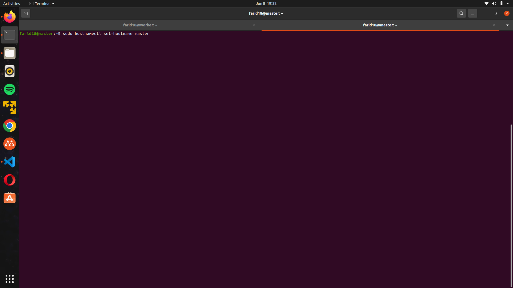
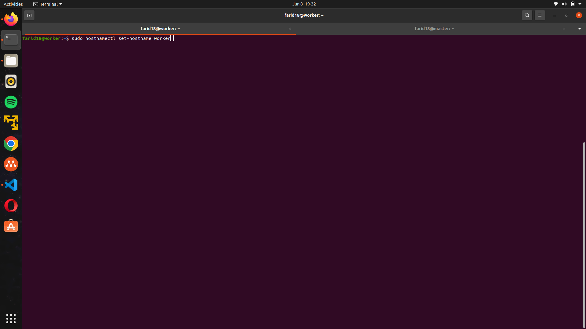
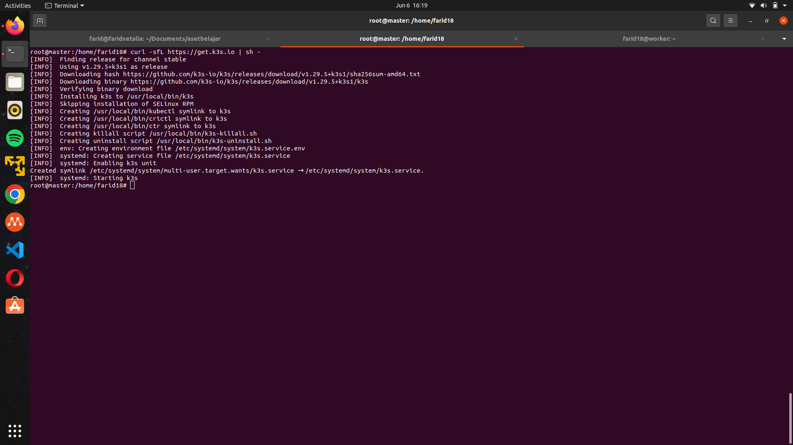
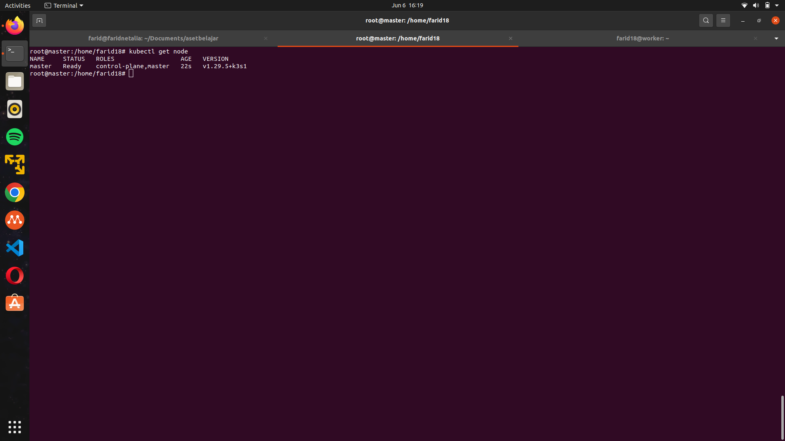
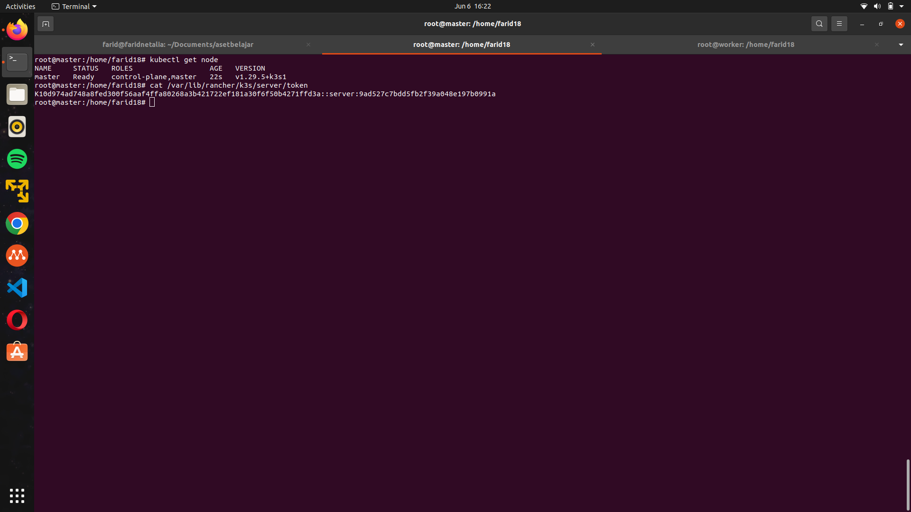
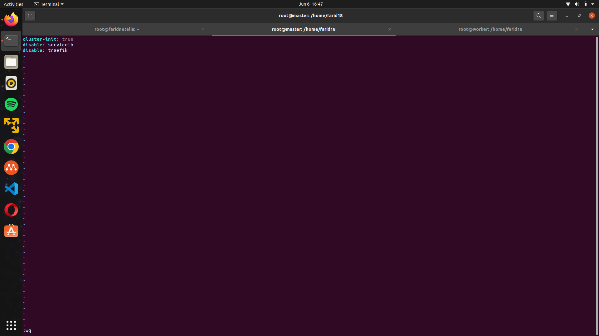
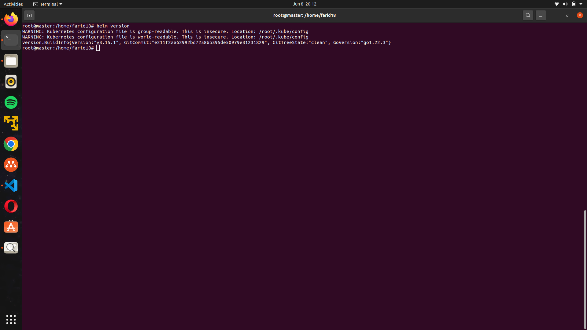
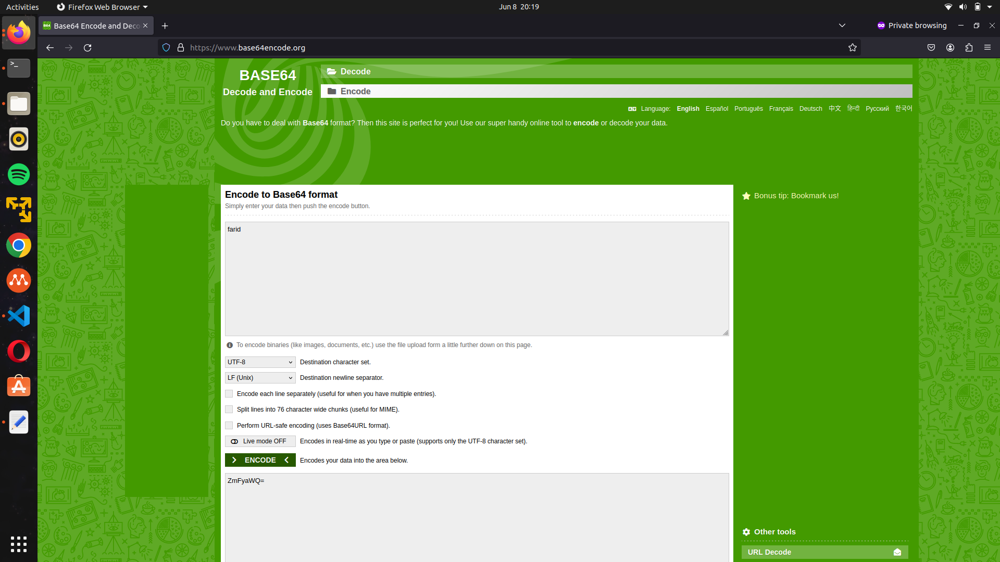
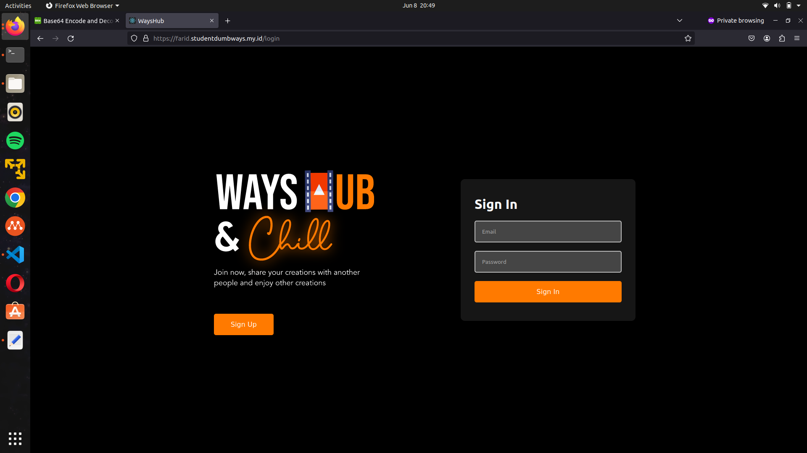
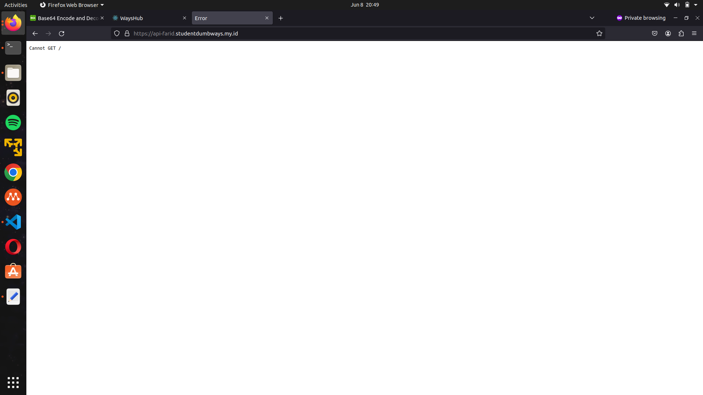

# Kubernetes

Kubernetes adalah sistem orkestrasi kontainer open-source yang mengotomatiskan pemasangan, skala, dan pengelolaan aplikasi kontainer. Kubernetes menangani kompleksitas operasi sehingga Anda dapat menskalakan beban kerja dan mengelola deployment kontainer di beberapa server. 

## Membuat sebuah cluster menggunakan k3s yang berisikan 2 node as a master and worker.

1.Mengubah hostname

```server appserver```
```
sudo hostnamectl set-hostname master
```
```server gateway```
```
sudo hostnamectl set-hostname worker
```



2. masuk ke root agar tidak perlu mengubah perizinan dan melakukan download ```k3s```

```
curl -sfL https://get.k3s.io | sh -
```


3. cek k3s jika sudah terinstall

```
kubectl get node
```



4. copy token k3s untuk menambahkan k3s agent

```
cat /var/lib/rancher/k3s/server/token
```



5. menginstall k3s di node worker

```
curl -sfL https://get.k3s.io | K3S_URL={$IP_NODE_MASTER:6433} K3S_TOKEN={$TOKEN} sh -
```


6. cek k3s jika sudah terinstall

```
kubectl get node -o wide
```


## Install ingress nginx using helm

1. menonaktifkan webserver default dari k3s yaitu ```traefik``` dan load balancing


```node master```
```
nano /etc/rancher/k3s/config.yaml
```
```
cluster-init: true
disable: servicelb
disable: traefik
```
```
systemctl restart k3s
```

```node worker```
```
nano /etc/rancher/node/config.yaml
```
```
disable: servicelb
disable: traefik
```
```
systemctl restart k3s-agent
```

2. instal nginx menggunakan Helm

```
# Ubuntu

curl https://baltocdn.com/helm/signing.asc | gpg --dearmor | sudo tee /usr/share/keyrings/helm.gpg > /dev/null

sudo apt-get install apt-transport-https --yes

echo "deb [arch=$(dpkg --print-architecture) signed-by=/usr/share/keyrings/helm.gpg] https://baltocdn.com/helm/stable/debian/ all main" | sudo tee /etc/apt/sources.list.d/helm-stable-debian.list

sudo apt-get update

sudo apt-get install helm
```


## Ingress Configuration

tambahkan repo helm nya
```
# add repo nginx
helm repo add ingress-nginx https://kubernetes.github.io/ingress-nginx
helm repo update

# install
helm install ingress-nginx ingress-nginx/ingress-nginx

# verify
kubectl get pods -n default -l app.kubernetes.io/name=ingress-nginx
```
## setup secrets

untuk menyimpan variable secara aman kita wajib menggunakan fitur kubernetes secret. variable nya terlebih dahulu kita encode base64 sebelum kita menaruhnya di file secret.yaml nya.



```yaml
apiVersion: v1
kind: Secret
metadata:
  name: mysql-secret
type: Opaque
data:
  mysql-root-password: cGFzc3dvcmQ= # base64 encoded 'password'
  mysql-user: dXNlcg== # base64 encoded 'user'
  mysql-password: cGFzc3dvcmQ= # base64 encoded 'password'
```

setelah variable sudah siap kita jalankan perintah kubectl untuk menggaplikasikan secret service tersebut

```bash
# apply
kubectl apply -f secret.yaml

# cek
kubectl get -n namespace secret
```


## Setup pvc

PVC, atau Persistent Volume Claim, adalah konsep dalam Kubernetes yang digunakan untuk mengelola penyimpanan persisten dalam klaster.

1. buat file ```pvc.yaml```

```
apiVersion: v1
kind: PersistentVolumeClaim
metadata:
  name: pvc
spec:
  storageClassName: local-path
  resources:
    requests:
      storage: 1Gi
  accessModes:
    - ReadWriteOnce
```
2. edit ```config.yaml``` yang ada di node master dan worker dan tambahkan default local path
```
default-local-storage-path: /mnt/disk1  
```

3. apply pvc
```
kubectl apply -f pvc.yaml
```
nantinya servicebpvc dalam status pending dan menunggu firstconsumer

4. membuat ```pod.yml``` untuk membuat firstconsumer untuk pvc

```
apiVersion: v1
kind: Pod
metadata:
  name: pod
spec:
  containers:
  - name: pod
    image: nginx:alpine
    imagePullPolicy: Always
    volumeMounts:
    - name: vol 
      mountPath: /data
    ports:
      - containerPort: 80
  volumes:
  - name: vol
    persistentVolumeClaim:
      claimName: pvc
```

## Deploy mysql with pvc
buat file ```mysql.yaml```
```
apiVersion: apps/v1
kind: StatefulSet
metadata:
  name: mysql
spec:
  serviceName: "mysql"
  replicas: 1
  selector:
    matchLabels:
      app: mysql
  template:
    metadata:
      labels:
        app: mysql
    spec:
      containers:
        - name: mysql
          image: mysql:5.7
          ports:
            - containerPort: 3306
          env:
            - name: MYSQL_ROOT_PASSWORD
              valueFrom:
                secretKeyRef:
                  name: mysql-secret
                  key: mysql-root-password
            - name: MYSQL_USER
              valueFrom:
                secretKeyRef:
                  name: mysql-secret
                  key: mysql-user
            - name: MYSQL_PASSWORD
              valueFrom:
                secretKeyRef:
                  name: mysql-secret
                  key: mysql-password
          volumeMounts:
            - name: mysql-persistent-storage
              mountPath: /var/lib/mysql
  volumeClaimTemplates:
    - metadata:
        name: mysql-persistent-storage
      spec:
        accessModes: ["ReadWriteOnce"]
        resources:
          requests:
            storage: 1Gi

```

```
kubectl apply -f mysql.yaml
```

## deploy aplikasi frontend dan backend

```yaml
apiVersion: apps/v1
kind: Deployment
metadata:
  name: frontend
spec:
  replicas: 1
  selector:
    matchLabels:
      app: backend
  template:
    metadata:
      labels:
        app: backend
    spec:
      containers:
        - name: backend
          image: your-frontend-image:latest
          ports:
            - containerPort: 3000
---
apiVersion: v1
kind: Service
metadata:
  name: backend
spec:
  selector:
    app: backend
  ports:
    - protocol: TCP
      port: 3000
      targetPort: 3000
```

tiggal apply saja sama seperti biasanya dan cek pod running nya..

cek juga di browser


```yaml
apiVersion: apps/v1
kind: Deployment
metadata:
  name: backend
spec:
  replicas: 1
  selector:
    matchLabels:
      app: backend
  template:
    metadata:
      labels:
        app: backend
    spec:
      containers:
        - name: backend
          image: your-backend-image:latest
          ports:
            - containerPort: 5000
---
apiVersion: v1
kind: Service
metadata:
  name: backend
spec:
  selector:
    app: backend
  ports:
    - protocol: TCP
      port: 5000
      targetPort: 5000
```



buat file ingress-fronend.yaml

```
apiVersion: networking.k8s.io/v1
kind: Ingress
metadata:
  name: frontend-ingress
  annotations:
    kubernetes.io/ingress.class: "nginx"
    nginx.ingress.kubernetes.io/rewrite-target: /
spec:
  rules:
  - host: farid.studentdumbways.my.id
    http:
      paths:
      - path: /
        pathType: Prefix
        backend:
          service:
            name: frontend
            port:
              number: 3000
```
buat file service-frontend.yaml

```
apiVersion: v1
kind: Service
metadata:
  name: frontend-external
spec:
  type: LoadBalancer 
  ports:
  - port: 3000
    targetPort: 3000
  selector:
    app: frontend
```
dan buat juga file ingress-backend.yaml

```
apiVersion: networking.k8s.io/v1
kind: Ingress
metadata:
  name: backend-ingress
  annotations:
    kubernetes.io/ingress.class: "nginx"
    nginx.ingress.kubernetes.io/rewrite-target: /
spec:
  rules:
  - host: api-farid.studentdumbways.my.id
    http:
      paths:
      - path: /
        pathType: Prefix
        backend:
          service:
            name: backend
            port:
              number: 5000
```
juga buat service-backend.yaml

```
apiVersion: v1
kind: Service
metadata:
  name: backend-external
spec:
  type: LoadBalancer 
  ports:
  - port: 5000
    targetPort: 5000
  selector:
    app: backend
```
tinggal di aplly saja nanti aplikasi kita bisa running dan berjalan lancar dengan menggunkan https protokol


