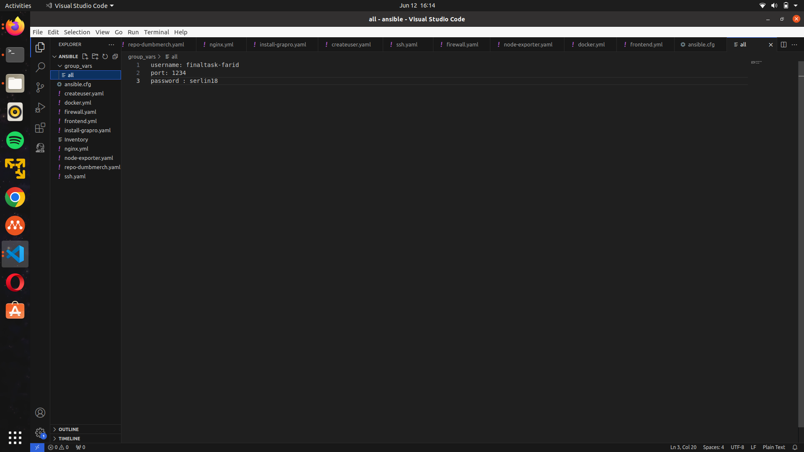

# Provisioning


**Requirements**

-   Local machine w/ Ansible & Terraform
-   Biznet GIO NEO Lite Servers
    -   Appserver - 2 CPU, 2GB RAM
    -   Gateway - 1 CPU, 1GB RAM

**Instructions**

-   Attach SSH keys & IP configuration to all VMs
-   Server Configuration using Ansible:

[ _All Servers_ ]

-   Docker Engine
-   Node Exporter

[ _Appserver_ ]

-   git repo (dumbmerch)
-   Prometheus & Grafana

[ _Gateway_ ]

-   NGINX/Apache2/Lightspeed
-   Reverse Proxy
-   Wildcard SSL Certificate

-----------------------------------------------------------------------------------

## Server Configuration using Ansible 
1. Install Ansible on local computer refers this docs https://docs.ansible.com/ansible/latest/installation_guide/installation_distros.html

2. Attach the SSH Key on every servers, use the same SSH Key

3. Adding the config ssh                                          

5. Configuration ansible environment
	- Hosts
	
	-  ansible.cfg
	
	-  group_vars/all
	
6. Buat user ansible playbook
```sh
- hosts: all
  become: true

  tasks:

    - name: Create user 'finaltask-farid'
      user:
        name: finaltask-farid
        password: '$1$SomeSalt$2aO932zlQ7II8jURoMLPx1' ###serlin18
        shell: /bin/bash
        groups: sudo
        state: present
        system: true
        createhome: yes

    - name: Setup Auth Pubkey sshd_config
      lineinfile:
        path: /etc/ssh/sshd_config
        regexp: '^#?Port 22'
        line: 'Port 1234'
      notify: Restart SSH Service

    - name: Setup Auth Pubkey sshd_config
      lineinfile:
        path: /etc/ssh/sshd_config
        regexp: '^#?PubkeyAuthentication no'
        line: 'PubkeyAuthentication yes'
      notify: Restart SSH Service

    - name: Setup File Cloud-Init sshd_config
      lineinfile:
        path: /etc/ssh/sshd_config.d/50-cloud-init.conf
        line: 'PubkeyAuthentication yes'
        backup: yes
      notify: Restart SSH Service

    - name: Make directory .ssh
      file:
        path: /home/finaltask-farid/.ssh
        state: directory
        owner: finaltask-farid
        group: finaltask-farid
        mode: "0700"

    - name: "buat authorized_keys"
      ansible.legacy.copy:
        src: /home/farid/.ssh/id_rsa.pub
        dest: /home/finaltask-farid/.ssh/authorized_keys
        owner: finaltask-farid
        group: finaltask-farid
        mode: "0600"

    - name: Restart SSH Service
      service:
        name: ssh
        state: restarted
```
7. Setup ssh ansible playbook

	```sh
	- hosts: all
	  become: true
	  tasks:

	  - name: Change port SSH
	    lineinfile:
	      path: /etc/ssh/sshd_config
	      state: present
	      regexp: 'Port 22'
	      line: 'Port 1234'

	  - name: UFW - Allow SSH connections
	    community.general.ufw:
	      rule: allow
	      port: '1234'


	  - name: UFW - Enable and deny by default
	    community.general.ufw:
	      state: enabled
	      default: deny        
	  
	  - name: "reload sshd"
	    ansible.builtin.systemd_service:
	      name: sshd
	      state: reloaded
	  
	```
8. Install docker ansible playbook
	```sh
	- name: install docker
	  hosts: all
	  become: true
	  tasks:
	  
	  - name: update 
	    apt: 
	      update_cache: yes
	  
	  - name: upgrade
	    apt:
	      upgrade: dist

	  - name: install docker dependencies
	    apt:
	      name:
	        - apt-transport-https
	        - ca-certificates
	        - curl
	        - gnupg-agent
	        - software-properties-common
	      update_cache: yes

	  - name: add docker gpg key
	    apt_key:
	      url: https://download.docker.com/linux/ubuntu/gpg
	      state: present
	      keyring: /etc/apt/keyrings/docker.gpg
	  - name: add docker repository
	    apt_repository:
	      filename: docker 
	      repo: deb [arch=amd64 signed-by=/etc/apt/keyrings/docker.gpg] https://download.docker.com/linux/ubuntu jammy stable
	      state: present
	  - name: install docker engine
	    apt:
	      name:
	        - docker-ce
	        - docker-ce-cli
	        - containerd.io
	        - docker-buildx-plugin
	        - docker-scan-plugin
	        - docker-compose-plugin
	      update_cache: yes

	  - name: update
	    shell: sudo apt update

	  - name: install docker-compose
	    shell: sudo curl -L "https://github.com/docker/compose/releases/download/1.29.2/docker-compose-$(uname -s)-$(uname -m)" -o /usr/local/bin/docker-compose

	  - name: set permission for docker
	    shell: sudo chmod +x /usr/local/bin/docker-compose

	  - name: setup docker command without sudo
	    shell: sudo usermod -aG docker {{username}}
	```
9. Install node exporter ansible playbook

```
  become: true
  gather_facts: false
  hosts: all
  tasks:

    - name: "buat directory"
      file:
        path: /home/finaltask-farid/monitoring
        state: directory
        owner: finaltask-farid
        group: finaltask-farid
        mode: 0700

    - name: "copy docker compose"
      copy:
        src: /home/farid/monitoring/docker-compose-exporter.yaml
        dest: /home/finaltask-farid/monitoring/docker-compose-exporter.yaml
        owner: finaltask-farid
        group: finaltask-farid
        mode: 0664

    - name: "deploy"
      shell: cd /home/finaltask-farid/monitoring/ && docker compose -f docker-compose-exporter.yaml up -d
```
	
### Appserver
#### git repo (dumbmerch)

buat file repo-dumbmerch.yml dan konfigurasi seperti berikut
```
---
- become: true
  gather_facts: false
  hosts: {{appserver}}
  tasks:
    - name: Clone Git Repository fe-dumbmerch
      git:
        repo: https://github.com/demo-dumbways/fe-dumbmerch
        dest: /home/{{username}}/fe-dumbmerch
    - name: Clone Git Repository be-dumbmerch
      git:
        repo: https://github.com/demo-dumbways/be-dumbmerch
        dest: /home/{{username}}/be-dumbmerch
```

```
ansible-playbook repo-dumbmerch.yml
```

#### Prometheus dan Grafana

buat file konfigurasi prometheus yang berfungsi menampung data dari node exporter dari server appserver dan gateway
```
---
global:
  scrape_interval: 10s

scrape_configs:
  
  - job_name: 'prometheus'
    static_configs:
      - targets:
          - 103.127.134.82:9100

  - job_name: 'node'
    static_configs:
      - targets:
          - 103.127.134.82:9100
          - 103.127.132.134:9100

  - job_name: 'cadvisor'
    static_configs:
      - targets:
          - 103.127.134.82:8080
          - 103.127.132.134:8080

```

buat file install-prometheusgrafana.yml dan konfigurasi seperti berikut
```
- become: true
  gather_facts: false
  hosts: 103.127.134.82
  tasks:

    - name: buat dir
      file:
        path: /home/{{username}}/monitoring
        state: directory
        owner: "{{username}}"
        group: "{{username}}"
        mode: 0700

    - name: "copy docker compose"
      copy:
        src: /home/farid/monitoring/docker-compose.yml
        dest: /home/{{username}}/monitoring/docker-compose.yml
        owner: "{{username}}"
        group: "{{username}}"

    - name: "copy prometheus.yaml"
      copy:
        src: /home/farid/monitoring/prometheus.yml
        dest: /home/{{username}}/monitoring/prometheus.yml
        owner: "{{username}}"
        group: "{{username}}"

    - name: "deploy"
      shell: cd /home/{{username}}/monitoring/ && docker compose up -d
```

```
ansible-playbook install-prometheusgrafana.yml
```
### Gateway
#### Nginx

buat file konfigurasi reverse proxy ```proxy.conf```

```
server {
        listen 80;
        server_name farid.studentdumbways.my.id;

        location /.well-known/acme-challenge/ {
           root  /var/www/certbot;
        }

        location / {
           return 301 https://$host$request_uri;
        }
}

server {
        listen 443 ssl;
        server_name farid.studentdumbways.my.id;

        ssl_certificate /etc/letsencrypt/live/farid.studentdumbways.my.id/fullchain.pem;
        ssl_certificate_key /etc/letsencrypt/live/farid.studentdumbways.my.id/privkey.pem;

        location / {
                proxy_pass http://103.127.132.134:3000;
        }
}

server {
        listen 80;
        server_name exporter.farid.studentdumbways.my.id;

        location /.well-known/acme-challenge/ {
           root  /var/www/certbot;
        }

        location / {
           return 301 https://$host$request_uri;
        }
}

server {
        listen 443 ssl;
        server_name exporter.farid.studentdumbways.my.id;

        ssl_certificate /etc/letsencrypt/live/farid.studentdumbways.my.id/fullchain.pem;
        ssl_certificate_key /etc/letsencrypt/live/farid.studentdumbways.my.id/privkey.pem;

        location / {
                proxy_pass http://103.127.132.134:9100;
        }
}


server {
        listen 80;
        server_name prom.farid.studentdumbways.my.id;

        location /.well-known/acme-challenge/ {
           root  /var/www/certbot;
        }

        location / {
           return 301 https://$host$request_uri;
        }
}

server {
        listen 443 ssl;
        server_name prom.farid.studentdumbways.my.id;

        ssl_certificate /etc/letsencrypt/live/farid.studentdumbways.my.id/fullchain.pem;
        ssl_certificate_key /etc/letsencrypt/live/farid.studentdumbways.my.id/privkey.pem;

        location / {
                proxy_pass http://103.127.134.82:9090;
        }
}

server {
        listen 80;
        server_name monitoring.farid.studentdumbways.my.id;

        location /.well-known/acme-challenge/ {
           root  /var/www/certbot;
        }

        location / {
           return 301 https://$host$request_uri;
        }
}

server {
        listen 443 ssl;
        server_name monitoring.farid.studentdumbways.my.id;

        ssl_certificate /etc/letsencrypt/live/farid.studentdumbways.my.id/fullchain.pem;
        ssl_certificate_key /etc/letsencrypt/live/farid.studentdumbways.my.id/privkey.pem;

        location / {
                proxy_pass http://103.127.134.82:3001;
                proxy_set_header Host $host;
                proxy_set_header X-Real-IP $remote_addr;
                proxy_set_header X-Forwarded-For $proxy_add_x_forwarded_for;
                proxy_set_header X-Forwarded-Proto $scheme;
        }
}


```

buat file ```nginx.yml``` dan konfigurasi seperti berikut

```
---
- become: true
  gather_facts: false
  hosts: 103.127.132.134
  tasks:


    - name: "buat dir webserver"
      file:
        path: /home/{{username}}/webserver
        state: directory
        owner: "{{username}}"
        group: "{{username}}"
        mode: 0700

    - name: "buat dir certbot"
      file:
        path: /home/{{username}}/webserver/certbot
        state: directory
        owner: "{{username}}"
        group: "{{username}}"
        mode: 0700

    - name: "buat dir nginx"
      file:
        path: /home/{{username}}/webserver/nginx/
        state: directory
        owner: "{{username}}"
        group: "{{username}}"
        mode: 0700

    - name: "buat dir conf"
      file:
        path: /home/{{username}}/webserver/nginx/conf
        state: directory
        owner: "{{username}}"
        group: "{{username}}"
        mode: 0700

    - name: "copy docker compose"
      copy:
        src: /home/farid/monitoring/docker-compose-webserver.yaml
        dest: /home/{{username}}/webserver/docker-compose-webserver.yaml
        owner: "{{username}}"
        group: "{{username}}"
        mode: 0700

    - name: "copy nginx.conf"
      copy:
        src: /home/farid/monitoring/nginx.conf
        dest: /home/{{username}}/webserver/nginx/conf/nginx.conf
        owner: "{{username}}"
        group: "{{username}}"
        mode: 0664

    - name: copy certbot.ini
      copy:
        src: /home/farid/monitoring/certbot.ini
        dest: /home/{{username}}/webserver/certbot
        mode: 0664


    - name: "deploy"
      shell: cd /home/{{username}}/webserver/ && docker compose -f docker-compose-webserver.yaml up -d
```

#### SSL 

buat file untuk credential dns cloudflare
```
dns_cloudflare_email = "adipatiaslam28@gmail.com"

dns_cloudflare_api_key = "112e95decd6ee528e63d8d83911d249bcef26"

server = https://acme-v02.api.letsencrypt.org/directory
```