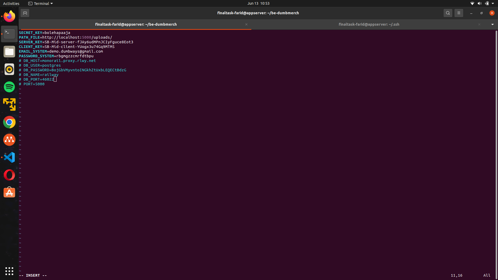

# Repository

**Requirements**

-   Personal Github/GitLab accounts
-   Frontend :  [fe-dumbmerch](https://github.com/demo-dumbways/fe-dumbmerch)
    -   NodeJS v16.x or above
    -   Create .env file for FE+BE Integration (REACT_APP_BASEURL)
-   Backend :  [be-dumbmerch](https://github.com/demo-dumbways/be-dumbmerch)
    -   Golang v1.16.x or above
    -   Modify .env file for DB Integration

**Instructions**

-   Create a repository on Github or Gitlab
-   **Private**  repository access
-   Set up 2 branches
    -   Staging
    -   Production
-   Each Branch have their own CI/CD

---
## Edit the source code menggunakan railway.com
**Backend**
1. Clone source code to the Appserver 
2. Modify .env file for DB Integration
```
SECRET_KEY=bolehapaaja
PATH_FILE=http://localhost:5000/uploads/
SERVER_KEY=SB-Mid-server-fJAy6udMPnJCIyFguce8Eot3
CLIENT_KEY=SB-Mid-client-YUogx3u74Gq9MTMS
EMAIL_SYSTEM=demo.dumbways@gmail.com
PASSWORD_SYSTEM=rbgmgzzcmrfdtbpu
# DB_HOST={ip appserver}
# DB_USER=farid
# DB_PASSWORD=farid
# DB_NAME=dumbmerch
# DB_PORT=5432
# PORT=5000
```


**Frontend**
1. Clone source code to the Appserver
2. Create .env file for FE-BE Integration
```sh
	REACT_APP_BASEURL=https://api.farid.studentdumbways.my.id/api/v1
```
## Push Repository
1. buka halaman ```new project ```


2. Kemudian pilih ```Create Blank Project```
- Projectname diisi ```be-dumbmerch```
- Visibility Private

3. Tambahkan SSH keys di gitlab menggunakan id_rsa.pub
jika belum ada/karena rebuild server kita bisa menggunakan command:
```
ssh-keygen
```
untuk mendapatkan id_rsa.pub server kita.
lalu masukan perintah pada terminal:
```
ssh -T git@gitlab.com
```

4. masuk ke terminal dan lakukan perintah ini untuk push file ke gitlab
```
cd be-dumbmerch
git init --initial-branch=main
git remote add origin git@gitlab.com:FaridAslam/be-dumbmerch.git
git add .
git commit -m "Initial commit"
git push --set-upstream origin main
```


5. Klik ikon + lalu klik ```new branch``` untuk menambahkan branch baru seperti branch staging dan production


6. lakukan hal yang sama untuk frontend

