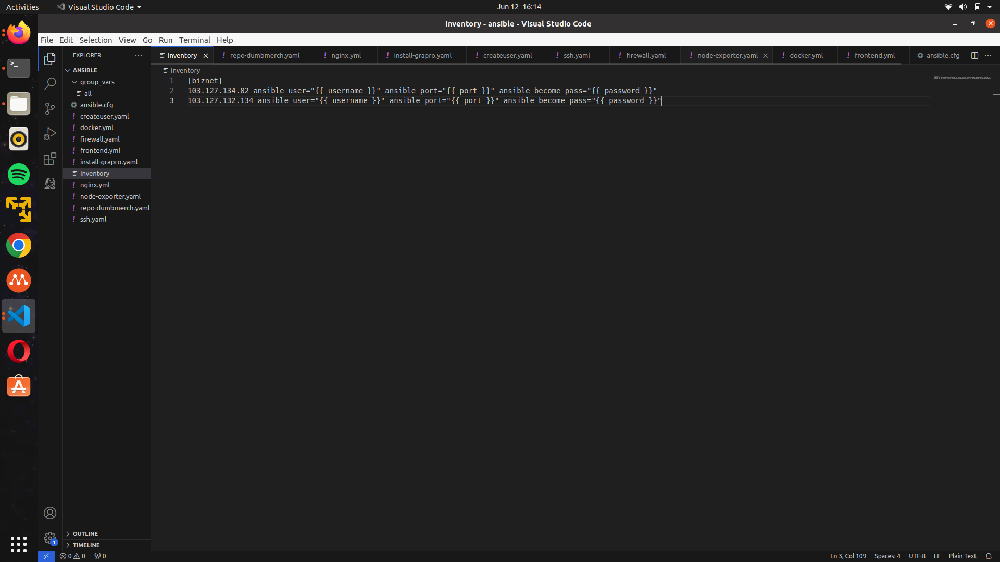
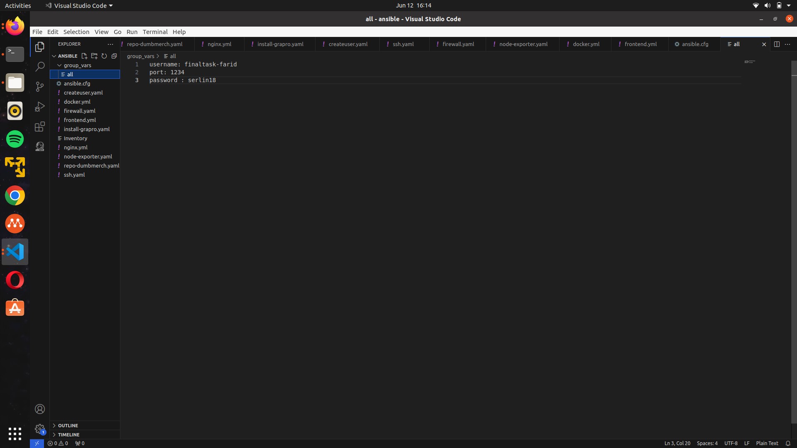

# Server Management





## Membuat User baru

manajement server di lakukan di ansible dengan membuat file ```new-user.yml```

```
- hosts: all
  become: true

  tasks:

    - name: Create user 'finaltask-farid'
      user:
        name: finaltask-farid
        password: '$1$SomeSalt$2aO932zlQ7II8jURoMLPx1' ###serlin18
        shell: /bin/bash
        groups: sudo
        state: present
        system: true
        createhome: yes

    - name: Setup Auth Pubkey sshd_config
      lineinfile:
        path: /etc/ssh/sshd_config
        regexp: '^#?Port 22'
        line: 'Port 1234'
      notify: Restart SSH Service

    - name: Setup Auth Pubkey sshd_config
      lineinfile:
        path: /etc/ssh/sshd_config
        regexp: '^#?PubkeyAuthentication no'
        line: 'PubkeyAuthentication yes'
      notify: Restart SSH Service

    - name: Setup File Cloud-Init sshd_config
      lineinfile:
        path: /etc/ssh/sshd_config.d/50-cloud-init.conf
        line: 'PubkeyAuthentication yes'
        backup: yes
      notify: Restart SSH Service

    - name: Make directory .ssh
      file:
        path: /home/finaltask-farid/.ssh
        state: directory
        owner: finaltask-farid
        group: finaltask-farid
        mode: "0700"

    - name: "buat authorized_keys"
      ansible.legacy.copy:
        src: /home/farid/.ssh/id_rsa.pub
        dest: /home/finaltask-farid/.ssh/authorized_keys
        owner: finaltask-farid
        group: finaltask-farid
        mode: "0600"

    - name: Restart SSH Service
      service:
        name: ssh
        state: restarted
```

## Setup Firewall

setup firewall dilakukan di ansible dengan membuat file ```firewall.yml```

```
---
- become: true
  gather_facts: false
  hosts: gateway
  tasks:
    - name: install firewall
      apt:
        name: ufw
        update_cache: yes
        state: latest
    - name: enable ufw
      community.general.ufw:
        state: enabled
        policy: allow
    - name: rules
      community.general.ufw:
        rule: allow
        proto: tcp
        port: "{{ item }}"
      with_items:
      - 22
      - 80
      - 443
      - 1234
      - 3000
      - 3001
      - 5000
      - 9090
      - 9100
      - 8080
    - name: enable ufw
      community.general.ufw:
        state: reloaded
        policy: allow
```
```
ansible-playbook firewall.yml
```