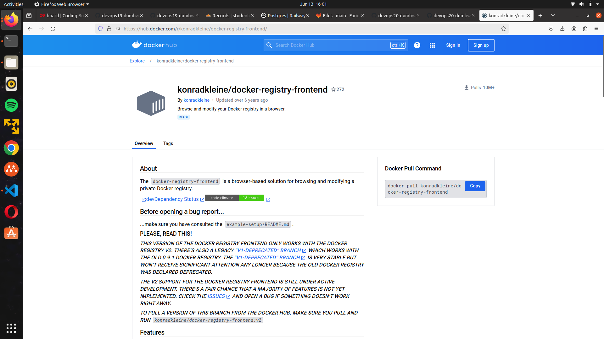
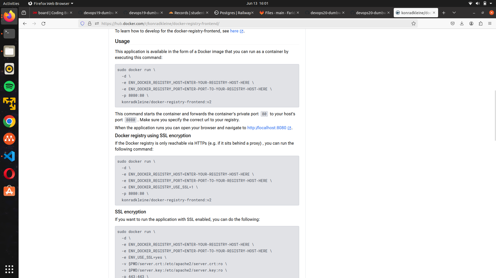

# Docker Private Registry
**Requirements**

-   Docker Registry Private

**Instructions**

[ _Docker Registry_ ]

-   Deploy Docker Registry Private on Registry Server

## Buat docker compose file
- Buat folder name registry dan buat docker-compose-registry.yaml
```sh
version: '3'

services:
    docker-registry:
        container_name: registry.farid.studentdumbways.my.id
        image: registry:2
        ports:
            - 5000:5000
        restart: always
        volumes:
            - ./volume-reg:/var/lib/registry

    docker-registry-ui:
        container_name: docker-registry-ui
        image: konradkleine/docker-registry-frontend:v2
        ports:
            - 8080:80
        environment:
            ENV_DOCKER_REGISTRY_HOST: registry.farid.studentdumbways.my.id
            ENV_DOCKER_REGISTRY_PORT: 5000
```
- reference :




## Buat reverse proxy
- Create reverse proxy into webserver
```sh
server {
        listen 80;
        server_name registry.farid.studentdumbways.my.id;

        location /.well-known/acme-challenge/ {
           root  /var/www/certbot;
        }

        location / {
           return 301 https://$host$request_uri;
        }
}

server {
        listen 443 ssl;
        server_name registry.farid.studentdumbways.my.id;

        ssl_certificate /etc/letsencrypt/live/farid.studentdumbways.my.id/fullchain.pem;
        ssl_certificate_key /etc/letsencrypt/live/farid.studentdumbways.my.id/privkey.pem;

        location / {
                proxy_pass http://103.127.134.82:8080/;
                proxy_set_header Host $host;
                proxy_set_header X-Real-IP $remote_addr;
                proxy_set_header X-Forwarded-For $proxy_add_x_forwarded_for;
                proxy_set_header X-Forwarded-Proto $scheme;
        }
}

server {
        listen 80;
        server_name registry.farid.studentdumbways.my.id;

        location /.well-known/acme-challenge/ {
           root  /var/www/certbot;
        }

        location / {
           return 301 https://$host$request_uri;
        }
}

server {
        listen 443 ssl;
        server_name registry.farid.studentdumbways.my.id;

        ssl_certificate /etc/letsencrypt/live/farid.studentdumbways.my.id/fullchain.pem;
        ssl_certificate_key /etc/letsencrypt/live/farid.studentdumbways.my.id/privkey.pem;

        location / {
                proxy_pass http://103.127.134.82:5000/;
                proxy_set_header Host $host;
                proxy_set_header X-Real-IP $remote_addr;
                proxy_set_header X-Forwarded-For $proxy_add_x_forwarded_for;
                proxy_set_header X-Forwarded-Proto $scheme;
        }
}

```


## Push image 
```
# Tag the images
docker tag faridaslam/dmbackend registry.farid.studentdumbways.my.id/faridaslam/dmbackend:2.0
docker tag faridaslam/dmfrontend registry.farid.studentdumbways.my.id/faridaslam/dmfrontend:1.0

# Log in to the private registry
docker login registry.farid.studentdumbways.my.id

# Push the images
docker push registry.farid.studentdumbways.my.id/faridaslam/dmbackend:2.0
docker push registry.farid.studentdumbways.my.id/faridaslam/dmfrontend:1.0
```


