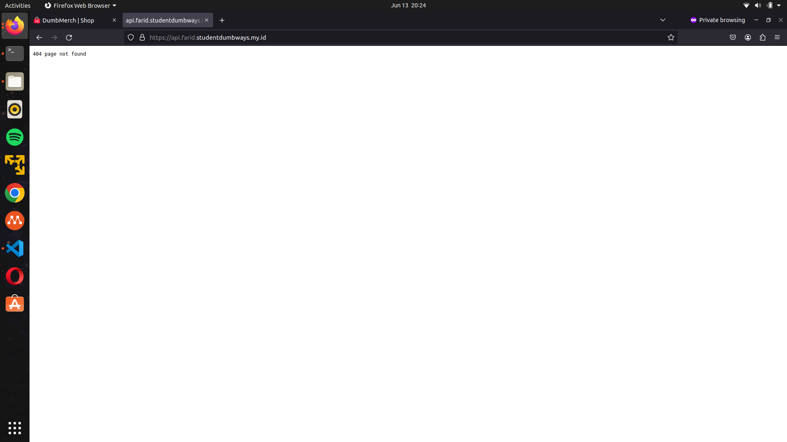

# Deployment
**Requirements**

-   Deployments on top Docker
-   Frontend :  [fe-dumbmerch](https://github.com/demo-dumbways/fe-dumbmerch)
-   Backend :  [be-dumbmerch](https://github.com/demo-dumbways/be-dumbmerch)

**Instructions**

[ _Database_ ]

-   App database using  _PostgreSQL_
-   Deploy postgresql on top docker
-   Set the volume location in  `/home/$USER/`
-   Allow database to remote from another server

[ _Application_ ]

-   Create a Docker image for frontend & backend
-   Staging: A lightweight docker image (as small as possible)
-   Production: Deploy a production ready app
-   Building Docker image on every environment using docker multistage build
-   Create load balancing for frontend and backend

## Database setup
- Buat directory baru database, lalu buat docker compose.yaml
	```sh

	services:
	  database:
	    container_name: postgres
	    image: postgres:14
	    ports:
	      - 5432:5432
	    volumes:
	      - ~/apps/postgres:/var/lib/postgresql/data
	    env_file:
	      - var.env

	  pgadmin:
	    container_name: pgadmin4
	    image: dpage/pgadmin4
	    restart: always
	    env_file:
	      - admin.env
	    ports:
	      - 5050:80
	```
- buat file .env nya di directory database

	├── admin.env

	└── var.env

	```sh
	#var.env
	POSTGRES_PASSWORD=XXXXX
	POSTGRES_USER=farid
	POSTGRES_DB=dumbmerch

	#admin.env
	PGADMIN_DEFAULT_EMAIL: admin@admin.com
	PGADMIN_DEFAULT_PASSWORD: root

	```

## 2. Create a Docker image for frontend

1. Masuk ke direktori fe
```
cd ~/fe-dumbmerch/
```

2. Membuat ```Dockerfile```
```
 # First stage - Building the application
 FROM node:16-alpine AS build

 WORKDIR /app

 COPY . .

 RUN npm install

 # Second stage - Serve the application
 FROM node:16-alpine

 WORKDIR /app

 COPY --from=build /app .

 EXPOSE 3000

 CMD ["npm", "start"]
```

3.Mengubah variable dari ```.env``` nya agar mengintegerasikan frontend dengan backendnya
```
REACT_APP_BASEURL=https://api.farid.studentdumbways.my.id/api/v1
```

4. Build Image

Melakukan build image dengan melakukan perintah
```
docker build -t faridaslam/dmfrontend:1.0 .
```


## 3. Create a Docker image for backend

1. Masuk ke direktori be
```
cd ~/be-dumbmerch/
```

2. Membuat ```Dockerfile```

```
FROM golang:1.19-alpine as build

WORKDIR /app    

COPY . .

RUN go build -o go-docker

FROM golang:1.19-alpine

WORKDIR /app
 
COPY --from=build /app .

EXPOSE 5000

CMD ["./go-docker"]
```

3.Mengubah variable dari ```.env``` nya agar mengintegerasikan backend dengan database
```
SECRET_KEY=bolehapaaja
PATH_FILE=http://localhost:5000/uploads/
SERVER_KEY=SB-Mid-server-fJAy6udMPnJCIyFguce8Eot3
CLIENT_KEY=SB-Mid-client-YUogx3u74Gq9MTMS
EMAIL_SYSTEM=demo.dumbways@gmail.com
PASSWORD_SYSTEM=rbgmgzzcmrfdtbpu
DB_HOST={ip appserver}
DB_USER=farid
DB_PASSWORD=farid
DB_NAME=dumbmerch
DB_PORT=5432
PORT=5000
```


4. Build Image

 Melakukan build image dengan melakukan perintah
```
docker build -t faridaslam/dmbackend:1.0 .
```
 

## 4. Create Docker compose file

-  Membuat file ```docker-compose.yml``` di directory be-dumbmerch
```
services:
  backend:
    container_name: be
    image: faridaslam/dmbackend:1.0
    ports:
      - "5001:5000"

```

-  Menjalankan docker compose backend
```
docker compose up -d
```

-  Membuat file ```docker-compose.yml``` di directory fe-dumbmerch
```
services:
  frontend:
    container_name: fe
    image: faridaslam/frontend:1.0
    ports:
      - "3000:5000"

```

-  Menjalankan docker compose
```
docker-compose up -d
````

- coba login psql lewat terminal, apakah sudah ada database nya atau belum :

```
psql -h 103.127.134.82 -p 30432 -U farid -d dumbmerch
```
```
- lalu ubah user yg sudah di register menjadi admin :
```
SELECT * FROM users;
```
lalu ketik command :
```
UPDATE users SET status = 'admin' WHERE id = 2;
```


Aplikasi Berhasil di deploy dan dapat berjalan dengan lancar bisa melakukan login dan register



