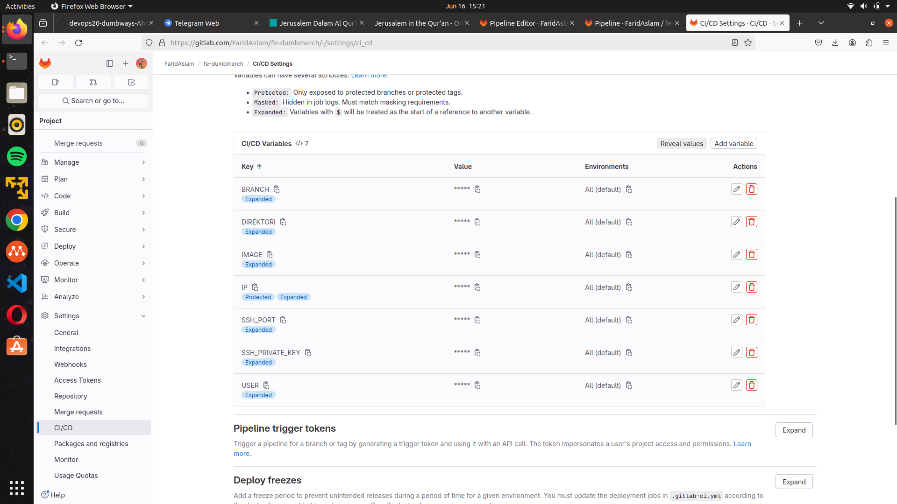
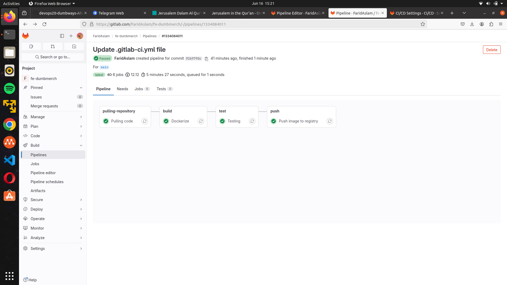
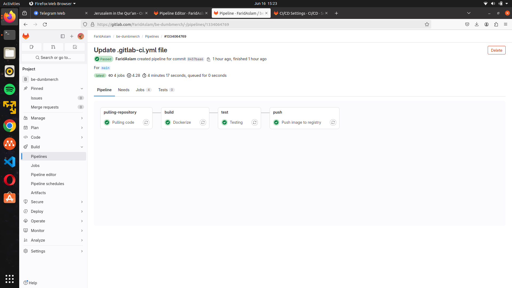

-----
# **CICD**
-----

## TASK

**Before you start the task, please read this:**
- Please screenshot the command step-by-step
- Describe the process in your final task repository

**Requirements**
- CI/CD with Jenkins

**Instructions**

[ *CI/CD* ]

- Using Jenkins, create a pipeline running:
   - Repository pull
   - Image build
   - Testing
   - Push Image into your own docker registry private
   - SSH into your biznet server
   - Pull image from docker registry private
   - Redeploy your deployment apps
 
-----

# CICD

## 1. Frontend

1. Buat variable pada repositori yang ingin di gunakan ```Settings -> CI/CD -> Variables```



2. Membuat file ```.gitlab-ci.yml``` pada Pipeline Editor di branch staging dan production

```staging```

```
 stages:
   - pulling-repository
   - build
   - test
   - push

 variables:
   USER: 'finaltask-farid'
   IP: '103.127.134.82'
   DIREKTORI: '/home/finaltask-farid/be-dumbmerch'
   SSH_PORT: '1234'
   BRANCH: 'Staging'
   IMAGE: 'registry.farid.studentdumbways.my.id/dmbackend:4.0'

 Pulling code:
   stage : pulling-repository
   image: docker
   services:
     - docker:dind
   before_script:
     - 'which ssh-agent || ( apt-get install -qq openssh-client )'
     - mkdir -p ~/.ssh
     - touch ~/.ssh/id_rsa
     - echo "$SSH_PRIVATE_KEY" | tr -d '\r' > ~/.ssh/id_rsa
     - chmod 600 ~/.ssh/id_rsa
     - echo -e "Host *\nStrictHostKeyChecking no\n" > ~/.ssh/config
     - eval "$(ssh-agent -s)"
     - ssh-add ~/.ssh/id_rsa


   script :
     - ssh -o StrictHostKeyChecking=no $USER@$IP -p $SSH_PORT "cd $DIREKTORI && git pull origin Staging && exit"
     - echo "pulling code success!"

 Dockerize:
   stage : build
   image: docker
   services:
     - docker:dind
   before_script:
     - 'which ssh-agent || ( apt-get install -qq openssh-client )'
     - mkdir -p ~/.ssh
     - touch ~/.ssh/id_rsa
     - echo "$SSH_PRIVATE_KEY" | tr -d '\r' > ~/.ssh/id_rsa
     - chmod 600 ~/.ssh/id_rsa
     - echo -e "Host *\nStrictHostKeyChecking no\n" > ~/.ssh/config
     - eval "$(ssh-agent -s)"
     - ssh-add ~/.ssh/id_rsa


   script : 
     - ssh -o StrictHostKeyChecking=no $USER@$IP -p $SSH_PORT "cd $DIREKTORI && docker build -t $IMAGE ."
     - ssh -o StrictHostKeyChecking=no $USER@$IP -p $SSH_PORT "cd $DIREKTORI && cd ../be-dumbmerch && docker compose down backend"
     - ssh -o StrictHostKeyChecking=no $USER@$IP -p $SSH_PORT "cd $DIREKTORI && cd ../be-dumbmerch && docker compose up -d && exit "
     - echo "building application success!"

 Testing:
   stage : test
   image: docker
   services:
     - docker:dind
   before_script:
     - 'which ssh-agent || ( apt-get install -qq openssh-client )'
     - mkdir -p ~/.ssh
     - touch ~/.ssh/id_rsa
     - echo "$SSH_PRIVATE_KEY" | tr -d '\r' > ~/.ssh/id_rsa
     - chmod 600 ~/.ssh/id_rsa
     - echo -e "Host *\nStrictHostKeyChecking no\n" > ~/.ssh/config
     - eval "$(ssh-agent -s)"
     - ssh-add ~/.ssh/id_rsa

   script : 
     - ssh -o StrictHostKeyChecking=no $USER@$IP -p $SSH_PORT "cd $DIREKTORI"
     - ssh -o StrictHostKeyChecking=no $USER@$IP -p $SSH_PORT "curl localhost:5000"
     - echo "testing application success!"

 Push image to registry:
   stage : push
   image: docker
   services:
     - docker:dind
   before_script:
     - 'which ssh-agent || ( apt-get install -qq openssh-client )'
     - mkdir -p ~/.ssh
     - touch ~/.ssh/id_rsa
     - echo "$SSH_PRIVATE_KEY" | tr -d '\r' > ~/.ssh/id_rsa
     - chmod 600 ~/.ssh/id_rsa
     - echo -e "Host *\nStrictHostKeyChecking no\n" > ~/.ssh/config
     - eval "$(ssh-agent -s)"
     - ssh-add ~/.ssh/id_rsa


   script : 
     - ssh -o StrictHostKeyChecking=no $USER@$IP -p $SSH_PORT "docker push $IMAGE && exit"
     - echo "Push image to registry success!"
```



```production```

```
 stages:
   - pulling-repository
   - build
   - test
   - push
   - pull docker registry

 variables:
   USER: 'finaltask-farid'
   IP: '103.127.134.82'
   DIREKTORI: '/home/finaltask-farid/be-dumbmerch'
   SSH_PORT: '1234'
   BRANCH: 'Production'
   IMAGE: 'registry.farid.studentdumbways.my.id/dmbackend:4.0'

 Pulling code:
   stage : pulling-repository
   image: docker
   services:
     - docker:dind
   before_script:
     - 'which ssh-agent || ( apt-get install -qq openssh-client )'
     - mkdir -p ~/.ssh
     - touch ~/.ssh/id_rsa
     - echo "$SSH_PRIVATE_KEY" | tr -d '\r' > ~/.ssh/id_rsa
     - chmod 600 ~/.ssh/id_rsa
     - echo -e "Host *\nStrictHostKeyChecking no\n" > ~/.ssh/config
     - eval "$(ssh-agent -s)"
     - ssh-add ~/.ssh/id_rsa


   script :
     - ssh -o StrictHostKeyChecking=no $USER@$IP -p $SSH_PORT "cd $DIREKTORI && git pull origin Staging && exit"
     - echo "pulling code success!"

 Dockerize:
   stage : build
   image: docker
   services:
     - docker:dind
   before_script:
     - 'which ssh-agent || ( apt-get install -qq openssh-client )'
     - mkdir -p ~/.ssh
     - touch ~/.ssh/id_rsa
     - echo "$SSH_PRIVATE_KEY" | tr -d '\r' > ~/.ssh/id_rsa
     - chmod 600 ~/.ssh/id_rsa
     - echo -e "Host *\nStrictHostKeyChecking no\n" > ~/.ssh/config
     - eval "$(ssh-agent -s)"
     - ssh-add ~/.ssh/id_rsa


   script : 
     - ssh -o StrictHostKeyChecking=no $USER@$IP -p $SSH_PORT "cd $DIREKTORI && docker build -t $IMAGE ."
     - ssh -o StrictHostKeyChecking=no $USER@$IP -p $SSH_PORT "cd $DIREKTORI && cd ../be-dumbmerch && docker compose down backend"
     - ssh -o StrictHostKeyChecking=no $USER@$IP -p $SSH_PORT "cd $DIREKTORI && cd ../be-dumbmerch && docker compose up -d && exit "
     - echo "building application success!"

 Testing:
   stage : test
   image: docker
   services:
     - docker:dind
   before_script:
     - 'which ssh-agent || ( apt-get install -qq openssh-client )'
     - mkdir -p ~/.ssh
     - touch ~/.ssh/id_rsa
     - echo "$SSH_PRIVATE_KEY" | tr -d '\r' > ~/.ssh/id_rsa
     - chmod 600 ~/.ssh/id_rsa
     - echo -e "Host *\nStrictHostKeyChecking no\n" > ~/.ssh/config
     - eval "$(ssh-agent -s)"
     - ssh-add ~/.ssh/id_rsa

   script : 
     - ssh -o StrictHostKeyChecking=no $USER@$IP -p $SSH_PORT "cd $DIREKTORI"
     - ssh -o StrictHostKeyChecking=no $USER@$IP -p $SSH_PORT "curl localhost:5000"
     - echo "testing application success!"

 Push image to registry:
   stage : push
   image: docker
   services:
     - docker:dind
   before_script:
     - 'which ssh-agent || ( apt-get install -qq openssh-client )'
     - mkdir -p ~/.ssh
     - touch ~/.ssh/id_rsa
     - echo "$SSH_PRIVATE_KEY" | tr -d '\r' > ~/.ssh/id_rsa
     - chmod 600 ~/.ssh/id_rsa
     - echo -e "Host *\nStrictHostKeyChecking no\n" > ~/.ssh/config
     - eval "$(ssh-agent -s)"
     - ssh-add ~/.ssh/id_rsa


   script : 
     - ssh -o StrictHostKeyChecking=no $USER@$IP -p $SSH_PORT "docker push $IMAGE && exit"
     - echo "Push image to registry success!"

Pulling code:
   stage : pull docker registry
   image: docker
   services:
     - docker:dind
   before_script:
     - 'which ssh-agent || ( apt-get install -qq openssh-client )'
     - mkdir -p ~/.ssh
     - touch ~/.ssh/id_rsa
     - echo "$SSH_PRIVATE_KEY" | tr -d '\r' > ~/.ssh/id_rsa
     - chmod 600 ~/.ssh/id_rsa
     - echo -e "Host *\nStrictHostKeyChecking no\n" > ~/.ssh/config
     - eval "$(ssh-agent -s)"
     - ssh-add ~/.ssh/id_rsa


   script :
     - ssh -o StrictHostKeyChecking=no $USER@$IP -p $SSH_PORT "docker pull registry.farid.studentdumbways.my.id:5000/faridaslam/dmfrontend:4/0  && exit"
     - echo "pulling image success!"
```


## 2. Backend

1. Buat variable pada repositori yang ingin di gunakan ```Settings -> CI/CD -> Variables```


2. Membuat file ```.gitlab-ci.yml``` pada Pipeline Editor di branch staging dan production

```staging```

```
 stages:
   - pulling-repository
   - build
   - test
   - push

 variables:
   USER: 'finaltask-farid'
   IP: '103.127.134.82'
   DIREKTORI: '/home/finaltask-farid/be-dumbmerch'
   SSH_PORT: '1234'
   BRANCH: 'Staging'
   IMAGE: 'registry.farid.studentdumbways.my.id/dmbackend:4.0'

 Pulling code:
   stage : pulling-repository
   image: docker
   services:
     - docker:dind
   before_script:
     - 'which ssh-agent || ( apt-get install -qq openssh-client )'
     - mkdir -p ~/.ssh
     - touch ~/.ssh/id_rsa
     - echo "$SSH_PRIVATE_KEY" | tr -d '\r' > ~/.ssh/id_rsa
     - chmod 600 ~/.ssh/id_rsa
     - echo -e "Host *\nStrictHostKeyChecking no\n" > ~/.ssh/config
     - eval "$(ssh-agent -s)"
     - ssh-add ~/.ssh/id_rsa


   script :
     - ssh -o StrictHostKeyChecking=no $USER@$IP -p $SSH_PORT "cd $DIREKTORI && git pull origin Staging && exit"
     - echo "pulling code success!"

 Dockerize:
   stage : build
   image: docker
   services:
     - docker:dind
   before_script:
     - 'which ssh-agent || ( apt-get install -qq openssh-client )'
     - mkdir -p ~/.ssh
     - touch ~/.ssh/id_rsa
     - echo "$SSH_PRIVATE_KEY" | tr -d '\r' > ~/.ssh/id_rsa
     - chmod 600 ~/.ssh/id_rsa
     - echo -e "Host *\nStrictHostKeyChecking no\n" > ~/.ssh/config
     - eval "$(ssh-agent -s)"
     - ssh-add ~/.ssh/id_rsa


   script : 
     - ssh -o StrictHostKeyChecking=no $USER@$IP -p $SSH_PORT "cd $DIREKTORI && docker build -t $IMAGE ."
     - ssh -o StrictHostKeyChecking=no $USER@$IP -p $SSH_PORT "cd $DIREKTORI && cd ../be-dumbmerch && docker compose down backend"
     - ssh -o StrictHostKeyChecking=no $USER@$IP -p $SSH_PORT "cd $DIREKTORI && cd ../be-dumbmerch && docker compose up -d && exit "
     - echo "building application success!"

 Testing:
   stage : test
   image: docker
   services:
     - docker:dind
   before_script:
     - 'which ssh-agent || ( apt-get install -qq openssh-client )'
     - mkdir -p ~/.ssh
     - touch ~/.ssh/id_rsa
     - echo "$SSH_PRIVATE_KEY" | tr -d '\r' > ~/.ssh/id_rsa
     - chmod 600 ~/.ssh/id_rsa
     - echo -e "Host *\nStrictHostKeyChecking no\n" > ~/.ssh/config
     - eval "$(ssh-agent -s)"
     - ssh-add ~/.ssh/id_rsa

   script : 
     - ssh -o StrictHostKeyChecking=no $USER@$IP -p $SSH_PORT "cd $DIREKTORI"
     - ssh -o StrictHostKeyChecking=no $USER@$IP -p $SSH_PORT "curl localhost:5000"
     - echo "testing application success!"

 Push image to registry:
   stage : push
   image: docker
   services:
     - docker:dind
   before_script:
     - 'which ssh-agent || ( apt-get install -qq openssh-client )'
     - mkdir -p ~/.ssh
     - touch ~/.ssh/id_rsa
     - echo "$SSH_PRIVATE_KEY" | tr -d '\r' > ~/.ssh/id_rsa
     - chmod 600 ~/.ssh/id_rsa
     - echo -e "Host *\nStrictHostKeyChecking no\n" > ~/.ssh/config
     - eval "$(ssh-agent -s)"
     - ssh-add ~/.ssh/id_rsa


   script : 
     - ssh -o StrictHostKeyChecking=no $USER@$IP -p $SSH_PORT "docker push $IMAGE && exit"
     - echo "Push image to registry success!"
```



```peoduction```

```
 stages:
   - pulling-repository
   - build
   - test
   - push

 variables:
   USER: 'finaltask-farid'
   IP: '103.127.134.82'
   DIREKTORI: '/home/finaltask-farid/be-dumbmerch'
   SSH_PORT: '1234'
   BRANCH: 'Production'
   IMAGE: 'registry.farid.studentdumbways.my.id/dmbackend:4.0'

 Pulling code:
   stage : pulling-repository
   image: docker
   services:
     - docker:dind
   before_script:
     - 'which ssh-agent || ( apt-get install -qq openssh-client )'
     - mkdir -p ~/.ssh
     - touch ~/.ssh/id_rsa
     - echo "$SSH_PRIVATE_KEY" | tr -d '\r' > ~/.ssh/id_rsa
     - chmod 600 ~/.ssh/id_rsa
     - echo -e "Host *\nStrictHostKeyChecking no\n" > ~/.ssh/config
     - eval "$(ssh-agent -s)"
     - ssh-add ~/.ssh/id_rsa


   script :
     - ssh -o StrictHostKeyChecking=no $USER@$IP -p $SSH_PORT "cd $DIREKTORI && git pull origin Staging && exit"
     - echo "pulling code success!"

 Dockerize:
   stage : build
   image: docker
   services:
     - docker:dind
   before_script:
     - 'which ssh-agent || ( apt-get install -qq openssh-client )'
     - mkdir -p ~/.ssh
     - touch ~/.ssh/id_rsa
     - echo "$SSH_PRIVATE_KEY" | tr -d '\r' > ~/.ssh/id_rsa
     - chmod 600 ~/.ssh/id_rsa
     - echo -e "Host *\nStrictHostKeyChecking no\n" > ~/.ssh/config
     - eval "$(ssh-agent -s)"
     - ssh-add ~/.ssh/id_rsa


   script : 
     - ssh -o StrictHostKeyChecking=no $USER@$IP -p $SSH_PORT "cd $DIREKTORI && docker build -t $IMAGE ."
     - ssh -o StrictHostKeyChecking=no $USER@$IP -p $SSH_PORT "cd $DIREKTORI && cd ../be-dumbmerch && docker compose down backend"
     - ssh -o StrictHostKeyChecking=no $USER@$IP -p $SSH_PORT "cd $DIREKTORI && cd ../be-dumbmerch && docker compose up -d && exit "
     - echo "building application success!"

 Testing:
   stage : test
   image: docker
   services:
     - docker:dind
   before_script:
     - 'which ssh-agent || ( apt-get install -qq openssh-client )'
     - mkdir -p ~/.ssh
     - touch ~/.ssh/id_rsa
     - echo "$SSH_PRIVATE_KEY" | tr -d '\r' > ~/.ssh/id_rsa
     - chmod 600 ~/.ssh/id_rsa
     - echo -e "Host *\nStrictHostKeyChecking no\n" > ~/.ssh/config
     - eval "$(ssh-agent -s)"
     - ssh-add ~/.ssh/id_rsa

   script : 
     - ssh -o StrictHostKeyChecking=no $USER@$IP -p $SSH_PORT "cd $DIREKTORI"
     - ssh -o StrictHostKeyChecking=no $USER@$IP -p $SSH_PORT "curl localhost:5000"
     - echo "testing application success!"

 Push image to registry:
   stage : push
   image: docker
   services:
     - docker:dind
   before_script:
     - 'which ssh-agent || ( apt-get install -qq openssh-client )'
     - mkdir -p ~/.ssh
     - touch ~/.ssh/id_rsa
     - echo "$SSH_PRIVATE_KEY" | tr -d '\r' > ~/.ssh/id_rsa
     - chmod 600 ~/.ssh/id_rsa
     - echo -e "Host *\nStrictHostKeyChecking no\n" > ~/.ssh/config
     - eval "$(ssh-agent -s)"
     - ssh-add ~/.ssh/id_rsa


   script : 
     - ssh -o StrictHostKeyChecking=no $USER@$IP -p $SSH_PORT "docker push $IMAGE && exit"
     - echo "Push image to registry success!"
```

