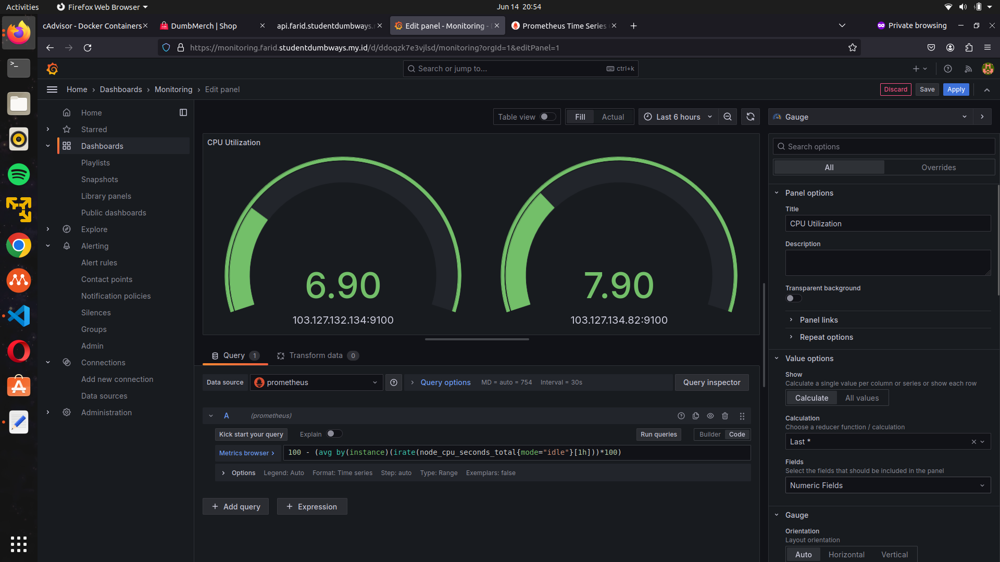
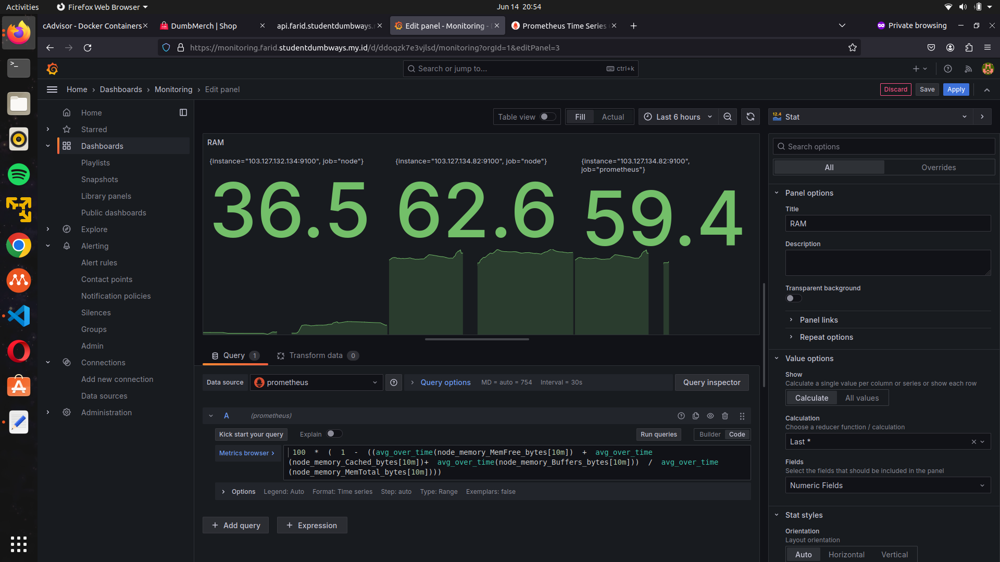
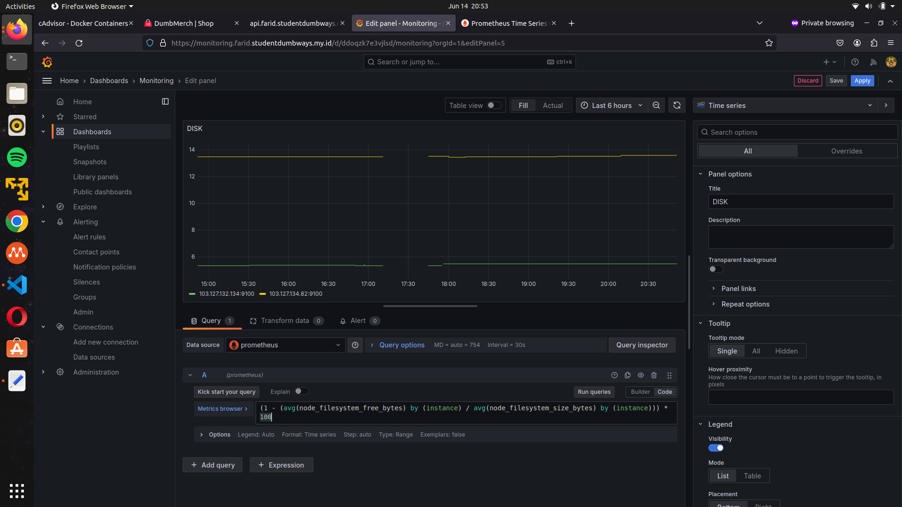
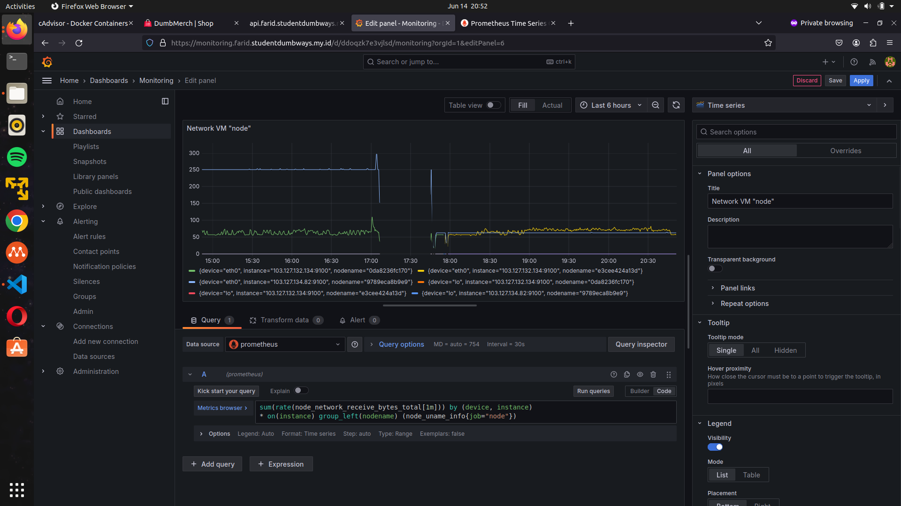
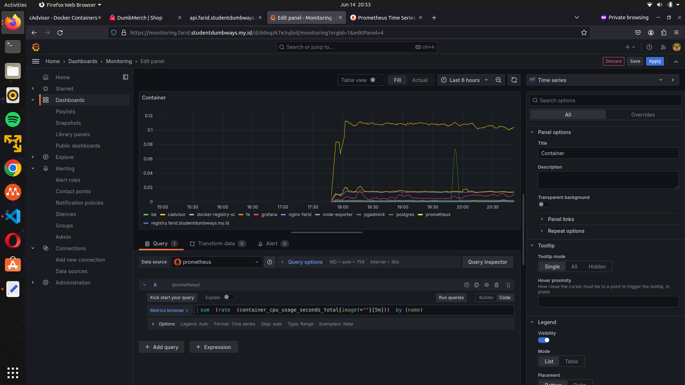
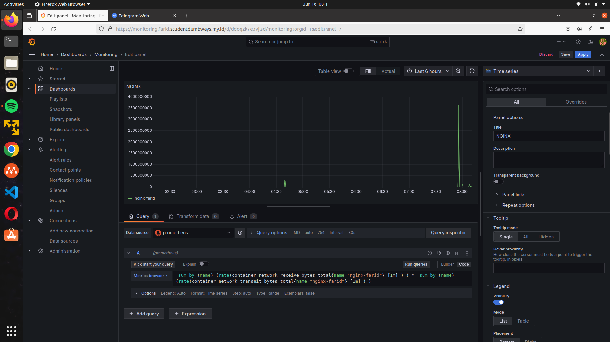
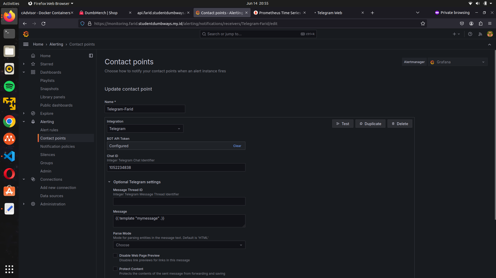
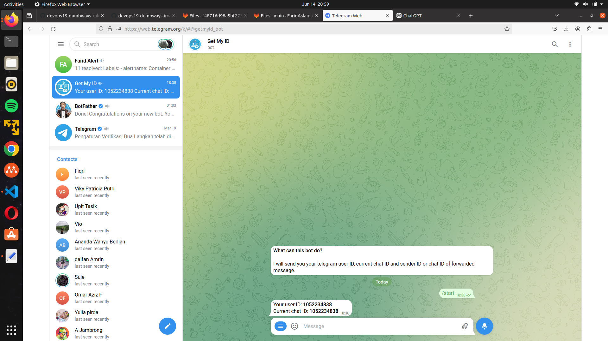
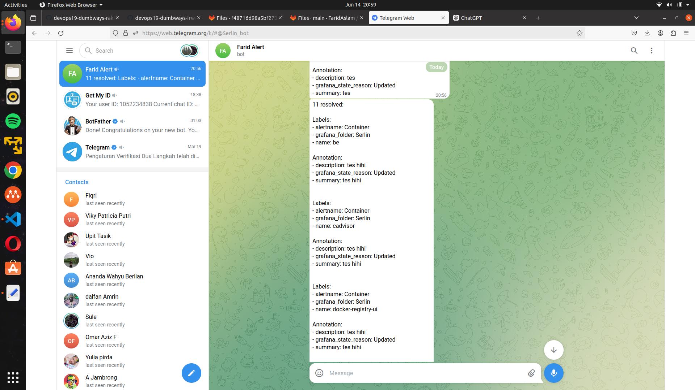

# Monitoring
**Requirements**

-   Deployments on top Docker

**Instructions**

-   Create Basic Auth into your Prometheus
-   Monitor resources for  _Appserver & Gateway & Registry server_
-   Create a fully working dashboard in Grafana
    -   Disk
    -   Memory Usage
    -   CPU Usage
    -   VM Network
    -   Monitoring all of container resources on VM
-   Grafana Alert/Prometheus Alertmanager for:
    -   Send Notification to Telegram
    -   CPU Usage
    -   RAM Usage
    -   Free Storage
    -   Network I/O (NGINX Monitoring)
## Setup Environment monitoring di sever appserver
- Create folder monitoring and create docker compose file into it
	```sh
	version: '3.8'

	volumes:
	  prometheus_data: {}

	services:
	  node-exporter:
	    image: prom/node-exporter:latest
	    container_name: node-exporter
	    restart: unless-stopped
	    volumes:
	      - /proc:/host/proc:ro
	      - /sys:/host/sys:ro
	      - /:/rootfs:ro
	    command:
	      - '--path.procfs=/host/proc'
	      - '--path.rootfs=/rootfs'
	      - '--path.sysfs=/host/sys'
	      - '--collector.filesystem.mount-points-exclude=^/(sys|proc|dev|host|etc)($$|/)'
	    ports:
	      - 9100:9100
	    networks:
	      - monitoring

	  prometheus:
	    image: prom/prometheus:latest
	    container_name: prometheus
	    restart: unless-stopped
	    volumes:
	      - ./prometheus:/etc/prometheus/

	    command:
	      - '--config.file=/etc/prometheus/prometheus.yml'
	      - '--web.config.file=/etc/prometheus/web.yml'
	      - '--storage.tsdb.path=/prometheus'
	      - '--web.console.libraries=/etc/prometheus/console_libraries'
	      - '--web.console.templates=/etc/prometheus/consoles'
	      - '--web.enable-lifecycle'
	    ports:
	      - 9090:9090
	    networks:
	      - monitoring

	  grafana:
	    image: grafana/grafana:latest
	    container_name: grafana
	    restart: unless-stopped
	    ports:
	      - 3001:3000
	    user: root
	    volumes:
	      - ./grafana/data:/var/lib/grafana  
	      - ./grafana/provisioning/datasource:/etc/grafana/provisioning/datasource
	    networks:
	      - monitoring

	  cadvisor:
	    container_name: cadvisor
	    image: gcr.io/cadvisor/cadvisor:latest
	    ports:
	      - "8081:8080"
	    privileged: true
	    devices: 
	      - "/dev/kmsg" 
	    volumes: 
	      - "/:/rootfs:ro"
	      - "/var/run:/var/run:rw"
	      - "/sys:/sys:ro"
	      - "/var/lib/docker/:/var/lib/docker:ro"
	      - "/dev/disk/:/dev/disk:ro"
	    networks:
	      - monitoring
	    
	networks:
	  monitoring:
	    driver: bridge
	```
- Create prometheus.yml for connection node which would took the metrics
```
global:
  scrape_interval: 10s

scrape_configs:
  
  - job_name: 'prometheus'
    static_configs:
      - targets:
          - 103.127.134.82:9090

  - job_name: 'node'
    static_configs:
      - targets:
          - 103.127.134.82:9100
          - 103.127.132.134:9100

  - job_name: 'cadvisor'
    static_configs:
      - targets:
          - 103.127.134.82:8081

```
## Setup environment monitoring on gateway server:
- Buat directory monitoring, lalu buat docker-compose.yaml:
	```sh
	version: '3.8'

	volumes:
	  prometheus_data: {}

	services:
	  node-exporter:
	    image: prom/node-exporter:latest
	    container_name: node-exporter
	    restart: unless-stopped
	    volumes:
	      - /proc:/host/proc:ro
	      - /sys:/host/sys:ro
	      - /:/rootfs:ro
	    command:
	      - '--path.procfs=/host/proc'
	      - '--path.rootfs=/rootfs'
	      - '--path.sysfs=/host/sys'
	      - '--collector.filesystem.mount-points-exclude=^/(sys|proc|dev|host|etc)($$|/)'
	    ports:
	      - 9100:9100
	    networks:
	      - monitoring

	  cadvisor:
	    container_name: cadvisor
	    image: gcr.io/cadvisor/cadvisor:latest
	    ports:
	      - "8081:8080"
	    privileged: true
	    devices: 
	      - "/dev/kmsg" 
	    volumes: 
	      - "/:/rootfs:ro"
	      - "/var/run:/var/run:rw"
	      - "/sys:/sys:ro"
	      - "/var/lib/docker/:/var/lib/docker:ro"
	      - "/dev/disk/:/dev/disk:ro"
	    networks:
	      - monitoring
	      
	networks:
	  monitoring:
	    driver: bridge
	```
## Create new dashboard grafana
Access dashboard grafana using domain monitoring.farid.studentdumbways.my.id and create new dashboard
#### 1. CPU Usage


masukkan promql berikut



```
  100 - (avg by(instance)(irate(node_cpu_seconds_total{mode="idle"}[1h]))*100)
```

Dalam rumus ini:

Rumus ini dapat diartikan sebagai 100 dikurangi dengan persentase rata-rata waktu CPU dalam mode 'idle' dalam satu jam terakhir. Semakin tinggi nilai hasil rumus, semakin sedikit waktu CPU yang dihabiskan dalam mode 'idle', yang mungkin mengindikasikan tingkat beban CPU yang lebih tinggi.

   - node_cpu_seconds_total{mode="idle"}[1h]: Ini memilih total detik CPU yang dihabiskan dalam mode siaga untuk setiap instance selama satu jam terakhir.

   - irate(...): Fungsi irate menghitung laju perubahan penghitung per detik pada rentang yang ditentukan (1 jam dalam kasus ini). Ini memberi kita tingkat di mana CPU dalam keadaan idle.

   - avg by(instance)(...): Ini menghitung rata-rata tingkat CPU idle untuk setiap instance.

   - (...)*100: Ini mengubah tingkat CPU menganggur menjadi persentase.

   - 100 - (...): Ini mengurangi persentase CPU yang menganggur dari 100%, sehingga menghasilkan persentase pemanfaatan CPU.

#### 2. RAM Usage

masukkan promql berikut
```
 100  *  (  1  -  ((avg_over_time(node_memory_MemFree_bytes[10m])  +  avg_over_time(node_memory_Cached_bytes[10m])+  avg_over_time(node_memory_Buffers_bytes[10m]))  /  avg_over_time(node_memory_MemTotal_bytes[10m])))
```
Rumus ini dapat diartikan sebagai persentase penggunaan memori terhadap total kapasitas memori yang tersedia dalam interval waktu 10 menit terakhir. Semakin tinggi nilai hasil rumus, semakin tinggi penggunaan memori terhadap kapasitas total yang tersedia.

Kueri Prometheus yang disediakan menghitung persentase memori yang digunakan selama 10 menit terakhir dengan mempertimbangkan memori bebas, memori cache, dan memori buffer relatif terhadap total memori. Mari kita uraikan langkah demi langkah:

   - avg_over_time(node_memory_MemFree_bytes[10m]): Ini menghitung rata-rata memori bebas dalam byte selama 10 menit terakhir.

   -  avg_over_time(node_memory_Cached_bytes[10m]): Ini menghitung rata-rata memori cache dalam byte selama 10 menit terakhir.

   - avg_over_time(node_memory_Buffers_bytes[10m]): Ini menghitung rata-rata memori buffer dalam byte selama 10 menit terakhir.
  
   - avg_over_time(node_memory_MemTotal_bytes[10m]): Ini menghitung total rata-rata memori dalam byte selama 10 menit terakhir.

Selanjutnya komponen-komponen tersebut digabungkan sebagai berikut:

   - avg_over_time(node_memory_MemFree_bytes[10m]) + avg_over_time(node_memory_Cached_bytes[10m]) + avg_over_time(node_memory_Buffers_bytes[10m]): Ini menjumlahkan rata-rata memori bebas, cache, dan buffer selama 10 menit terakhir.

   - (...) / avg_over_time(node_memory_MemTotal_bytes[10m]): Ini membagi jumlah dengan total memori rata-rata untuk mendapatkan pecahan dari total memori yang bebas, di-cache, atau di-buffer.

   - 1 - (...): Ini menghitung sebagian kecil dari total memori yang digunakan (yaitu, tidak gratis, di-cache, atau di-buffer).
    100 * (...): Ini mengubah sebagian kecil memori yang digunakan menjadi persentase.

#### 3. Disk Usage



masukkan promql berikut

```
(1 - (avg(node_filesystem_free_bytes) by (instance) / avg(node_filesystem_size_bytes) by (instance))) * 100
```

dalam rumus ini:

- avg(node_filesystem_free_bytes) by (instance): Mengambil rata-rata ruang disk yang tersedia untuk setiap instance.
- avg(node_filesystem_size_bytes) by (instance): Mengambil rata-rata total kapasitas disk untuk setiap instance.
- (1 - ...) * 100: Menghitung persentase penggunaan disk dengan menghitung perbandingan antara ruang disk yang tersedia dan total kapasitas disk, lalu mengonversinya ke dalam persen.

#### 4. Network VM



masukkan promql berikut

```
sum(rate(node_network_receive_bytes_total[1m])) by (device, instance) * on(instance) group_left(nodename) (node_uname_info{job="node"})
```
- rate(node_network_receive_bytes_total[1m]):
 fungsi rate() menghitung laju kenaikan node_network_receive_bytes_total per detik selama interval 1 menit ([1m]).

-  sum(...) oleh (device, instance):
 sum(...) mengagregasi hasil berdasarkan perangkat dan instans, menghitung total byte jaringan yang diterima per menit untuk setiap kombinasi unik perangkat dan instans.

- * on(instance):
  * memilih semua rangkaian waktu dari metrik berikut (node_uname_info) berdasarkan label instance.

-  group_left(nodename):
 group_left(nodename) menentukan bahwa data dari node_uname_info harus disertakan dalam hasil kueri dan harus digabungkan berdasarkan label instance, menambahkan label nama node ke data gabungan dari node_network_receive_bytes_total.

-  (node_uname_info{job="node"}):
  Filter metrik node_uname_info untuk hanya menyertakan metrik dengan job="node", memastikan kami mendapatkan informasi spesifik node.

#### 5. Container



masukkan promql berikut
```
 sum  (rate  (container_cpu_usage_seconds_total{image!=""}[5m]))  by (name)
```

- container_cpu_usage_seconds_total{image!=""}:
container_cpu_usage_seconds_total adalah metrik yang mewakili total waktu CPU yang dikonsumsi oleh wadah dalam hitungan detik.
 {Image! = ""} adalah pemilih yang memastikan kami hanya mempertimbangkan wadah yang memiliki label gambar, yang berarti mereka menjalankan wadah dengan gambar yang dapat diidentifikasi.

-   rate(...) [5m]:
 rate() menghitung laju perubahan per detik dari metrik container_cpu_usage_seconds_total selama interval 5 menit ([5m]).
 Ini memberi kita rata-rata penggunaan CPU per detik selama 5 menit terakhir untuk setiap container.

 -   sum(...) by (name):
  sum(...) mengagregasi hasil berdasarkan label nama.
 Ini mengelompokkan metrik penggunaan CPU berdasarkan nama kontainer, menjumlahkan total detik CPU yang digunakan selama periode 5 menit untuk setiap kontainer unik.

 Hasil:

Hasil dari kueri ini akan berupa tabel dengan baris yang setiap barisnya berhubungan dengan wadah unik yang diidentifikasi berdasarkan label namanya, dan nilai di setiap baris mewakili total detik CPU yang digunakan oleh wadah tersebut selama 5 menit terakhir.

#### 6. Network I/O Nginx


```
 sum by (name) (rate(container_network_receive_bytes_total{name="nginx-farid"} [1m] ) ) *  sum by (name) (rate(container_network_transmit_bytes_total{name="nginx-farid"} [1m] ) )
```

Rumus PromQL (Prometheus Query Language) yang diberikan melakukan penghitungan berdasarkan metrik jaringan dari kontainer yang bernama nginx-farid. Berikut adalah penjelasan dari setiap bagian rumus tersebut:

- rate(container_network_receive_bytes_total{name="nginx-farid"}[1m]):
        container_network_receive_bytes_total{name="nginx-farid"}: Metrik ini mengumpulkan total byte yang diterima oleh kontainer dengan nama nginx-farid.
		
- [1m]: Interval waktu jendela untuk rate calculation adalah 1 menit.
        rate(...): Fungsi ini menghitung laju perubahan (rate of change) per detik dari metrik dalam interval waktu yang ditentukan (1 menit dalam hal ini).

- sum by (name) (...):
        sum by (name): Fungsi ini mengelompokkan hasil berdasarkan label name dan menjumlahkan nilai-nilainya.

- rate(container_network_transmit_bytes_total{name="nginx-farid"}[1m]):
        container_network_transmit_bytes_total{name="nginx-farid"}: Metrik ini mengumpulkan total byte yang dikirim oleh kontainer dengan nama nginx-farid.

- [1m]: Interval waktu jendela untuk rate calculation adalah 1 menit.
        rate(...): Fungsi ini menghitung laju perubahan (rate of change) per detik dari metrik dalam interval waktu yang ditentukan (1 menit dalam hal ini).

- Mengalikan hasil kedua sum by (name):
        Setelah menghitung rate dari byte yang diterima dan dikirim dalam interval 1 menit, hasilnya kemudian dikalikan. Ini berarti kita mengalikan laju penerimaan byte per detik dengan laju pengiriman byte per detik untuk kontainer nginx-farid.

Secara keseluruhan, rumus ini menghitung laju perubahan per detik dari jumlah byte yang diterima dan dikirim oleh kontainer nginx-farid, kemudian mengalikannya. Interpretasi hasil dari operasi ini mungkin tergantung pada konteks penggunaan, namun secara umum ini bisa memberikan pandangan tentang aktivitas jaringan kontainer tersebut dalam hal penerimaan dan pengiriman data.


## Membuat Alert

##### 1. menambahkan contact poin



##### 2. Membuat template telegram

```
{{ define "mymessage" }}
{{ if gt (len .Alerts.Firing) 0 }}
{{ len .Alerts.Firing }} firing:
{{ range .Alerts.Firing }} {{ template "myalert" .}} {{ end }}
{{ end }}
{{ if gt (len .Alerts.Resolved) 0 }}
{{ len .Alerts.Resolved }} resolved:
{{ range .Alerts.Resolved }} {{ template "myalert" .}} {{ end }}
{{ end }}
{{ end }}

{{ define "myalert" }}
Labels: {{ range .Labels.SortedPairs }}
- {{ .Name }}: {{ .Value }} {{ end }}

Annotation: {{ if gt (len .Annotations) 0 }} {{ range .Annotations.SortedPairs }}
- {{ .Name }}: {{ .Value }} {{ end }} {{ end }}

{{ if gt (len .DashboardURL ) 0 }} Go to dashboard: {{ .DashboardURL }}
{{ end }} {{ end }}
```


##### 3. membuat bot di telegram


#####  4. tambahkan chat id/ mendapatkan id chat nya menggunakan bot get id



#### Hasilnya akan mengirimkan alert secara otomatis
