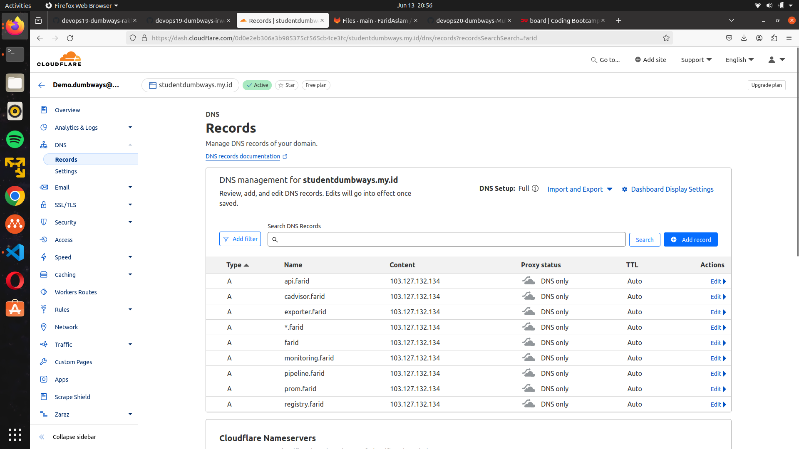

# Webserver

## 1. Nginx dan SSL

1. Penginstalan nginx sebelumnya dilakukan di ansible dengan script berikut
```
---
- become: true
  gather_facts: false
  hosts: 103.127.132.134
  tasks:

    - name: "buat dir webserver"
      file:
        path: /home/{{username}}/webserver
        state: directory
        owner: "{{username}}"
        group: "{{username}}"
        mode: 0700

    - name: "buat dir certbot"
      file:
        path: /home/{{username}}/webserver/certbot
        state: directory
        owner: "{{username}}"
        group: "{{username}}"
        mode: 0700

    - name: "buat dir nginx"
      file:
        path: /home/{{username}}/webserver/nginx/
        state: directory
        owner: "{{username}}"
        group: "{{username}}"
        mode: 0700

    - name: "buat dir conf"
      file:
        path: /home/{{username}}/webserver/nginx/conf
        state: directory
        owner: "{{username}}"
        group: "{{username}}"
        mode: 0700

    - name: "copy docker compose"
      copy:
        src: /home/farid/monitoring/docker-compose-webserver.yaml
        dest: /home/{{username}}/webserver/docker-compose-webserver.yaml
        owner: "{{username}}"
        group: "{{username}}"
        mode: 0700

    - name: "copy nginx.conf"
      copy:
        src: /home/farid/monitoring/nginx.conf
        dest: /home/{{username}}/webserver/nginx/conf/nginx.conf
        owner: "{{username}}"
        group: "{{username}}"
        mode: 0664

    - name: copy certbot.ini
      copy:
        src: /home/farid/monitoring/certbot.ini
        dest: /home/{{username}}/webserver/certbot
        mode: 0664


    - name: "deploy"
      shell: cd /home/{{username}}/webserver/ && docker compose -f docker-compose-webserver.yaml up -d
```
2. Buat Konfigurasi Reverse Proxy

buat konfigurasi ```reverse proxy``` seperti berikut
```
server {
        listen 80;
        server_name farid.studentdumbways.my.id;

        location /.well-known/acme-challenge/ {
           root  /var/www/certbot;
        }

        location / {
           return 301 https://$host$request_uri;
        }
}

server {
        listen 443 ssl;
        server_name farid.studentdumbways.my.id;

        ssl_certificate /etc/letsencrypt/live/farid.studentdumbways.my.id/fullchain.pem;
        ssl_certificate_key /etc/letsencrypt/live/farid.studentdumbways.my.id/privkey.pem;

        location / {
                proxy_pass http://103.127.134.82:3000;
        }
}

server {
        listen 80;
        server_name api.farid.studentdumbways.my.id;

        location /.well-known/acme-challenge/ {
           root  /var/www/certbot;
        }

        location / {
           return 301 https://$host$request_uri;
        }
}

server {
        listen 443 ssl;
        server_name api.farid.studentdumbways.my.id;

        ssl_certificate /etc/letsencrypt/live/farid.studentdumbways.my.id/fullchain.pem;
        ssl_certificate_key /etc/letsencrypt/live/farid.studentdumbways.my.id/privkey.pem;

        location / {
                proxy_pass http://103.127.134.82:5001;
        }
}


server {
        listen 80;
        server_name exporter.farid.studentdumbways.my.id;

        location /.well-known/acme-challenge/ {
           root  /var/www/certbot;
        }

        location / {
           return 301 https://$host$request_uri;
        }
}

server {
        listen 443 ssl;
        server_name exporter.farid.studentdumbways.my.id;

        ssl_certificate /etc/letsencrypt/live/farid.studentdumbways.my.id/fullchain.pem;
        ssl_certificate_key /etc/letsencrypt/live/farid.studentdumbways.my.id/privkey.pem;

        location / {
                proxy_pass http://103.127.132.134:9100;
        }
}


server {
        listen 80;
        server_name prom.farid.studentdumbways.my.id;

        location /.well-known/acme-challenge/ {
           root  /var/www/certbot;
        }

        location / {
           return 301 https://$host$request_uri;
        }
}

server {
        listen 443 ssl;
        server_name prom.farid.studentdumbways.my.id;

        ssl_certificate /etc/letsencrypt/live/farid.studentdumbways.my.id/fullchain.pem;
        ssl_certificate_key /etc/letsencrypt/live/farid.studentdumbways.my.id/privkey.pem;

        location / {
                proxy_pass http://103.127.134.82:9090;
        }
}

server {
        listen 80;
        server_name monitoring.farid.studentdumbways.my.id;

        location /.well-known/acme-challenge/ {
           root  /var/www/certbot;
        }

        location / {
           return 301 https://$host$request_uri;
        }
}

server {
        listen 443 ssl;
        server_name monitoring.farid.studentdumbways.my.id;

        ssl_certificate /etc/letsencrypt/live/farid.studentdumbways.my.id/fullchain.pem;
        ssl_certificate_key /etc/letsencrypt/live/farid.studentdumbways.my.id/privkey.pem;

        location / {
                proxy_pass http://103.127.134.82:3001;
                proxy_set_header Host $host;
                proxy_set_header X-Real-IP $remote_addr;
                proxy_set_header X-Forwarded-For $proxy_add_x_forwarded_for;
                proxy_set_header X-Forwarded-Proto $scheme;
        }
}


server {
        listen 80;
        server_name cadvisor.farid.studentdumbways.my.id;

        location /.well-known/acme-challenge/ {
           root  /var/www/certbot;
        }

        location / {
           return 301 https://$host$request_uri;
        }
}

server {
        listen 443 ssl;
        server_name cadvisor.farid.studentdumbways.my.id;

        ssl_certificate /etc/letsencrypt/live/farid.studentdumbways.my.id/fullchain.pem;
        ssl_certificate_key /etc/letsencrypt/live/farid.studentdumbways.my.id/privkey.pem;

        location / {
                proxy_pass http://103.127.134.82:8081;
                proxy_set_header Host $host;
                proxy_set_header X-Real-IP $remote_addr;
                proxy_set_header X-Forwarded-For $proxy_add_x_forwarded_for;
                proxy_set_header X-Forwarded-Proto $scheme;
        }
}

server {
        listen 80;
        server_name registry.farid.studentdumbways.my.id;

        location /.well-known/acme-challenge/ {
           root  /var/www/certbot;
        }

        location / {
           return 301 https://$host$request_uri;
        }
}

server {
        listen 443 ssl;
        server_name registry.farid.studentdumbways.my.id;

        ssl_certificate /etc/letsencrypt/live/farid.studentdumbways.my.id/fullchain.pem;
        ssl_certificate_key /etc/letsencrypt/live/farid.studentdumbways.my.id/privkey.pem;

        location / {
                proxy_pass http://103.127.134.82:8080/;
                proxy_set_header Host $host;
                proxy_set_header X-Real-IP $remote_addr;
                proxy_set_header X-Forwarded-For $proxy_add_x_forwarded_for;
                proxy_set_header X-Forwarded-Proto $scheme;

        }
}

server {
        listen 80;
        server_name registry.farid.studentdumbways.my.id;

        location /.well-known/acme-challenge/ {
           root  /var/www/certbot;
        }

        location / {
           return 301 https://$host$request_uri;
        }
}

server {
        listen 443 ssl;
        server_name registry.farid.studentdumbways.my.id;

        ssl_certificate /etc/letsencrypt/live/farid.studentdumbways.my.id/fullchain.pem;
        ssl_certificate_key /etc/letsencrypt/live/farid.studentdumbways.my.id/privkey.pem;

        location / {
                proxy_pass http://103.127.134.82:5000/;
                proxy_set_header Host $host;
                proxy_set_header X-Real-IP $remote_addr;
                proxy_set_header X-Forwarded-For $proxy_add_x_forwarded_for;
                proxy_set_header X-Forwarded-Proto $scheme;
        }
}
```

3. tambahkan DNS sesuai dengan yang sudah di intruksikan



Aplikasi dalam keadaan https atau secure


## Cara cara nya
- buat docker-compose.yaml
```
services:
  webserver:
    container_name: nginx-farid
    image: nginx:alpine
    ports:
      - "80:80"
      - "443:443"
    restart: always
    volumes:
      - ./nginx/conf:/etc/nginx/conf.d
      - ./certbot/www/:/var/www/certbot
      - ./certbot/conf/:/etc/letsencrypt


  certbot:
    container_name: certbot
    image: certbot/dns-cloudflare:latest
    volumes:
      - ./certbot/certbot.ini:/etc/letsencrypt/renewal/renewal.conf:ro
      - ./certbot/www/:/var/www/certbot
      - ./certbot/conf/:/etc/letsencrypt
    command: [
      "certonly",
      "--non-interactive",
      "--dns-cloudflare",
      "--dns-cloudflare-credentials",
      "/etc/letsencrypt/renewal/renewal.conf",
      "--email", "adipatiaslam28@gmail.com.com",
      "--agree-tos",
      "--no-eff-email",
      "--server", "https://acme-v02.api.letsencrypt.org/directory",
      "--domain", "*.farid.studentdumbways.my.id",
      "--domain", "farid.studentdumbways.my.id"
    ]
```
- Buat certbot.ini dan di taruh pada directory certbot setelah menjalankan docker-compose.yaml tersebut
```
dns_cloudflare_email = "adipatiaslam28@gmail.com"

dns_cloudflare_api_key = "112e95decd6ee528e63d8d83911d249bcef26"

server = https://acme-v02.api.letsencrypt.org/directory
```

## Automatic renewal for certificates
1. buat bash script ```renewal.sh``` di directory webserver

```
#!/bin/bash

# Renew the certificates
docker compose restart certbot
docker restart nginx-farid
```

2. Tambahkan izin untuk mengeksekusi
```
chmod +x renewal.sh
```
3. Jadwalkan eksekusi tiap 15 hari dengan crontab
```
sudo crontab -e
```
5. Tambahkan crontab expression
```
0 0 */15 * *  /home/finaltask-farid/webserver/renewal.sh
```
