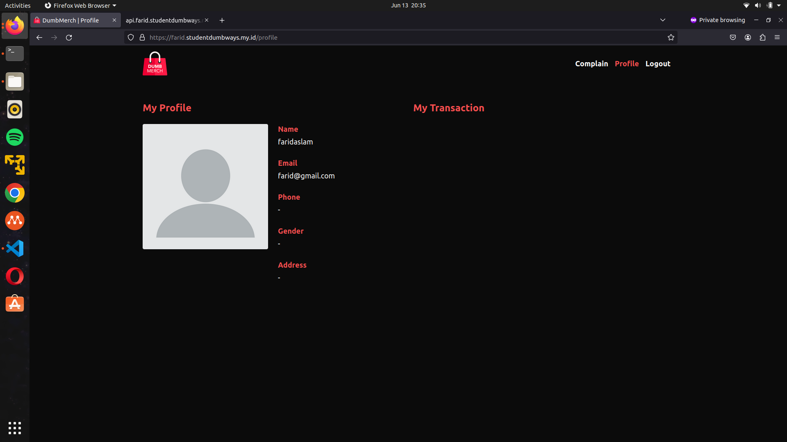

# Kubernetes

Kubernetes adalah sistem orkestrasi kontainer open-source yang mengotomatiskan pemasangan, skala, dan pengelolaan aplikasi kontainer. Kubernetes menangani kompleksitas operasi sehingga Anda dapat menskalakan beban kerja dan mengelola deployment kontainer di beberapa server. 

## Membuat sebuah cluster menggunakan k3s yang berisikan 2 node as a master and worker.

1.Mengubah hostname

```server appserver```
```
sudo hostnamectl set-hostname master
```
```server gateway```
```
sudo hostnamectl set-hostname worker
```

2. masuk ke root agar tidak perlu mengubah perizinan dan melakukan download ```k3s```

```
curl -sfL https://get.k3s.io | sh -
```

3. cek k3s jika sudah terinstall

```
kubectl get node
```

4. copy token k3s untuk menambahkan k3s agent

```
cat /var/lib/rancher/k3s/server/token
```

5. menginstall k3s di node worker

```
curl -sfL https://get.k3s.io | K3S_URL={$IP_NODE_MASTER:6433} K3S_TOKEN={$TOKEN} sh -
```

6. cek k3s jika sudah terinstall

```
kubectl get node -o wide
```
- (note) copy config ke directory .kube
```
cd .kube/ cp /etc/rancher/k3s/k3s.yaml config
```

## Install ingress nginx using helm

1. menonaktifkan webserver default dari k3s yaitu ```traefik``` dan load balancing

```node master```
```
nano /etc/rancher/k3s/config.yaml
```
```
cluster-init: true
disable: servicelb
disable: traefik
```
```
systemctl restart k3s
```

```node worker```
```
nano /etc/rancher/node/config.yaml
```
```
disable: servicelb
disable: traefik
```
```
systemctl restart k3s-agent
```

## Task 2: Install ingress nginx using helm or manifest

Jalankan command berikut untuk menginstall helm:
```
curl https://baltocdn.com/helm/signing.asc | gpg --dearmor | sudo tee /usr/share/keyrings/helm.gpg > /dev/null
sudo apt-get install apt-transport-https --yes
echo "deb [arch=$(dpkg --print-architecture) signed-by=/usr/share/keyrings/helm.gpg] https://baltocdn.com/helm/stable/debian/ all main" | sudo tee /etc/apt/sources.list.d/helm-stable-debian.list
sudo apt-get update
sudo apt-get install helm
```

Uninstall traefik using helm:
```
sudo rm -rf /var/lib/rancher/k3s/server/manifests/traefik.yaml;
helm uninstall traefik traefik-crd -n kube-system
```

Buat namespace baru:
```
kubectl create ns farid
```
Install ingress-nginx using helm:
```
helm repo add ingress-nginx https://kubernetes.github.io/ingress-nginx
helm repo update
helm install ingress-nginx ingress-nginx/ingress-nginx --namespace farid
```

Cek apakah sudah terinstall
```
kubectl get all -n farid
```

- Buat directory ks3s lalu buat posgres.yaml untuk database backend (jika ingin menggunakan k3s untuk menjalankan database nya) tinggal diubah saja file .env di server yg ada directory be-dumbmerch nya, lalu build ulang dan push ke docker registry.

```
apiVersion: v1 
kind: Secret 
metadata: 
  name: postgres-secrets 
   
type: Opaque 
data: 
  POSTGRES_DB: ZHVtYm1lcmNo #dumbmerch
  POSTGRES_USER: ZmFyaWQ= #farid
  POSTGRES_PASSWORD: ZmFyaWQ= #farid
 
--- 
apiVersion: v1 
kind: PersistentVolumeClaim 
metadata: 
  name: postgres-pvc 
   
spec: 
  accessModes: 
    - ReadWriteOnce 
  resources: 
    requests: 
      storage: 1Gi 
  storageClassName: local-path 
 
--- 
apiVersion: apps/v1 
kind: StatefulSet 
metadata: 
  name: postgresql 
   
spec: 
  serviceName: postgresql 
  replicas: 1 
  selector: 
    matchLabels: 
      app: postgresql 
  template: 
    metadata: 
      labels: 
        app: postgresql 
    spec: 
      containers: 
        - name: postgresql 
          image: postgres:latest 
          env: 
            - name: POSTGRES_DB 
              valueFrom: 
                secretKeyRef: 
                  name: postgres-secrets 
                  key: POSTGRES_DB 
            - name: POSTGRES_USER 
              valueFrom: 
                secretKeyRef: 
                  name: postgres-secrets 
                  key: POSTGRES_USER 
            - name: POSTGRES_PASSWORD 
              valueFrom: 
                secretKeyRef: 
                  name: postgres-secrets 
                  key: POSTGRES_PASSWORD 
          ports: 
            - containerPort: 5432 
          volumeMounts: 
            - name: postgres-storage 
              mountPath: /var/lib/postgresql/data 
      volumes: 
        - name: postgres-storage 
          persistentVolumeClaim: 
            claimName: postgres-pvc 
 
--- 
apiVersion: v1 
kind: Service 
metadata: 
  name: postgresql 
   
spec: 
  type: NodePort 
  ports: 
    - port: 5432 
      targetPort: 5432 
      nodePort: 30432 
  selector: 
    app: postgresql

```

lalu jalankan dengan command:
```
kubectl apply -f postgres.yaml
```

lalu selanjutnya buat frontend.yaml dimana kita akan pull image yg sudah di push ke docker registry :

```
apiVersion: apps/v1
kind: Deployment
metadata:
  name: frontend
spec:
  replicas: 1
  selector:
    matchLabels:
      app: frontend
  template:
    metadata:
      labels:
        app: frontend
    spec:
      containers:
        - name: frontend
          image: registry.farid.studentdumbways.my.id/faridaslam/dmfrontend:4.0
          ports:
            - containerPort: 3000
---
apiVersion: v1
kind: Service
metadata:
  name: frontend-service
spec:
  type: LoadBalancer
  ports:
    - port: 3000
      targetPort: 3000
      nodePort: 30300
  selector:
    app: frontend
```

jalankan dengan command:
```
kubectl apply -f frontend.yaml
```
lalu selanjutnya buat backend.yaml dimana kita akan pull image yg sudah di push ke docker registry :

```
apiVersion: apps/v1
kind: Deployment
metadata:
  name: backend
spec:
  replicas: 1
  selector:
    matchLabels:
      app: backend
  template:
    metadata:
      labels:
        app: backend
    spec:
      containers:
        - name: backend
          image: registry.farid.studentdumbways.my.id/faridaslam/dmbackend:3.0
          ports:
            - containerPort: 5000
---
apiVersion: v1
kind: Service
metadata:
  name: backend-service
spec:
  type: LoadBalancer
  ports:
    - port: 5000
      targetPort: 5000
      nodePort: 30500
  selector:
    app: backend

```
jalankan dengan command:
```
kubectl apply -f backend.yaml
```

dan kita cek apakah status nya sudah running apa belum dengan menggunakan command :

```
kubectl get all
```
Screenshot file .env dan hasil get all


cek di browser




- NOTE UNTUK DIRI SENDIRI DI MASA DEPAN : DISARANKAN MENGGUNAKAN 3 BUAH VM, KARENA TIDAK AKAN KUAT JIKA MENJALANKAN SEKALIGUS DI SERVER APP SERVER.

- SARAN : 
- MENGGUNAKAN VM APPSERVER UNTUK K3S, DOCKER CONTAINER PROMETHEUS, GRAFANA, CADVISOR, EXPORTER
- MENGGUNAKAN VM GATEWAY UNTUK KEPERLUAN REVERSE PROXY/MENJALANKAN DOCKER CONTAINER YG MENCAKUP CADVISOR, NGINX, CERTBOT, EXPORTER, DOCKER REGISTRY
- SERVER AZURE UNNTUK MENJALANKAN DOCKER CONTAINER FE DAN BE DAN BUILD IMAGES