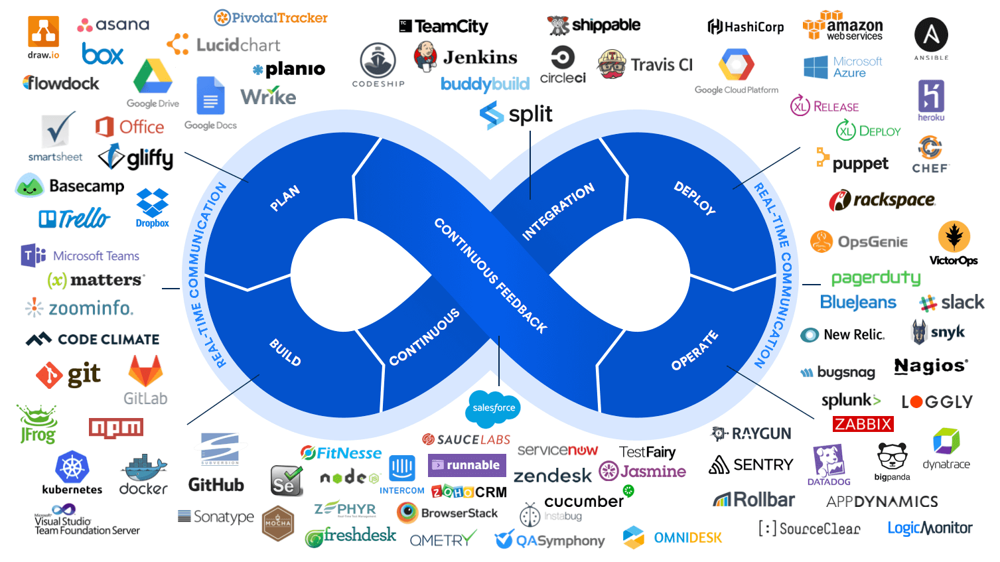
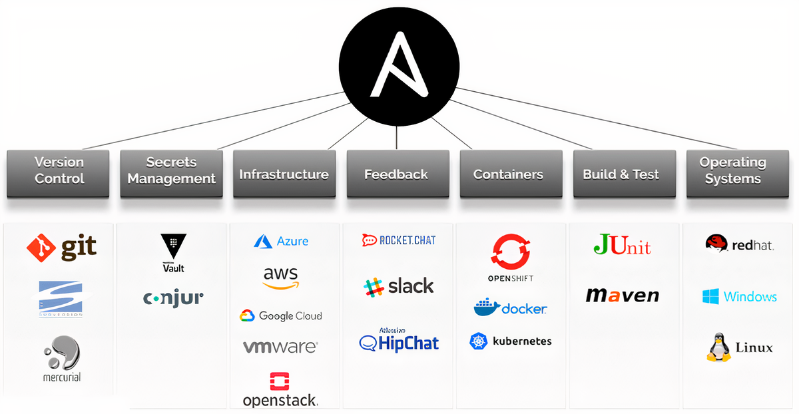
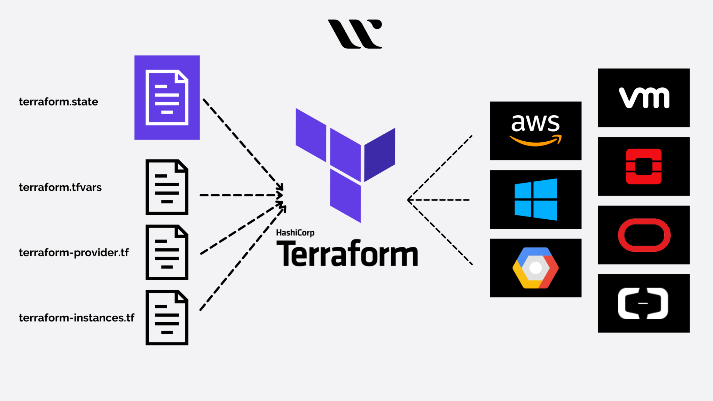
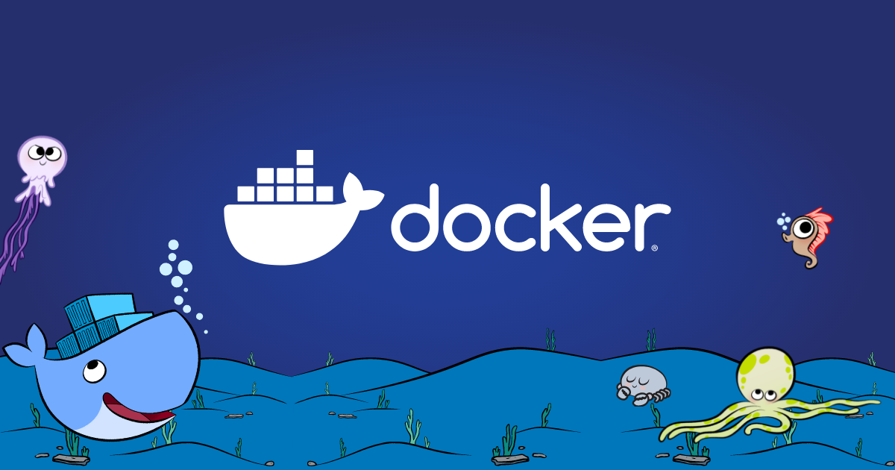
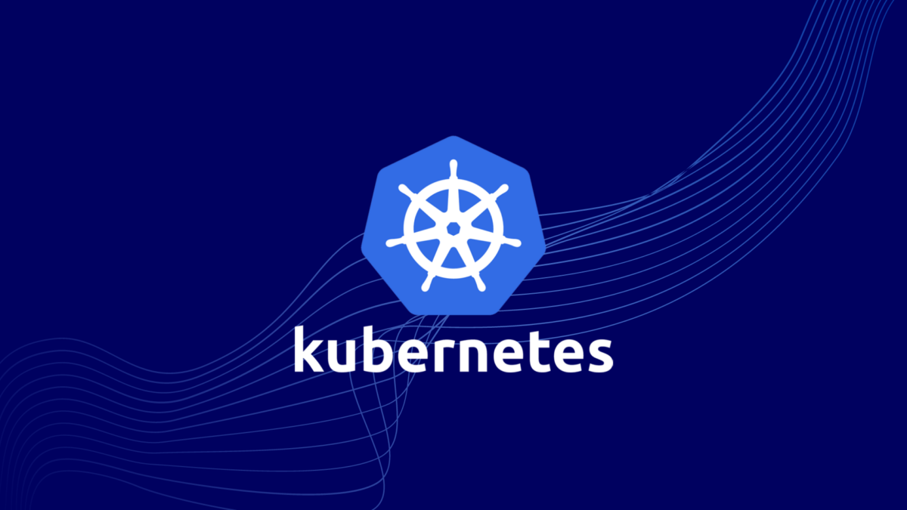
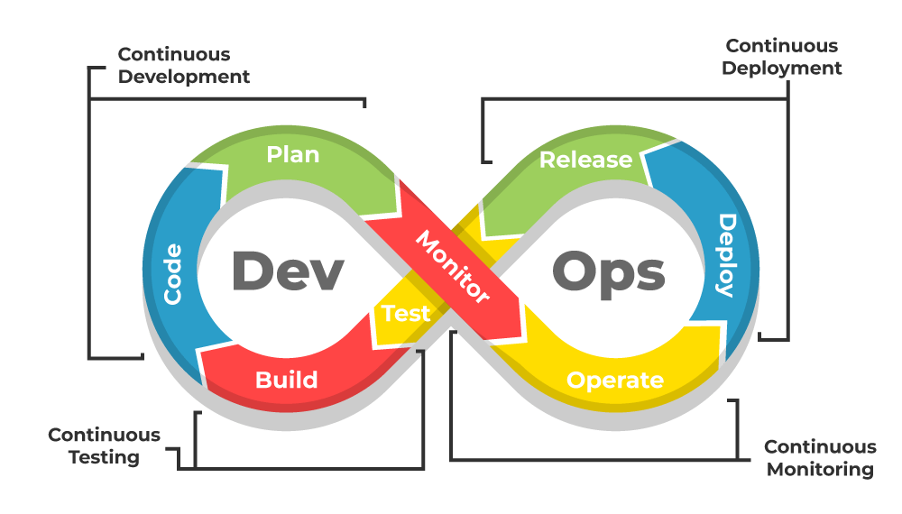
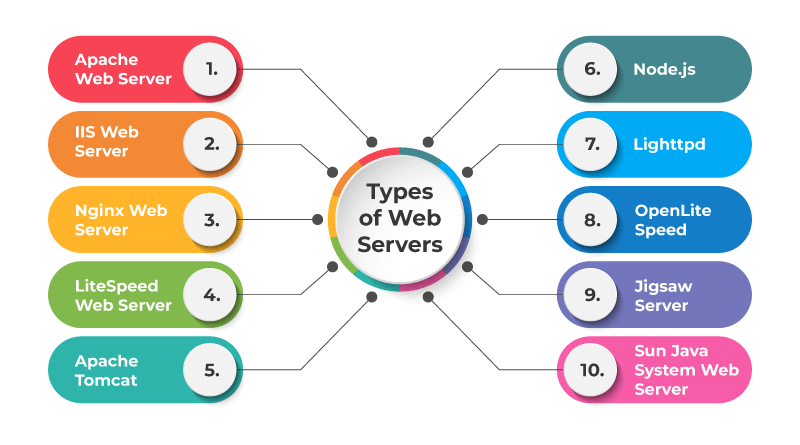

# DevOps


DevOps adalah gabungan konsep dan praktik dari "Development" (pengembangan perangkat lunak) dan "Operations" (operasional IT) yang bertujuan untuk mengotomatiskan dan mengintegrasikan proses antara pengembang perangkat lunak dan tim operasi IT. Tujuan utama DevOps adalah untuk meningkatkan kolaborasi, efisiensi, dan kecepatan dalam penyampaian aplikasi dan layanan. Berikut adalah penjelasan lebih rinci tentang DevOps:

Tujuan dan Manfaat DevOps

-    Kolaborasi dan Komunikasi: DevOps menghilangkan silo antara tim pengembangan dan operasi, mendorong kolaborasi yang lebih erat dan komunikasi yang lebih baik.
-    Peningkatan Kecepatan: Dengan mengotomatiskan proses-proses manual dan mengintegrasikan berbagai alat, DevOps mempercepat siklus pengembangan dan penyebaran perangkat lunak.
-    Kualitas dan Keandalan: Praktik-praktik DevOps seperti Continuous Integration (CI) dan Continuous Deployment/Delivery (CD) memastikan bahwa kode selalu diuji dan siap untuk produksi, meningkatkan kualitas dan keandalan perangkat lunak.
-    Skalabilitas dan Fleksibilitas: DevOps memungkinkan organisasi untuk dengan mudah menyesuaikan skala operasi IT mereka sesuai dengan kebutuhan bisnis yang berubah-ubah.

Prinsip-prinsip DevOps

-    Otomatisasi: Automasi proses, mulai dari pengembangan, pengujian, hingga penyebaran dan pemantauan, untuk meningkatkan efisiensi dan mengurangi kesalahan manusia.
-    Kolaborasi: Memperkuat kolaborasi antara tim pengembangan dan operasi melalui komunikasi terbuka dan alat kolaboratif.
-    Iterasi dan Inkrementasi: Mengadopsi pendekatan iteratif dan inkremental dalam pengembangan dan penyampaian perangkat lunak, memungkinkan perbaikan dan penyesuaian cepat berdasarkan umpan balik.
-    Pengukuran: Memantau dan mengukur semua aspek dari proses DevOps untuk mengidentifikasi area perbaikan dan mengoptimalkan kinerja.
-    Berfokus pada Pelanggan: Memprioritaskan kebutuhan dan umpan balik pelanggan dalam setiap langkah pengembangan dan penyampaian produk.

Praktik-praktik Utama dalam DevOps

-    Continuous Integration (CI): Praktik mengintegrasikan perubahan kode dari beberapa kontributor secara rutin ke dalam repositori bersama, yang kemudian diuji secara otomatis untuk mendeteksi kesalahan sejak dini.
-    Continuous Delivery/Deployment (CD): Memastikan bahwa kode yang lulus tes otomatis dapat dengan cepat dan aman disebarkan ke lingkungan produksi, baik dengan persetujuan manusia (Continuous Delivery) atau secara otomatis (Continuous Deployment).
-    Infrastructure as Code (IaC): Mengelola dan menyediakan infrastruktur melalui definisi dan skrip kode, memungkinkan otomatisasi dan konsistensi dalam penyediaan sumber daya.
-    Monitoring dan Logging: Memantau kinerja aplikasi dan infrastruktur serta mengumpulkan log untuk mendeteksi masalah dan menganalisis kinerja.
-    Microservices: Membagi aplikasi menjadi layanan-layanan kecil yang independen, yang dapat dikembangkan, diuji, dan disebarkan secara terpisah.

Alat-alat DevOps

-    Jenkins: Alat otomasi open-source untuk Continuous Integration dan Continuous Deployment.
-    Docker: Platform untuk mengembangkan, mengirim, dan menjalankan aplikasi dalam container, memungkinkan portabilitas dan konsistensi lingkungan.
-    Kubernetes: Platform orkestrasi container untuk mengotomatisasi penyebaran, penskalaan, dan pengelolaan aplikasi container.
-    Ansible: Alat otomasi open-source untuk manajemen konfigurasi, penyebaran aplikasi, dan orkestrasi.
-    Terraform: Alat Infrastructure as Code untuk membangun, mengubah, dan mengelola infrastruktur secara aman dan efisien.
-    Prometheus: Sistem monitoring dan alerting open-source yang digunakan bersama Grafana untuk visualisasi data.

Kesimpulan

DevOps adalah pendekatan holistik yang menggabungkan prinsip-prinsip pengembangan perangkat lunak dan operasional IT untuk meningkatkan kolaborasi, kecepatan, dan efisiensi. Dengan mengotomatiskan dan mengintegrasikan berbagai proses dan alat, DevOps memungkinkan organisasi untuk mengirimkan perangkat lunak berkualitas tinggi dengan cepat dan andal, sambil tetap beradaptasi dengan kebutuhan bisnis yang terus berkembang.

## 1. Ansible

Ansible adalah alat otomasi open-source yang digunakan untuk manajemen konfigurasi, penerapan aplikasi, dan orkestrasi tugas-tugas IT. Dikembangkan oleh Michael DeHaan dan pertama kali dirilis pada tahun 2012, Ansible dirancang untuk memudahkan pengelolaan infrastruktur IT dengan mengotomatisasi tugas-tugas yang berulang dan kompleks. Berikut adalah beberapa poin kunci tentang Ansible:

- Manajemen Konfigurasi: Ansible memungkinkan pengguna untuk mendefinisikan konfigurasi sistem dan perangkat lunak dalam bentuk kode, yang kemudian dapat diterapkan secara konsisten ke banyak mesin.

- Penerapan Aplikasi: Ansible dapat digunakan untuk mengotomatisasi proses deployment aplikasi, memastikan bahwa aplikasi dan dependensinya diinstal dan dikonfigurasi dengan benar di berbagai lingkungan.

- Orkestrasi: Ansible dapat mengkoordinasikan proses yang melibatkan banyak sistem, seperti melakukan pembaruan secara bertahap atau mengelola server cluster.

- Pendekatan Agentless: Tidak seperti beberapa alat otomasi lain yang memerlukan agen diinstal pada setiap node yang dikelola, Ansible bekerja tanpa agen. Ini mengurangi overhead manajemen dan keamanan, karena hanya membutuhkan SSH dan Python yang biasanya sudah tersedia di kebanyakan sistem.

- YAML: Ansible menggunakan YAML (Yet Another Markup Language) untuk menulis playbook, yaitu skrip yang mendefinisikan serangkaian tugas yang harus dijalankan pada sistem target.

- Idempotensi: Tugas-tugas yang didefinisikan dalam Ansible playbook bersifat idempotent, artinya menjalankan kembali playbook yang sama tidak akan mengubah sistem jika sudah berada dalam keadaan yang diinginkan.

- Komunitas dan Ekosistem: Ansible memiliki komunitas yang aktif dan ekosistem yang luas, termasuk Ansible Galaxy, yang menyediakan berbagai modul dan peran siap pakai yang dapat digunakan untuk berbagai tugas.

Dengan fitur-fitur tersebut, Ansible menjadi salah satu alat yang populer dalam DevOps dan pengelolaan infrastruktur modern.

##  2. Terraform


Terraform adalah alat otomasi open-source yang dikembangkan oleh HashiCorp untuk membangun, mengubah, dan versi infrastruktur secara aman dan efisien. Berikut adalah beberapa poin kunci tentang Terraform:

-    Infrastruktur sebagai Kode (IaC): Terraform memungkinkan pengguna untuk mendefinisikan infrastruktur mereka menggunakan bahasa deklaratif yang disebut HashiCorp Configuration Language (HCL). Ini berarti bahwa infrastruktur dapat didefinisikan, dikelola, dan diaudit seperti kode sumber lainnya.

-    Provider: Terraform mendukung berbagai penyedia layanan cloud seperti AWS, Google Cloud Platform, Microsoft Azure, serta penyedia layanan lainnya seperti Kubernetes, OpenStack, dan banyak lagi. Provider ini memungkinkan Terraform untuk berinteraksi dengan berbagai API penyedia layanan untuk membuat dan mengelola sumber daya.

 -   Deklaratif: Dalam Terraform, pengguna mendefinisikan kondisi akhir dari infrastruktur yang diinginkan, dan Terraform secara otomatis menghitung tindakan yang diperlukan untuk mencapai kondisi tersebut. Ini berbeda dari alat imperatif di mana pengguna menentukan langkah-langkah yang tepat untuk mencapai hasil.

-    Idempotensi: Terraform memastikan bahwa penerapan infrastruktur bersifat idempotent, artinya menjalankan skrip Terraform yang sama berulang kali akan menghasilkan kondisi infrastruktur yang sama tanpa mengubahnya jika tidak ada perubahan yang diperlukan.

-    State Management: Terraform mempertahankan keadaan (state) dari infrastruktur yang dikelolanya dalam file state. File ini digunakan untuk melacak sumber daya yang telah dibuat, memungkinkan Terraform untuk menentukan perbedaan antara konfigurasi yang diinginkan dan keadaan saat ini dari infrastruktur.

-    Plan: Fitur terraform plan memungkinkan pengguna untuk mempratinjau perubahan yang akan diterapkan sebelum benar-benar membuat perubahan tersebut. Ini memberikan transparansi dan kontrol yang lebih baik atas perubahan yang dilakukan pada infrastruktur.

-    Modularitas dan Reusabilitas: Terraform memungkinkan pengguna untuk membuat modul yang dapat digunakan kembali yang mengenkapsulasi konfigurasi infrastruktur yang kompleks. Modul ini dapat dibagikan dan digunakan di berbagai proyek, meningkatkan efisiensi dan konsistensi.

-    Ekosistem dan Komunitas: Terraform memiliki komunitas yang luas dan ekosistem yang kaya, dengan banyak modul yang tersedia di Terraform Registry yang dapat digunakan untuk berbagai tujuan infrastruktur.

Dengan kemampuan untuk mengelola infrastruktur lintas platform dan penyedia layanan, Terraform menjadi alat penting dalam praktik DevOps dan manajemen infrastruktur modern, memungkinkan otomatisasi, konsistensi, dan efisiensi yang lebih besar dalam pengelolaan infrastruktur.


## 3. Docker

Docker adalah platform open-source yang dirancang untuk mengotomatisasi penyebaran, skala, dan pengelolaan aplikasi dalam container. Container adalah lingkungan terisolasi yang berisi semua yang dibutuhkan untuk menjalankan sebuah aplikasi, termasuk kode, dependensi, pustaka, dan konfigurasi. Berikut adalah beberapa poin kunci tentang Docker:

-    Containerization: Docker memungkinkan pembuatan, penyebaran, dan pengelolaan container, yang merupakan unit terisolasi yang menjalankan aplikasi dan semua dependensinya. Ini memastikan bahwa aplikasi berjalan secara konsisten di berbagai lingkungan.

-    Image: Docker menggunakan konsep image, yaitu template read-only yang mendefinisikan semua yang dibutuhkan untuk menjalankan sebuah container. Image ini dapat dibuat dari Dockerfile, yang berisi instruksi untuk membangun image tersebut.

-    Dockerfile: Ini adalah file teks yang berisi serangkaian perintah yang digunakan Docker untuk membangun sebuah image. Dockerfile mendefinisikan lingkungan dan langkah-langkah yang diperlukan untuk menginstal dan menjalankan aplikasi dalam container.

-    Portabilitas: Docker containers sangat portabel dan dapat dijalankan di berbagai platform yang mendukung Docker, termasuk berbagai distribusi Linux, Windows, dan macOS, serta lingkungan cloud seperti AWS, Google Cloud Platform, dan Microsoft Azure.

-   Isolasi: Container Docker menyediakan isolasi proses, sistem file, dan jaringan, memastikan bahwa aplikasi berjalan terpisah satu sama lain dan dari sistem host. Ini meningkatkan keamanan dan keandalan aplikasi.

-    Efisiensi: Container Docker lebih ringan daripada mesin virtual (VM) karena mereka berbagi kernel host dan menggunakan sumber daya lebih efisien. Ini memungkinkan penyebaran aplikasi dengan overhead minimal.

-    Ekosistem Docker: Docker memiliki ekosistem yang luas, termasuk Docker Hub (repositori publik untuk berbagi dan mendistribusikan image Docker), Docker Compose (alat untuk mendefinisikan dan menjalankan aplikasi multi-container), dan Docker Swarm (untuk orkestrasi container).

-    DevOps: Docker sangat populer dalam praktik DevOps karena memfasilitasi integrasi dan pengiriman berkelanjutan (CI/CD), memungkinkan pengembang dan tim operasi untuk bekerja dengan lebih kolaboratif dan efisien.

Dengan fitur-fitur ini, Docker telah menjadi alat yang penting dalam pengembangan dan penyebaran aplikasi modern, memungkinkan pengembang untuk mengembangkan, menguji, dan menyebarkan aplikasi dengan cepat dan konsisten di berbagai lingkungan.

## Docker Compose

Docker Compose adalah alat yang digunakan untuk mendefinisikan dan menjalankan aplikasi multi-container menggunakan file konfigurasi berbasis YAML. Dengan Docker Compose, Anda dapat mengelola dan mengoordinasikan beberapa container sebagai satu kesatuan, yang memudahkan pengelolaan aplikasi yang terdiri dari berbagai layanan. Berikut adalah beberapa poin kunci tentang Docker Compose:

-    File Konfigurasi YAML: Docker Compose menggunakan file YAML (biasanya bernama docker-compose.yml) untuk mendefinisikan layanan, jaringan, dan volume yang diperlukan oleh aplikasi. Dalam file ini, Anda dapat menentukan berbagai container yang membentuk aplikasi, serta bagaimana mereka harus dihubungkan dan dikonfigurasi.

-    Layanan (Services): Dalam Docker Compose, sebuah layanan merepresentasikan satu container atau lebih yang menjalankan aplikasi. Misalnya, sebuah aplikasi web mungkin terdiri dari layanan untuk server web, database, dan cache.

-    Komposisi Multi-Container: Docker Compose memungkinkan Anda untuk mengelola aplikasi yang terdiri dari beberapa container yang saling bergantung. Misalnya, Anda bisa memiliki container untuk aplikasi web, container untuk database, dan container untuk sistem antrian pesan, semuanya didefinisikan dan dijalankan bersama-sama.

-    Otomasi: Docker Compose menyederhanakan proses memulai, menghentikan, dan mengelola seluruh tumpukan aplikasi dengan satu perintah. Anda bisa menjalankan seluruh aplikasi dengan perintah docker-compose up dan menghentikannya dengan docker-compose down.

-    Skalabilitas: Docker Compose memungkinkan Anda untuk mendefinisikan bagaimana setiap layanan dapat diskalakan. Misalnya, Anda dapat menjalankan beberapa instance dari layanan tertentu untuk menangani peningkatan beban.

-    Isolasi Jaringan dan Volume: Docker Compose memungkinkan Anda untuk mendefinisikan jaringan khusus yang mengisolasi layanan dalam aplikasi, serta volume untuk menyimpan data yang persisten antara restart container.

-    Pengembangan dan Pengujian: Docker Compose sangat berguna dalam lingkungan pengembangan dan pengujian, di mana pengembang dapat dengan mudah memulai seluruh tumpukan aplikasi di mesin lokal mereka dan memastikan bahwa lingkungan pengembangan konsisten dengan lingkungan produksi.

-    Integrasi CI/CD: Docker Compose sering digunakan dalam pipeline CI/CD untuk mengotomatisasi pengujian dan penyebaran aplikasi. Ini memastikan bahwa semua bagian aplikasi diuji bersama-sama dalam lingkungan yang konsisten.

Contoh sederhana dari file docker-compose.yml:
```
yaml

version: '3'
services:
  web:
    image: nginx
    ports:
      - "80:80"
  db:
    image: mysql
    environment:
      MYSQL_ROOT_PASSWORD: example
```
Dalam contoh ini, Docker Compose akan membuat dua layanan: satu untuk server web Nginx dan satu lagi untuk database MySQL, yang masing-masing dapat dijalankan dan dikelola bersama-sama.

Dengan Docker Compose, Anda dapat dengan mudah mendefinisikan, menjalankan, dan mengelola aplikasi multi-container, menjadikannya alat yang sangat berguna dalam pengembangan aplikasi modern dan praktik DevOps.


## 5. Kubernetes


Kubernetes adalah platform orkestrasi container open-source yang dirancang untuk mengotomatisasi penyebaran, penskalaan, dan pengelolaan aplikasi dalam container. Dikembangkan oleh Google dan sekarang dikelola oleh Cloud Native Computing Foundation (CNCF), Kubernetes adalah alat utama dalam ekosistem cloud-native dan DevOps. Berikut adalah beberapa poin kunci tentang Kubernetes:

-    Orkestrasi Container: Kubernetes mengelola penjadwalan dan eksekusi container di kluster mesin (nodes), mengotomatisasi banyak tugas operasional yang diperlukan untuk menjalankan aplikasi container secara efisien dan andal.

-    Kluster: Kubernetes bekerja dalam konfigurasi kluster yang terdiri dari beberapa node. Node bisa berupa mesin fisik atau virtual yang menjalankan container aplikasi. Kluster Kubernetes terdiri dari master node yang mengelola kluster dan worker nodes yang menjalankan container aplikasi.

-    Pod: Pod adalah unit terkecil dalam Kubernetes dan merupakan satu atau lebih container yang dijalankan bersama-sama pada satu node. Pod menyediakan lingkungan bersama untuk container, termasuk alamat IP, namespace, dan penyimpanan.

-    Layanan (Services): Kubernetes menyediakan layanan untuk mendefinisikan sekumpulan pod yang bekerja sama, memungkinkan discovery dan load balancing antar pod. Layanan juga bisa mengatur komunikasi dengan aplikasi eksternal ke kluster.

-    Replikasi dan Pensakalan: Kubernetes memungkinkan pengelolaan replika pod untuk memastikan ketersediaan tinggi dan pensakalan horizontal otomatis berdasarkan metrik penggunaan (seperti CPU dan memori).

-    Deployment: Kubernetes mendukung berbagai strategi penyebaran, seperti rolling updates dan rollback, untuk memperbarui aplikasi tanpa downtime.

-    Penyimpanan: Kubernetes menyediakan abstraksi penyimpanan yang memungkinkan pod menggunakan berbagai jenis penyimpanan, termasuk volume lokal, network storage, dan persistent storage dari penyedia cloud.

-    Keamanan: Kubernetes menyediakan fitur keamanan seperti autentikasi, otorisasi, dan kontrol akses berbasis peran (RBAC), serta isolasi jaringan antar pod melalui namespace dan policy.

-    Ekosistem: Kubernetes memiliki ekosistem yang luas dengan banyak alat dan ekstensi yang dibangun di sekitarnya, seperti Helm (untuk manajemen paket), Prometheus (untuk monitoring), dan Istio (untuk manajemen layanan).

-    Portabilitas: Kubernetes mendukung berbagai lingkungan, termasuk data center on-premises, cloud publik, dan hybrid cloud, memungkinkan aplikasi untuk berjalan secara konsisten di berbagai platform.

Dengan fitur-fitur ini, Kubernetes telah menjadi standar de facto untuk orkestrasi container, membantu organisasi dalam mengelola aplikasi skala besar dengan efisien dan fleksibel.

## 6. CI/CD

CI/CD adalah singkatan dari Continuous Integration (CI) dan Continuous Deployment/Continuous Delivery (CD). Ini adalah praktik dalam pengembangan perangkat lunak yang dirancang untuk meningkatkan kualitas dan kecepatan dalam penyampaian perangkat lunak. Berikut penjelasan masing-masing komponennya:
Continuous Integration (CI)

CI adalah praktik di mana pengembang secara rutin menggabungkan (mengintegrasikan) kode mereka ke dalam repositori bersama beberapa kali sehari. Setiap integrasi atau perubahan pada kode kemudian divalidasi dengan membangun dan menjalankan tes otomatis untuk mendeteksi kesalahan secepat mungkin. Tujuan dari CI adalah:

-    Deteksi Dini Kesalahan: Mengidentifikasi dan memperbaiki kesalahan sejak dini dalam siklus pengembangan.
-    Pengurangan Integrasi Terakhir yang Menyakitkan: Menghindari masalah integrasi kode besar yang sering terjadi saat pengembang menggabungkan semua perubahan mereka pada akhir siklus pengembangan.
-    Kualitas Kode: Memastikan bahwa kode yang digabungkan berfungsi dengan baik dan sesuai standar kualitas yang ditetapkan.

Continuous Deployment/Continuous Delivery (CD)

CD adalah lanjutan dari CI, yang dapat diartikan menjadi dua konsep berbeda namun berhubungan erat:
Continuous Delivery

Continuous Delivery adalah praktik di mana setiap perubahan kode yang lulus tes otomatis dapat dirilis ke lingkungan produksi kapan saja dengan satu klik tombol. Namun, rilis ke produksi masih membutuhkan persetujuan manusia. Tujuan dari Continuous Delivery adalah:

-    Otomatisasi Penyebaran: Memastikan bahwa proses penyebaran dapat dilakukan secara otomatis dan konsisten di berbagai lingkungan (staging, testing, produksi).
-    Frekuensi Rilis: Meningkatkan frekuensi rilis dengan memastikan bahwa kode selalu dalam kondisi yang dapat dirilis.
    Pengurangan Risiko: Mengurangi risiko rilis dengan melakukan rilis kecil yang sering dibandingkan rilis besar yang jarang.

Continuous Deployment

Continuous Deployment adalah praktik yang lebih lanjut di mana setiap perubahan kode yang lulus tes otomatis secara otomatis dirilis ke produksi tanpa perlu persetujuan manusia. Tujuannya adalah untuk:

-    Otomatisasi Penuh: Menghilangkan kebutuhan intervensi manusia dalam proses rilis.
-   Kecepatan Rilis: Mempercepat penyampaian fitur dan perbaikan bug ke pengguna akhir dengan segera setelah kode siap.
    Responsivitas: Meningkatkan kemampuan untuk merespons umpan balik pengguna dan perubahan pasar dengan cepat.

Kesimpulan

CI/CD adalah kombinasi praktik yang bertujuan untuk meningkatkan efisiensi, kualitas, dan kecepatan dalam pengembangan dan penyampaian perangkat lunak. CI memastikan bahwa kode yang digabungkan selalu dalam kondisi yang baik, sementara CD memastikan bahwa kode tersebut dapat dirilis ke produksi dengan cepat dan aman. Bersama-sama, CI/CD membantu tim pengembang untuk mengirimkan perangkat lunak dengan lebih andal dan sering, serta merespons perubahan dengan lebih cepat.

## 7. Web Server

Web server adalah perangkat lunak dan perangkat keras yang menggunakan HTTP (Hypertext Transfer Protocol) dan protokol lain untuk merespons permintaan dari klien, biasanya browser web, dengan mengirimkan halaman web atau konten lain yang diminta. Web server memainkan peran penting dalam pengiriman konten web di internet atau intranet. Berikut adalah beberapa poin kunci tentang web server:
Pengertian Utama

-    Perangkat Lunak (Software): Web server sebagai perangkat lunak adalah aplikasi yang berjalan di komputer server dan bertanggung jawab untuk menerima, memproses, dan merespons permintaan HTTP dari klien. Contoh perangkat lunak web server termasuk Apache HTTP Server, Nginx, Microsoft Internet Information Services (IIS), dan LiteSpeed.

-    Perangkat Keras (Hardware): Web server sebagai perangkat keras adalah komputer atau server yang menjalankan perangkat lunak web server. Server ini biasanya dioptimalkan untuk menangani permintaan HTTP dalam jumlah besar dan mengelola lalu lintas web.

Fungsi Utama Web Server

-    Menerima Permintaan HTTP: Web server menerima permintaan dari klien, yang biasanya berupa URL yang dimasukkan pengguna di browser.

-    Memproses Permintaan: Setelah menerima permintaan, web server memprosesnya dengan mencari file atau sumber daya yang diminta dalam sistem file lokal atau dengan menjalankan skrip server-side (seperti PHP, Python, Ruby, dll.).

-    Mengirim Respons: Web server mengirimkan respons kembali ke klien, biasanya berupa halaman web (HTML), gambar, file CSS, JavaScript, atau konten lainnya.

-    Manajemen Sumber Daya: Web server mengelola berbagai sumber daya dan memastikan bahwa permintaan diproses efisien, termasuk penggunaan caching untuk meningkatkan kecepatan dan performa.

Fitur Tambahan

-    Keamanan: Web server menyediakan fitur keamanan seperti SSL/TLS untuk enkripsi data, autentikasi pengguna, dan konfigurasi firewall untuk melindungi data dan aplikasi.

-    Logging: Web server mencatat log aktivitas yang dapat digunakan untuk analisis, debugging, dan pemantauan kinerja.

-    Load Balancing: Untuk menangani lalu lintas tinggi, web server dapat menggunakan teknik load balancing untuk mendistribusikan permintaan ke beberapa server.

-    Pengelolaan Konten Dinamis: Selain mengirimkan konten statis, web server sering bekerja sama dengan aplikasi server (seperti server aplikasi Java, server aplikasi .NET, dll.) untuk mengirimkan konten dinamis yang dihasilkan berdasarkan permintaan pengguna.

Jenis-jenis Web Server

-    Apache HTTP Server: Salah satu web server yang paling populer dan banyak digunakan. Open-source dan dapat berjalan di berbagai platform seperti Unix, Linux, dan Windows.

-    Nginx: Web server ringan yang dikenal karena kinerjanya yang tinggi dan kemampuan untuk menangani banyak koneksi secara bersamaan. Sering digunakan sebagai reverse proxy dan load balancer.

-    Microsoft Internet Information Services (IIS): Web server dari Microsoft yang terintegrasi dengan sistem operasi Windows dan mendukung berbagai fitur untuk aplikasi web berbasis ASP.NET.

-    LiteSpeed: Web server komersial yang menawarkan kinerja tinggi dan kompatibilitas dengan konfigurasi Apache.

Kesimpulan

Web server adalah komponen penting dalam infrastruktur web yang berfungsi untuk menerima permintaan dari klien, memprosesnya, dan mengirimkan respons yang sesuai. Dengan fitur-fitur seperti keamanan, logging, dan load balancing, web server memastikan bahwa aplikasi web berjalan dengan efisien, aman, dan dapat diandalkan.

## 8. Monitoring

Monitoring adalah proses pengawasan dan pemantauan kinerja, kesehatan, dan status berbagai sistem, aplikasi, jaringan, atau infrastruktur IT secara terus-menerus. Tujuannya adalah untuk memastikan bahwa semua komponen bekerja sesuai dengan yang diharapkan, mendeteksi dan menangani masalah sebelum menjadi kritis, dan memberikan wawasan yang dapat digunakan untuk meningkatkan performa dan keandalan sistem. Berikut adalah beberapa poin kunci tentang monitoring:
Tujuan Monitoring

-    Ketersediaan dan Kinerja: Memastikan bahwa sistem, aplikasi, dan jaringan tersedia dan berfungsi dengan kinerja optimal.
    Deteksi Masalah: Mengidentifikasi dan mengatasi masalah atau anomali sedini mungkin sebelum mempengaruhi pengguna atau operasional bisnis.
-    Kepatuhan dan Keamanan: Memastikan bahwa sistem mematuhi kebijakan keamanan dan peraturan yang berlaku.
-    Optimalisasi dan Perencanaan Kapasitas: Menganalisis data kinerja untuk mengoptimalkan sistem dan merencanakan kapasitas masa depan.

Komponen Monitoring

-    Pengumpulan Data: Mengumpulkan data dari berbagai sumber seperti server, aplikasi, database, jaringan, dan perangkat keras. Data ini dapat mencakup metrik kinerja, log, dan peristiwa.
-    Visualisasi: Menampilkan data yang dikumpulkan dalam bentuk yang mudah dipahami seperti grafik, dasbor, dan laporan. Ini membantu dalam menganalisis tren dan mendeteksi anomali.
-    Notifikasi dan Alarm: Mengirimkan pemberitahuan atau alarm kepada administrator atau tim IT saat mendeteksi masalah atau ketika metrik tertentu melebihi ambang batas yang telah ditentukan.
-    Analisis dan Pelaporan: Menganalisis data untuk menemukan pola, tren, dan insight yang berguna untuk pengambilan keputusan dan perbaikan sistem.
-    Penyelesaian Masalah: Mengidentifikasi akar penyebab masalah dan membantu dalam proses penyelesaiannya.

Jenis-jenis Monitoring

-    Monitoring Kinerja: Memantau metrik kinerja seperti penggunaan CPU, memori, disk, latensi, dan throughput untuk memastikan sistem beroperasi secara efisien.
-    Monitoring Jaringan: Memantau perangkat jaringan, lalu lintas, bandwidth, latensi, dan kehilangan paket untuk memastikan jaringan berfungsi dengan baik.
-    Monitoring Aplikasi: Memantau kinerja dan kesehatan aplikasi, termasuk waktu respons, tingkat kesalahan, dan interaksi pengguna.
-    Monitoring Keamanan: Memantau aktivitas dan peristiwa untuk mendeteksi ancaman keamanan, serangan, dan kepatuhan terhadap kebijakan keamanan.
-    Monitoring Log: Mengumpulkan dan menganalisis log dari berbagai sumber untuk mendeteksi kesalahan, peristiwa penting, dan pola anomali.

Alat-alat Monitoring

-    Nagios: Alat monitoring open-source yang banyak digunakan untuk memantau sistem, aplikasi, dan jaringan.
-    Prometheus: Sistem monitoring dan pengumpulan metrik open-source yang dirancang untuk kinerja tinggi dan fleksibilitas.
-    Grafana: Platform open-source untuk analisis dan visualisasi data, sering digunakan bersama Prometheus.
-    Zabbix: Alat monitoring open-source yang menyediakan fitur monitoring kinerja dan keamanan untuk berbagai perangkat dan aplikasi.
-    Splunk: Platform komersial untuk analisis log dan data machine, menawarkan kemampuan monitoring dan analisis yang kuat.

Kesimpulan

Monitoring adalah praktik penting dalam manajemen IT yang memastikan kinerja optimal, ketersediaan, dan keamanan sistem serta aplikasi. Dengan menggunakan alat dan teknik monitoring yang tepat, organisasi dapat mendeteksi dan menangani masalah secara proaktif, meningkatkan efisiensi operasional, dan memberikan layanan yang lebih baik kepada pengguna.